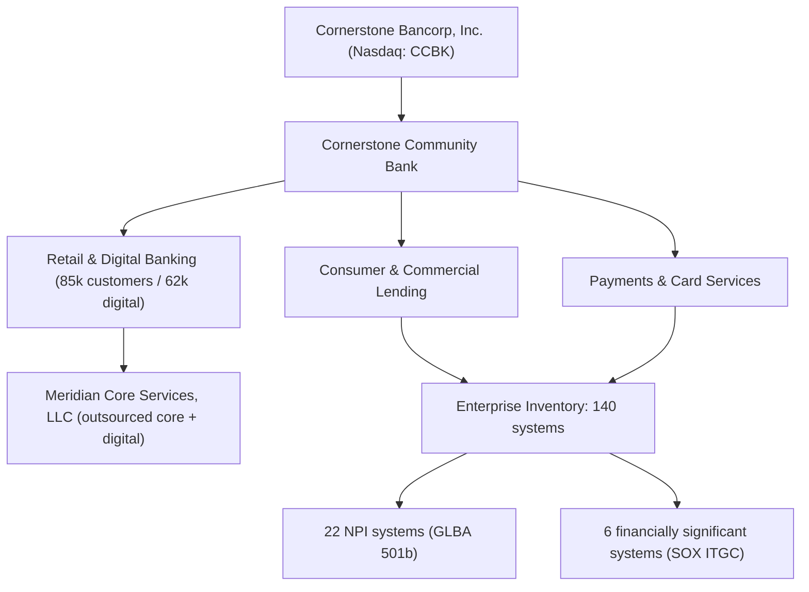

# 01.01 — Bank Profile and Business Model

| Field | Value |
|---|---|
| Document ID | CCB-ISP-PF-2026-101 |
| Version | 1.0 |
| Date | 2026-06-15 |
| Classification | Confidential — Nonpublic Information (NPI) // Illustrative Portfolio Sample |
| Owner | David Okonkwo — President, Cornerstone Community Bank |
| Author | Advisory Team (Financial-Services GRC) |
| Status | Approved |

## Purpose

This document establishes the institutional profile and business model of Cornerstone Community Bank ("Cornerstone" or "the Bank") as the foundation for the Bank's Gramm-Leach-Bliley Act (GLBA) §501(b) Information Security Program and the broader FFIEC/NIST CSF 2.0 and SOX/FDICIA control environment. It fixes the facts — size, structure, footprint, customer base, technology model, and data-at-risk — that every downstream phase (risk assessment, control design, third-party oversight, examination readiness, and board reporting) relies upon. All content is fictional and illustrative.

A precise, shared understanding of what the Bank does, who it serves, where nonpublic personal information (NPI) resides, and how technology is delivered is a prerequisite for scoping a defensible information security program. Regulatory expectations — including the Interagency Guidelines Establishing Information Security Standards — require the program to be commensurate with the Bank's size, complexity, and risk profile. This document provides that baseline.

## Institutional Snapshot

| Attribute | Detail |
|---|---|
| Legal name | Cornerstone Community Bank |
| Charter type | State-chartered, FDIC-insured commercial bank (Ohio non-member bank) |
| Holding company | Cornerstone Bancorp, Inc. — publicly traded SEC registrant (Nasdaq: CCBK) |
| Year founded | 1998 |
| Headquarters | Riverton, Ohio |
| Total assets | ~$1.2 billion |
| Branch network | 18 branches |
| Employees | ~240 |
| Retail & small-business customers | ~85,000 |
| Enrolled digital-banking users | ~62,000 |
| Core banking provider | Meridian Core Services, LLC (outsourced) |
| Primary federal regulator | Federal Deposit Insurance Corporation (FDIC) |
| State regulator | Ohio Division of Financial Institutions (DFI) |

Cornerstone is a community-focused commercial bank serving retail consumers, small businesses, and commercial clients across its Ohio market. As a wholly-owned subsidiary of a publicly traded holding company, the Bank operates within both banking-agency supervision and the securities-law obligations that attach to its parent, Cornerstone Bancorp, Inc. The parent's public status is the reason Sarbanes-Oxley (SOX) §404 IT general controls (ITGC) apply to the Bank's financially significant systems. With total assets at or above $1 billion, the Bank is also subject to FDICIA Part 363 — management and external attestation over internal control over financial reporting (ICFR).

## Business Model and Lines of Business

Cornerstone operates a traditional community-banking model funded primarily by core deposits and generating revenue through spread lending and fee-based services. Its principal lines of business are summarized below.

| Line of business | Description | Primary NPI exposure |
|---|---|---|
| Retail banking | Checking, savings, money market, and certificate-of-deposit products for ~85,000 customers | Account, identity, transaction, and balance data |
| Digital banking | Online and mobile banking delivered through Meridian's platform for ~62,000 enrolled users | Credentials, device data, transaction and payment data |
| Consumer lending | Mortgage, home-equity, auto, and personal lending | Credit reports, income, SSN, collateral and application data |
| Small-business & commercial | Deposit, treasury, and commercial credit for small and mid-sized businesses | Business identity, beneficial-owner, and financial data |
| Payments & card services | ACH, wire, debit card, and bill-pay services | Payment instructions, card and routing data |

Because core banking and digital banking are delivered through Meridian Core Services, LLC, a significant share of processing and data custody sits with a critical third-party service provider. This outsourced posture makes service-provider oversight (a GLBA §501(b) pillar) and third-party risk management (Phase 07) central to the program rather than peripheral.

## Technology and Data Environment

The Bank's enterprise technology estate and its NPI footprint define the attack surface the information security program must protect.

| Metric | Count | Significance |
|---|---|---|
| Systems in enterprise inventory | 140 | Total scope for asset inventory (Phase 02) |
| Systems processing/storing NPI | 22 | GLBA §501(b) protected-data scope |
| Financially significant systems | 6 | SOX §404 ITGC in-scope (Phase 06) |
| Core/digital banking platform | Meridian Core Services, LLC | SOC 1 Type II and SOC 2 Type II reliance |

The core banking system and the online/mobile digital-banking channels are hosted and operated by Meridian, for which SOC 1 Type II and SOC 2 Type II reports are obtained and reviewed. The Bank retains ownership of the risk and of customer relationships; outsourcing the technology does not outsource the regulatory obligation to safeguard NPI.

## Organizational Structure and Ownership

Cornerstone Community Bank sits within a two-tier corporate structure. The publicly traded holding company, Cornerstone Bancorp, Inc. (Nasdaq: CCBK), owns 100% of the Bank. This ownership relationship is the source of the Bank's securities-law obligations and the reason financial-reporting controls (SOX §404 ITGC and FDICIA Part 363 ICFR) flow up from the Bank into the consolidated public filings.

| Entity | Role | Regulatory consequence |
|---|---|---|
| Cornerstone Bancorp, Inc. | Publicly traded parent (Nasdaq: CCBK) | SEC registrant; 10-K / ICFR attestation |
| Cornerstone Community Bank | Operating bank subsidiary | FDIC + Ohio DFI supervision; GLBA §501(b) |
| Meridian Core Services, LLC | Outsourced core & digital provider | Third-party oversight; SOC 1/SOC 2 reliance |

## Customer Base and Delivery Channels

The Bank serves approximately 85,000 retail and small-business customers, of whom roughly 62,000 are enrolled digital-banking users — a digital-adoption rate that makes the online and mobile channels a primary point of NPI exposure and a focus of the security program. Delivery is spread across 18 physical branches plus the Meridian-hosted digital channels.

| Channel | Approximate volume | Primary controls emphasis |
|---|---|---|
| Branch network (18 locations) | Full customer base | Physical safeguards; access control; media handling |
| Online banking | ~62,000 enrolled users | Authentication; session security; monitoring |
| Mobile banking | Subset of digital users | Device security; encryption in transit |
| ATM / debit | Retail cardholders | PCI DSS reference; payment-data protection |

The concentration of activity in outsourced digital channels reinforces that the Bank's control effectiveness depends materially on Meridian's environment, evaluated through SOC 1 Type II and SOC 2 Type II reports and the third-party oversight program in Phase 07.

## Strategic Risk Context

Cornerstone's profile drives a Moderate inherent risk posture: a mid-sized asset base, a meaningful and growing digital channel, dependence on a critical outsourced core provider, and dual banking/securities regulatory exposure. These characteristics set the expected sophistication of the security program — more than a de novo community bank, yet scaled to a ~240-employee institution rather than a large regional or national bank. Subsequent phases calibrate control depth accordingly.

| Risk driver | Profile factor | Program implication |
|---|---|---|
| Scale | ~$1.2B assets; ≥$1B triggers FDICIA 363 | External ICFR attestation required |
| Digital dependence | ~62,000 digital users | Strong authentication, monitoring, IR |
| Outsourcing | Core & digital via Meridian | Enhanced service-provider oversight |
| Public parent | Nasdaq: CCBK | SOX 404 ITGC over 6 systems |
| NPI footprint | 22 of 140 systems hold NPI | Focused §501(b) safeguards |

The overall inherent risk profile is assessed as Moderate, with a targeted residual posture of Low-to-Moderate and well-managed once the program's safeguards, testing, and oversight are in place.

## Cross-References

- `01.02-charter-regulators-and-supervisory-structure.md` — charter and supervisory architecture
- `01.03-applicable-laws-and-regulations-register.md` — full applicable-law register
- `01.04-glba-501b-obligations-overview.md` — GLBA §501(b) obligations this profile scopes
- Phase 02 — `02.00-README.md` — asset inventory (140 systems) and data classification (22 NPI systems)
- Phase 06 — SOX ITGC & FDICIA (6 financially significant systems)
- Phase 07 — Third-Party / Vendor Risk (Meridian oversight)

---

[⬅ Previous](01.00-README.md) · [🏠 Phase README](01.00-README.md) · [Next ➡](01.02-charter-regulators-and-supervisory-structure.md)
