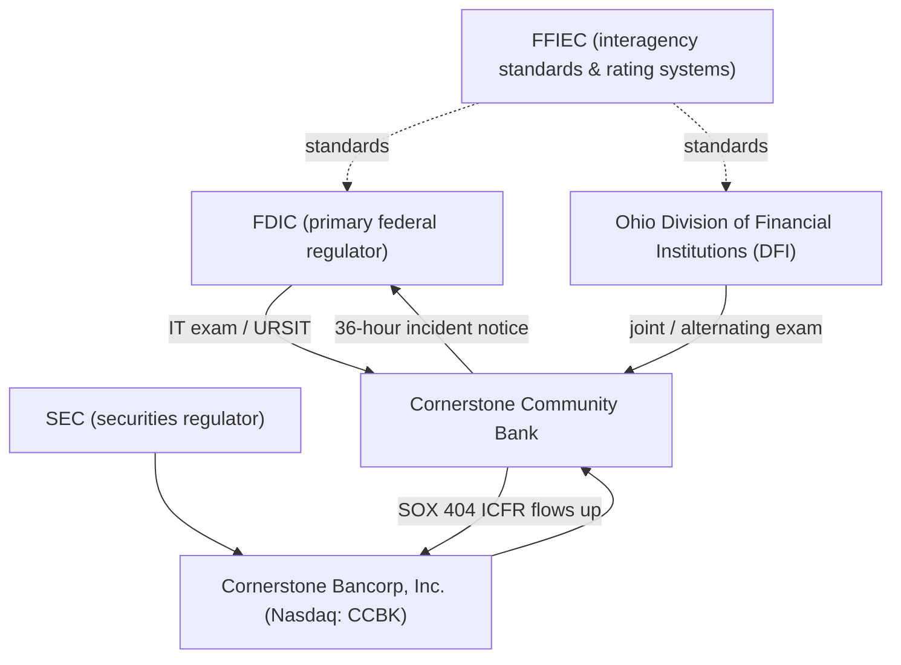

# 01.02 — Charter, Regulators, and Supervisory Structure

| Field | Value |
|---|---|
| Document ID | CCB-ISP-PF-2026-102 |
| Version | 1.0 |
| Date | 2026-06-15 |
| Classification | Confidential — Nonpublic Information (NPI) // Illustrative Portfolio Sample |
| Owner | David Okonkwo — President, Cornerstone Community Bank |
| Author | Advisory Team (Financial-Services GRC) |
| Status | Approved |

## Purpose

This document identifies the Bank's charter, its supervisory authorities, and the structure through which those authorities examine and rate the institution. Knowing precisely who supervises Cornerstone — and against which standards and rating systems — determines the examination cadence, the notification obligations, and the specific booklets and guidance the information security program must satisfy. This is the regulatory anchor for the program. All content is fictional and illustrative.

## Charter and Regulatory Status

Cornerstone Community Bank is a state-chartered commercial bank organized under the laws of the State of Ohio and insured by the FDIC. Because the Bank is a state non-member bank (not a member of the Federal Reserve System), its primary federal regulator is the FDIC. Its state chartering authority and co-supervisor is the Ohio Division of Financial Institutions (DFI). The Bank's holding company, Cornerstone Bancorp, Inc., is a public SEC registrant (Nasdaq: CCBK), which brings securities-law supervision to the consolidated organization.

| Dimension | Status |
|---|---|
| Charter | State-chartered commercial bank (Ohio) |
| Federal Reserve membership | Non-member |
| Deposit insurance | FDIC-insured |
| Primary federal regulator | FDIC |
| State regulator | Ohio Division of Financial Institutions (DFI) |
| Holding-company supervision | SEC (over Cornerstone Bancorp, Inc.) |
| Standard-setting coordination | FFIEC (interagency) |

## Supervisory Authorities and Their Roles

| Authority | Scope of supervision | Relevance to the security program |
|---|---|---|
| FDIC | Primary federal regulator; safety-and-soundness and IT examinations | Interagency Guidelines Safeguards; 36-hour incident notification; URSIT rating |
| Ohio DFI | State chartering authority; joint/alternating examinations | State supervisory expectations; coordinated exams with FDIC |
| SEC | Supervises the public holding company | Drives SOX §404 ITGC over financially significant systems |
| FFIEC | Interagency body that issues examination standards | IT Examination Handbook booklets; uniform rating systems |

The FDIC and Ohio DFI conduct safety-and-soundness and information-technology examinations, frequently on an alternating or joint basis under interagency arrangements. The FFIEC does not itself supervise banks; it establishes the uniform standards, examiner guidance (the IT Examination Handbook), and rating systems (including URSIT) that the FDIC and DFI apply.

## Examination Framework and Ratings

Information-technology examinations of Cornerstone are conducted under the FFIEC IT Examination Handbook and rated using the Uniform Rating System for Information Technology (URSIT). URSIT assigns a composite rating on a 1–5 scale (1 = strongest) across the components below. Safety-and-soundness examinations separately apply the CAMELS framework, which incorporates IT and operational risk into management and sensitivity assessments.

| URSIT component | Focus |
|---|---|
| Audit | Independence, scope, and quality of IT audit coverage |
| Management | Governance, oversight, strategy, and staffing of IT and security |
| Development & Acquisition | Systems development, acquisition, and change management |
| Support & Delivery | Operations, security, and service delivery to users |
| Composite | Overall IT condition (1–5; the Bank targets a composite "2") |

Under the program storyline, the anticipated FFIEC IT examination outcome is Satisfactory with a URSIT composite rating of "2," consistent with a well-managed institution with limited, manageable weaknesses.

## Supervisory Structure Diagram

## Examination Lifecycle

IT examinations follow a predictable lifecycle that the Bank prepares for through the program's examination-readiness work (Phase 08). Understanding the lifecycle lets management assemble evidence proactively rather than reactively.

| Stage | Activity | Bank preparation |
|---|---|---|
| Pre-exam | First-day-letter / information request | Assemble WISP, risk assessment, policies, prior findings |
| Scoping | Examiners set focus areas by risk | Provide asset inventory and risk profile |
| Fieldwork | Interviews, control review, testing | CISO and IT Security Manager coordinate |
| Findings | Examiner conclusions & MRAs/recommendations | Management response and remediation plan |
| Rating | URSIT composite and component ratings | Track ratings trend over cycles |

Under the program storyline, FFIEC IT examination fieldwork occurs in 2026-11 with the report delivered 2026-12-15, resulting in a Satisfactory outcome and a URSIT composite rating of "2."

## Coordination Across Regulators

Because Cornerstone is supervised by the FDIC and Ohio DFI at the bank level and its parent is an SEC registrant, the Bank maintains distinct but coordinated relationships. Banking-agency examinations focus on safety, soundness, and IT/security; the SEC relationship, managed at the holding-company level, focuses on financial-reporting integrity and securities disclosure, including cybersecurity incident materiality.

| Relationship | Managed by | Primary focus |
|---|---|---|
| FDIC | Bank management (CISO/CRO) | IT/security exam; incident notice |
| Ohio DFI | Bank management | State supervision; joint exams |
| SEC | Holding-company management (CFO) | 10-K, ICFR, disclosure |
| FFIEC | N/A (standards body) | Uniform guidance & ratings |

## Notification and Reporting Obligations

Cornerstone must notify its primary federal regulator (the FDIC) within 36 hours of determining that a qualifying "notification incident" has occurred, under the interagency Computer-Security Incident Notification Rule. In parallel, the Bank coordinates examination scheduling, information requests, and findings resolution with both the FDIC and the Ohio DFI. Securities-related disclosure obligations (including cybersecurity incident materiality assessment) are managed at the holding-company level with the SEC.

## Cross-References

- `01.01-bank-profile-and-business-model.md` — institutional profile that this supervision governs
- `01.03-applicable-laws-and-regulations-register.md` — statutes and guidance the regulators enforce
- `01.07-ciso-and-board-oversight-structure.md` — internal oversight aligned to examination expectations
- Phase 08 — Independent Testing, Audit & Examination Readiness (FFIEC IT exam; URSIT)

---

[⬅ Previous](01.01-bank-profile-and-business-model.md) · [🏠 Phase README](01.00-README.md) · [Next ➡](01.03-applicable-laws-and-regulations-register.md)
