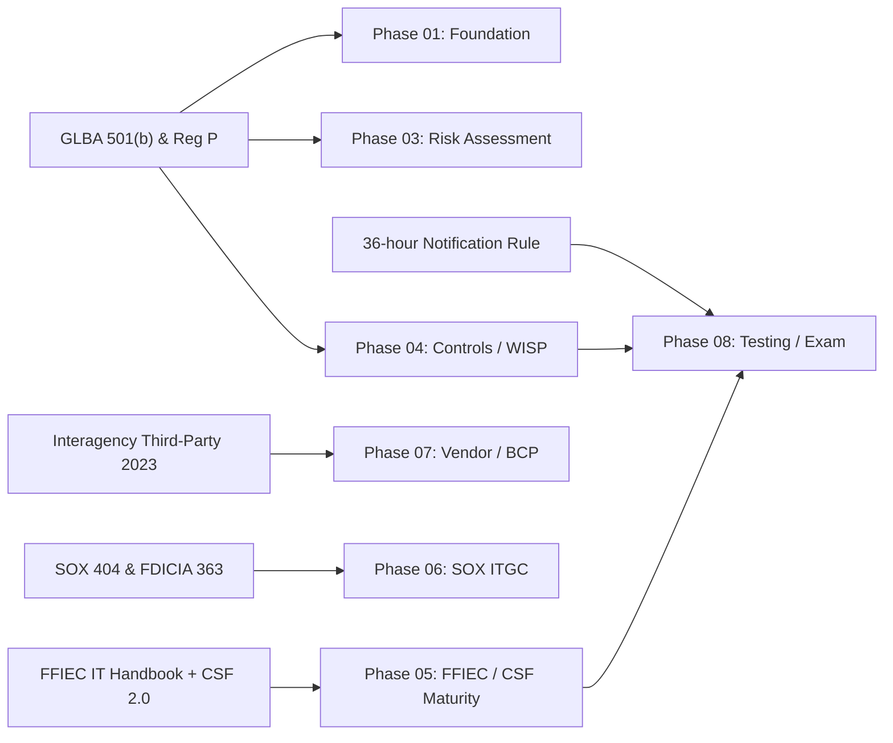

# 01.03 — Applicable Laws and Regulations Register

| Field | Value |
|---|---|
| Document ID | CCB-ISP-PF-2026-103 |
| Version | 1.0 |
| Date | 2026-06-15 |
| Classification | Confidential — Nonpublic Information (NPI) // Illustrative Portfolio Sample |
| Owner | Rachel Alvarez — CISO / Information Security Officer |
| Author | Advisory Team (Financial-Services GRC) |
| Status | Approved |

## Purpose

This register consolidates the laws, regulations, supervisory guidance, and standards frameworks that govern Cornerstone Community Bank's information security, IT governance, and financial-reporting control environment. It maps each obligation to its authoritative citation, the operative requirement, the accountable internal owner, and the program phase where it is operationalized. It is the single source of truth for regulatory scope and the traceability spine for the entire program. All content is fictional and illustrative.

## How to Read This Register

Each obligation is classified as a primary requirement (a binding legal or regulatory mandate the Bank must satisfy) or a supporting framework (a standard or methodology the Bank adopts to demonstrate a reasonable, risk-based approach). Owners are accountable executives; phases refer to the nine-phase program structure.

## Primary Regulatory Obligations Register

| Obligation | Citation | Requirement | Owner | Phase |
|---|---|---|---|---|
| GLBA §501(b) Safeguards | GLBA §501(b); Interagency Guidelines Establishing Information Security Standards | Written information security program; risk assessment; board oversight; service-provider oversight; adjust-and-report; annual board report | Rachel Alvarez (CISO/ISO) | 01, 03, 04 |
| GLBA Privacy Rule | Regulation P (12 CFR 1016) | Privacy notices; limits on NPI sharing; opt-out rights | Karen Ellis (Privacy Officer) | 01, 04 |
| FFIEC IT Examination Handbook | FFIEC IT Handbook (Information Security, Management, BCM, Audit, Outsourcing/Architecture) | Examiner-aligned IT governance, security, resilience, and audit expectations | Rachel Alvarez (CISO/ISO) | 01, 04, 05, 07, 08 |
| Cybersecurity Assessment (CAT sunset) | FFIEC CAT (sunset 2025-08-31); mapped forward to NIST CSF 2.0 | Inherent risk profile + maturity domains, carried forward via CSF 2.0 | Rachel Alvarez (CISO/ISO) | 05 |
| NIST CSF 2.0 | NIST Cybersecurity Framework 2.0 (6 Functions, 22 Categories, 106 Subcategories) | Current-vs-target profile; the assessment spine | Marcus Doyle (IT Security Manager) | 05 |
| SOX §404 ITGC | Sarbanes-Oxley Act §404 | IT general controls over financially significant systems; management ICFR assessment | Linda Barrett (CFO) | 06 |
| FDICIA Part 363 | 12 CFR Part 363 | Management + external ICFR attestation (institution ≥ $1B assets) | Linda Barrett (CFO) | 06 |
| 36-hour Incident Notification | Computer-Security Incident Notification Rule (2022; FDIC/OCC/Fed) | Notify primary federal regulator within 36 hours of a qualifying notification incident | Rachel Alvarez (CISO/ISO) | 04, 08 |
| Interagency Third-Party Guidance | Interagency Guidance on Third-Party Relationships (2023) | Risk-based third-party lifecycle management and oversight | Steven Nakamura (CRO) | 07 |

## Supporting Frameworks and Standards

| Framework / Standard | Reference | Use in the program | Owner | Phase |
|---|---|---|---|---|
| NIST SP 800-53 Rev. 5 | Security & Privacy Controls | Control catalog cross-walk for safeguards | Marcus Doyle | 04 |
| NIST SP 800-30 | Guide for Conducting Risk Assessments | Risk assessment methodology | Steven Nakamura | 03 |
| CIS Controls v8 | Center for Internet Security | Technical safeguard prioritization | Marcus Doyle | 04 |
| PCI DSS | Payment Card Industry DSS | Card-data handling reference | Marcus Doyle | 04, 07 |
| NIST SP 800-88 | Guidelines for Media Sanitization | Secure media disposal/sanitization | Marcus Doyle | 04 |

## Obligation-to-Phase Traceability

## Applicability Rationale

Each obligation applies to Cornerstone for a specific, documented reason tied to its profile. Recording the "why" defends the scope decision to examiners and prevents both over- and under-scoping.

| Obligation | Applies because | Would not apply if |
|---|---|---|
| GLBA §501(b) / Reg P | FDIC-insured institution holding customer NPI | Not a covered financial institution |
| SOX §404 ITGC | Parent is a public SEC registrant (CCBK) | Parent were privately held |
| FDICIA Part 363 | Total assets ≥ $1B (~$1.2B) | Assets below $1B threshold |
| 36-hour Notification Rule | Banking organization subject to FDIC | Non-bank entity |
| Interagency Third-Party Guidance 2023 | Reliance on Meridian and 85 third parties | No material outsourcing |
| FFIEC IT Handbook | Examined by FDIC/DFI under FFIEC standards | Not a supervised depository |

## Regulatory Change Monitoring

The CISO and Chief Compliance Officer jointly monitor regulatory developments affecting this register. Notable in the current cycle is the sunset of the FFIEC Cybersecurity Assessment Tool (CAT) on 2025-08-31; Cornerstone has carried the CAT's Inherent Risk Profile and five maturity domains forward, mapped to NIST CSF 2.0, as its ongoing cybersecurity-assessment approach.

| Watch item | Status | Bank response |
|---|---|---|
| FFIEC CAT sunset (2025-08-31) | Effective | Mapped forward to NIST CSF 2.0 (Phase 05) |
| NIST CSF 2.0 adoption | Adopted | Assessment spine (6 Functions) |
| Interagency Third-Party Guidance (2023) | In effect | Third-party program (Phase 07) |
| SEC cyber disclosure | Monitored at parent | Materiality process with CFO |

## Change Management for the Register

This register is a living control. The CISO reviews it at least annually and upon any material regulatory change (new rule, amended guidance, or updated framework version). Changes are versioned in the phase `CHANGELOG.md` and re-approved by the appropriate owner. Adoption of the CAT-to-CSF 2.0 forward mapping, following the CAT's sunset on 2025-08-31, is recorded as the current cybersecurity-assessment approach; the CRI Profile is referenced as an alternative crosswalk.

## Cross-References

- `01.02-charter-regulators-and-supervisory-structure.md` — the regulators enforcing these obligations
- `01.04-glba-501b-obligations-overview.md` — GLBA §501(b) obligations decomposed
- `01.06-governance-roles-and-raci.md` — owner accountabilities referenced in this register
- Phase 03 — Risk Assessment (NIST SP 800-30)
- Phase 06 — SOX ITGC & FDICIA (SOX §404, Part 363)

---

[⬅ Previous](01.02-charter-regulators-and-supervisory-structure.md) · [🏠 Phase README](01.00-README.md) · [Next ➡](01.04-glba-501b-obligations-overview.md)
