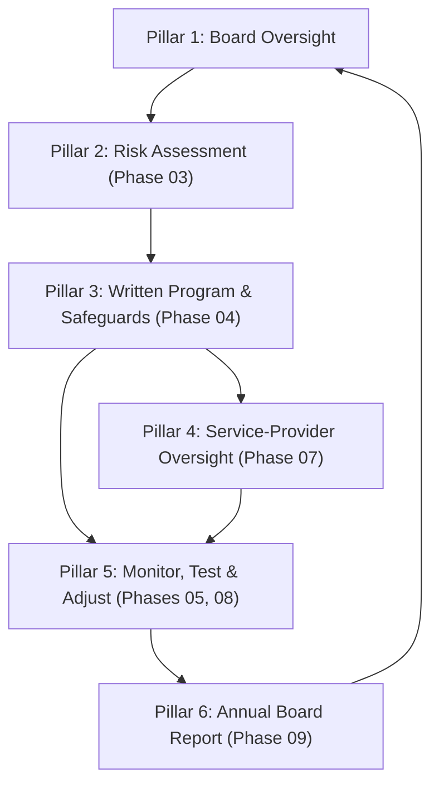

# 01.04 — GLBA §501(b) Obligations Overview

| Field | Value |
|---|---|
| Document ID | CCB-ISP-PF-2026-104 |
| Version | 1.0 |
| Date | 2026-06-15 |
| Classification | Confidential — Nonpublic Information (NPI) // Illustrative Portfolio Sample |
| Owner | Rachel Alvarez — CISO / Information Security Officer |
| Author | Advisory Team (Financial-Services GRC) |
| Status | Approved |

## Purpose

This document decomposes the Bank's obligations under Gramm-Leach-Bliley Act (GLBA) §501(b), as implemented through the Interagency Guidelines Establishing Information Security Standards (the banking-agency "Safeguards" requirement). It restates each required element in operational terms, maps it to the program phase and owner responsible for delivering it, and shows how the six pillars combine into a defensible, examinable information security program. All content is fictional and illustrative.

## The Statutory Mandate

GLBA §501(b) directs the banking agencies to establish appropriate standards for financial institutions to (1) ensure the security and confidentiality of customer records and information, (2) protect against anticipated threats or hazards to their security or integrity, and (3) protect against unauthorized access to or use of such records that could result in substantial harm or inconvenience to any customer. For Cornerstone, the protected asset is customer nonpublic personal information (NPI), which resides across 22 systems within the 140-system enterprise inventory.

| Objective | Meaning for Cornerstone |
|---|---|
| Security & confidentiality | Protect NPI across all 22 in-scope systems and the Meridian platform |
| Protect against threats | Anticipate and mitigate threats to NPI security and integrity |
| Protect against unauthorized access | Prevent access/use that could cause substantial customer harm |

## The Six Pillars of the Interagency Guidelines

The Interagency Guidelines translate §501(b) into six recurring program obligations. Each is mapped below to the phase where it is executed and the accountable owner.

| # | Pillar (Interagency Guidelines requirement) | Operational obligation | Phase | Owner |
|---|---|---|---|---|
| 1 | Board involvement & oversight | Board approves the program and oversees its development, implementation, and maintenance | 01, 09 | Board / Audit Committee |
| 2 | Risk assessment | Identify and assess reasonably foreseeable internal and external threats to NPI | 03 | Steven Nakamura (CRO) |
| 3 | Manage & control risk (written program & safeguards) | Design and implement administrative, technical, and physical safeguards; document a written program (WISP) | 04 | Rachel Alvarez (CISO/ISO) |
| 4 | Service-provider oversight | Exercise due diligence and oversight of providers handling NPI (notably Meridian) | 07 | Steven Nakamura (CRO) |
| 5 | Monitor, test & adjust | Test key controls; monitor effectiveness; adjust the program in light of changes | 05, 08 | Rachel Alvarez (CISO/ISO) |
| 6 | Report to the board (annually) | Deliver an annual written report to the board on program status and material matters | 09 | Rachel Alvarez (CISO/ISO) |

## Pillars-to-Phases Flow

The loop is deliberate: monitoring and testing feed the annual board report, which in turn informs the next cycle of oversight and risk assessment. This is the "adjust-and-report" discipline that examiners expect to see operating continuously, not as a one-time exercise.

## Safeguards Categories Under Pillar 3

The written program must address safeguards across three categories. Cornerstone's Written Information Security Program (WISP) and its 14 core policies (Phase 04) are organized to cover each.

| Safeguard category | Illustrative measures | Framework anchor |
|---|---|---|
| Administrative | Policies, training, access governance, roles & responsibilities | NIST SP 800-53 Rev. 5; CIS v8 |
| Technical | Encryption, authentication, logging/monitoring, vulnerability management | CIS v8; NIST CSF 2.0 Protect/Detect |
| Physical | Facility access controls, media handling, secure disposal | NIST SP 800-88 (media sanitization) |

## Evidence Expectations per Pillar

Examiners assess §501(b) compliance through documented evidence. The program produces the following artifacts, phase by phase, to demonstrate that each pillar operates.

| Pillar | Primary evidence | Producing phase |
|---|---|---|
| 1 — Board oversight | Board minutes; program approval; charter | 01, 09 |
| 2 — Risk assessment | Risk register (42 risks); methodology (SP 800-30) | 03 |
| 3 — Written program & safeguards | WISP + 14 core policies; control matrices | 04 |
| 4 — Service-provider oversight | Vendor inventory; due diligence; SOC reviews | 07 |
| 5 — Monitor, test & adjust | Test results; pen test; internal audit; KRIs | 05, 08 |
| 6 — Annual board report | Written GLBA report to the Board | 09 |

## Program Storyline Alignment

The six pillars are not abstract; they are traceable to concrete deliverables and outcomes across the engagement. This alignment lets the annual board report speak to each pillar with specific results.

| Pillar | Storyline outcome |
|---|---|
| Risk assessment | 42 risks (8 High, 18 Moderate, 16 Low); Moderate inherent profile |
| Written program | WISP + 14 core policies; board-approved 2026-04 |
| Monitor & adjust (maturity) | NIST CSF 2.0 baseline "Evolving/Baseline" → target "Intermediate"; 28 gaps |
| Service-provider oversight | 85 third parties; 12 critical/high; Meridian enhanced oversight |
| Test | Pen test 14 findings (2 High, 6 Medium, 6 Low) remediated; internal audit Satisfactory |
| Report | Annual GLBA report to Board delivered 2027-01 |

## Relationship to Regulation P and Incident Notification

GLBA also carries the Privacy Rule (Regulation P), governing privacy notices and NPI-sharing limits, owned by the Privacy Officer. Separately, a qualifying security incident affecting NPI may trigger the 36-hour notification obligation to the FDIC. The §501(b) Safeguards program, the Reg P privacy program, and the incident-notification process are complementary and must remain aligned.

## Cross-References

- `01.03-applicable-laws-and-regulations-register.md` — full obligation register including Reg P
- `01.05-information-security-program-charter.md` — the charter delivering Pillar 3
- `01.06-governance-roles-and-raci.md` — owner accountabilities for each pillar
- `01.07-ciso-and-board-oversight-structure.md` — Pillars 1 and 6 governance
- Phase 03 — Risk Assessment · Phase 07 — Third-Party Risk · Phase 09 — Board Reporting

---

[⬅ Previous](01.03-applicable-laws-and-regulations-register.md) · [🏠 Phase README](01.00-README.md) · [Next ➡](01.05-information-security-program-charter.md)
