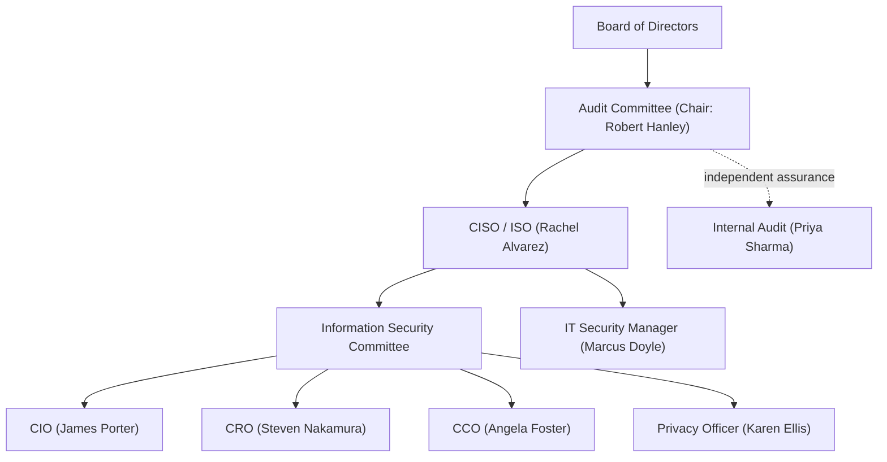

# 01.05 — Information Security Program Charter

| Field | Value |
|---|---|
| Document ID | CCB-ISP-PF-2026-105 |
| Version | 1.0 |
| Date | 2026-06-15 |
| Classification | Confidential — Nonpublic Information (NPI) // Illustrative Portfolio Sample |
| Owner | Rachel Alvarez — CISO / Information Security Officer |
| Author | Advisory Team (Financial-Services GRC) |
| Status | Approved |

## Purpose

This charter formally establishes Cornerstone Community Bank's Information Security Program, defining its mission, scope, authority, objectives, governance, and operating cadence. It is the constitutional document for the program required by GLBA §501(b) and the Interagency Guidelines: it names the program, grants the CISO the authority to run it, sets its measurable objectives, and commits the Bank to the governance rhythm that keeps it effective. All content is fictional and illustrative.

## Mission

The Information Security Program exists to protect the confidentiality, integrity, and availability of customer nonpublic personal information (NPI) and the Bank's information assets, in a manner commensurate with Cornerstone's size (~$1.2B assets, ~240 employees, 18 branches) and risk profile, and to satisfy the Bank's obligations under GLBA §501(b), the FFIEC IT Handbook, SOX/FDICIA, and related law.

## Scope

| Scope dimension | Coverage |
|---|---|
| Data | Customer NPI and other sensitive/confidential Bank information |
| Systems | All 140 systems in the enterprise inventory, with heightened controls on the 22 NPI systems and the 6 financially significant systems |
| People | All ~240 employees, contractors, and authorized third parties |
| Facilities | Headquarters (Riverton, OH) and all 18 branches |
| Third parties | Service providers handling NPI, including Meridian Core Services, LLC |
| Channels | Branch, online, and mobile banking (~62,000 digital users) |

The program covers the full lifecycle of information — creation, processing, storage, transmission, and disposal — whether operated in-house or by a service provider on the Bank's behalf.

## Authority

The Board of Directors charters this program and delegates its day-to-day design, implementation, and maintenance to the Chief Information Security Officer / Information Security Officer (Rachel Alvarez). The CISO is authorized to establish policies and standards, require compliance across all business units, direct risk-based remediation, and escalate unresolved risks to executive management and the Audit Committee. The CISO reports on program status to the Board no less than annually and on material matters as they arise.

## Objectives

| Objective | Measure | Target |
|---|---|---|
| Safeguard NPI | Coverage of NPI systems by required safeguards | 100% of 22 NPI systems |
| Maintain a written program | WISP + core policies approved and current | WISP + 14 core policies (Phase 04) |
| Assess and manage risk | Enterprise risk assessment completed and acted upon | Annual (42 risks tracked; Phase 03) |
| Achieve target maturity | NIST CSF 2.0 current-vs-target profile | "Intermediate" target (Phase 05) |
| Oversee service providers | Critical/high-risk vendors under enhanced oversight | 12 critical/high vendors (Phase 07) |
| Demonstrate assurance | Independent testing and examination outcomes | Satisfactory / ICFR effective |

## Governance Structure

The Information Security Committee is the program's working governance body, chaired by the CISO and including the CIO, CRO, Chief Compliance Officer, and Privacy Officer. It reviews risk, policy, incidents, metrics, and remediation, and prepares matters for Audit Committee and Board attention.

## Operating Cadence

| Activity | Frequency | Primary participants |
|---|---|---|
| Information Security Committee meeting | Quarterly (min.) | CISO, CIO, CRO, CCO, Privacy Officer |
| Enterprise risk assessment refresh | Annual | CRO, CISO |
| Policy review & re-approval | Annual or on material change | CISO, policy owners |
| Metrics / KRI reporting to Audit Committee | Quarterly | CISO, Internal Audit |
| Independent testing (pen test, internal audit) | Annual | CISO, Redwood Security Partners, Internal Audit |
| Annual GLBA report to the Board | Annual | CISO, Board |

## Roles Within the Program

The charter assigns program roles to named executives, each accountable for a defined domain and reporting into the Information Security Committee and, ultimately, the Board.

| Role | Individual | Program accountability |
|---|---|---|
| CISO / ISO | Rachel Alvarez | Overall program owner and authority |
| CIO | James Porter | IT infrastructure and systems delivery |
| CRO | Steven Nakamura | Risk assessment and third-party risk |
| CCO | Angela Foster | Regulatory compliance and BSA |
| Privacy Officer | Karen Ellis | Regulation P privacy program |
| IT Security Manager | Marcus Doyle | Technical safeguards and operations |
| Internal Audit | Priya Sharma | Independent assurance |

## Funding, Resources, and Independent Testing

The program is resourced to meet its objectives at a scale appropriate to a ~$1.2B, ~240-employee institution. Independent testing is procured from external specialists to preserve objectivity: Redwood Security Partners, LLC performs penetration testing and vulnerability assessment, and Whitmore &amp; Associates, LLP provides external financial-statement and ICFR/SOX 404 audit. Internal Audit provides independent internal assurance functionally to the Audit Committee.

| Resource | Provider | Frequency |
|---|---|---|
| Penetration testing | Redwood Security Partners, LLC | Annual (Phase 08) |
| External ICFR / SOX audit | Whitmore &amp; Associates, LLP | Annual (FY cycle) |
| Internal audit | Priya Sharma / Internal Audit | Per audit plan |
| SOC report review (Meridian) | CISO / vendor management | Annual (SOC 1/2 Type II) |

## Program Principles

The program is risk-based, defense-in-depth, and aligned to recognized frameworks (NIST CSF 2.0, NIST SP 800-53 Rev. 5, CIS v8). It applies least privilege and separation of duties, requires accountability at the executive-owner level, and treats service-provider risk as the Bank's own risk. It is continuously monitored and adjusted — the "adjust-and-report" discipline of §501(b).

## Cross-References

- `01.04-glba-501b-obligations-overview.md` — the §501(b) obligations this charter operationalizes
- `01.06-governance-roles-and-raci.md` — detailed roles and RACI supporting this governance
- `01.07-ciso-and-board-oversight-structure.md` — CISO authority and board oversight
- Phase 04 — Information Security Program & Control Design (WISP + 14 policies)
- Phase 05 — FFIEC / NIST CSF 2.0 maturity (target "Intermediate")

---

[⬅ Previous](01.04-glba-501b-obligations-overview.md) · [🏠 Phase README](01.00-README.md) · [Next ➡](01.06-governance-roles-and-raci.md)
