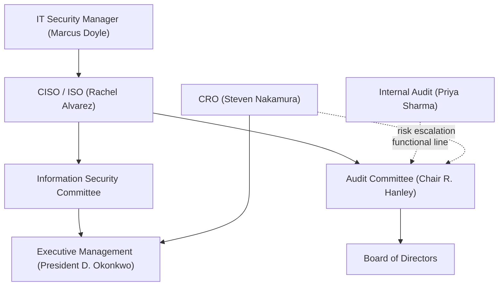

# 01.06 — Governance Roles and RACI

| Field | Value |
|---|---|
| Document ID | CCB-ISP-PF-2026-106 |
| Version | 1.0 |
| Date | 2026-06-15 |
| Classification | Confidential — Nonpublic Information (NPI) // Illustrative Portfolio Sample |
| Owner | Rachel Alvarez — CISO / Information Security Officer |
| Author | Advisory Team (Financial-Services GRC) |
| Status | Approved |

## Purpose

This document defines the governance roles that operate the Information Security Program and assigns accountability for each major program activity through a RACI matrix. Clear role definition and an unambiguous RACI are governance controls in their own right: they prevent gaps and overlaps, satisfy the FFIEC IT Handbook's management expectations, and give examiners a direct line of sight into who owns what. All content is fictional and illustrative.

## Governance Roles

| Role | Individual | Core responsibility |
|---|---|---|
| Holding Co. President & CEO | Margaret Chen | Enterprise leadership; tone at the top (parent) |
| Bank President | David Okonkwo | Bank leadership; business accountability |
| CISO / ISO | Rachel Alvarez | Owns the Information Security Program; program authority |
| CIO | James Porter | IT operations, infrastructure, and systems delivery |
| CRO | Steven Nakamura | Enterprise & operational risk; risk assessment |
| CFO | Linda Barrett | SOX 404 / FDICIA ICFR sponsorship |
| CCO (Compliance/BSA) | Angela Foster | Regulatory compliance; BSA |
| Privacy Officer | Karen Ellis | Regulation P privacy program |
| IT Security Manager | Marcus Doyle | Technical safeguards; day-to-day security operations |
| Director of Internal Audit | Priya Sharma | Independent assurance (reports to Audit Committee) |
| Audit Committee Chair | Robert Hanley | Board-level oversight of program & audit |
| Board / Audit Committee | Governance body | Approves program; receives annual GLBA report |

## RACI Legend

R = Responsible (does the work) · A = Accountable (owns the outcome; one per activity) · C = Consulted · I = Informed.

## Program RACI Matrix

| Activity | Board/AC | CISO | CIO | CRO | CFO | CCO | Privacy | IT Sec Mgr | Int. Audit |
|---|---|---|---|---|---|---|---|---|---|
| Approve InfoSec Program charter | A | R | C | C | I | C | C | I | I |
| Conduct enterprise risk assessment | I | C | C | A/R | I | C | C | C | I |
| Design WISP & core policies | I | A/R | C | C | I | C | C | R | I |
| Implement technical safeguards | I | A | R | I | I | I | I | R | I |
| Service-provider (vendor) oversight | I | C | C | A | I | C | C | R | I |
| FFIEC / NIST CSF 2.0 maturity assessment | I | A/R | C | C | I | C | I | R | C |
| SOX ITGC design & testing | I | C | R | C | A | I | I | R | C |
| Manage security incidents & 36-hr notice | I | A/R | R | C | I | C | C | R | I |
| Privacy (Reg P) notices & NPI sharing | I | C | I | I | I | C | A/R | I | I |
| Independent testing (pen test / audit) | I | A | C | C | I | I | I | R | R |
| Deliver annual GLBA report to Board | A | R | I | C | I | C | C | I | C |
| Provide independent assurance to Board | A | I | I | I | I | I | I | I | R |

Each activity has exactly one Accountable party. Where the CISO is both Accountable and Responsible (A/R), the CISO owns the outcome and drives the work directly, drawing on Responsible support from the IT Security Manager and other functions.

## Escalation and Reporting Lines

Routine matters flow through the Information Security Committee to executive management; risk and assurance matters have a direct, independent path to the Audit Committee. Internal Audit reports functionally to the Audit Committee to preserve independence.

## Committee Structure

Governance is exercised through a small set of committees that connect operational execution to board oversight. Each committee has a defined chair, membership, and remit.

| Committee | Chair | Core remit |
|---|---|---|
| Board of Directors | Board Chair | Ultimate governance; approves program |
| Audit Committee | Robert Hanley | Oversight of program, audit, and ICFR |
| Information Security Committee | Rachel Alvarez (CISO) | Program execution, risk, policy, incidents |
| Vendor / Third-Party Risk forum | Steven Nakamura (CRO) | Service-provider oversight (Phase 07) |

## Decision Authority

Decision rights are calibrated so that routine operational choices sit with management while program-defining and risk-acceptance decisions escalate to the Board. This prevents both bottlenecks and inappropriate delegation of material risk.

| Decision | Authority |
|---|---|
| Approve/adopt the Information Security Program | Board / Audit Committee |
| Approve WISP and core policies | CISO (recommend); Board (approve) |
| Accept residual risk above threshold | Audit Committee |
| Accept residual risk within threshold | CISO / CRO |
| Approve critical third-party engagement | CRO with CISO review |
| Authorize incident regulatory notification | CISO (with President) |

## Separation of Duties

The model separates the second line (CISO, CRO, Compliance — risk ownership and oversight) from the first line (CIO/IT operations — control operation) and the third line (Internal Audit — independent assurance). The CFO sponsors ICFR/SOX to keep financial-reporting accountability distinct from security operations. This alignment is detailed as the three-lines-of-defense model in 01.07.

## Cross-References

- `01.05-information-security-program-charter.md` — governance structure and cadence
- `01.07-ciso-and-board-oversight-structure.md` — three-lines-of-defense and board oversight
- `01.03-applicable-laws-and-regulations-register.md` — obligation owners referenced here
- Phase 06 — SOX ITGC & FDICIA (CFO-sponsored controls)
- Phase 09 — Board Reporting (annual GLBA report)

---

[⬅ Previous](01.05-information-security-program-charter.md) · [🏠 Phase README](01.00-README.md) · [Next ➡](01.07-ciso-and-board-oversight-structure.md)
