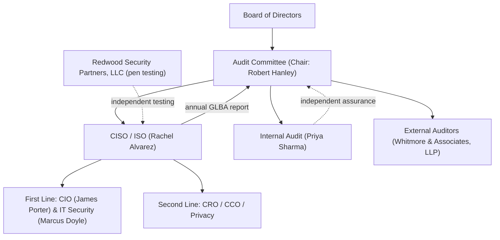

# 01.07 — CISO and Board Oversight Structure

| Field | Value |
|---|---|
| Document ID | CCB-ISP-PF-2026-107 |
| Version | 1.0 |
| Date | 2026-06-15 |
| Classification | Confidential — Nonpublic Information (NPI) // Illustrative Portfolio Sample |
| Owner | Rachel Alvarez — CISO / Information Security Officer |
| Author | Advisory Team (Financial-Services GRC) |
| Status | Approved |

## Purpose

This document defines how the Chief Information Security Officer (CISO) is positioned within Cornerstone's governance and how the Board of Directors, through its Audit Committee, exercises oversight of the Information Security Program. It establishes reporting lines, CISO independence, the three-lines-of-defense model, the Audit Committee's role, and the annual GLBA reporting obligation. Board involvement and oversight is the first pillar of the Interagency Guidelines; this document evidences it. All content is fictional and illustrative.

## CISO Reporting Lines and Independence

Rachel Alvarez serves as CISO / Information Security Officer and owns the Information Security Program. To preserve the independence and standing of the role, the CISO has a direct reporting and escalation path to the Audit Committee of the Board, in addition to administrative alignment within executive management. This dual pathway ensures that security risk can reach the Board without being filtered by the functions whose activities create that risk (notably IT operations under the CIO).

| Line | Path | Purpose |
|---|---|---|
| Administrative | CISO within executive management | Day-to-day management alignment |
| Functional / escalation | CISO → Audit Committee → Board | Independent risk escalation & reporting |
| Assurance | Internal Audit → Audit Committee | Independent testing of the program |

Notably, the CISO does not report to the CIO; security oversight is kept independent of the IT operations it evaluates, consistent with FFIEC expectations for an appropriately independent information security function.

## Three Lines of Defense

Cornerstone applies the three-lines-of-defense model to information security governance.

| Line | Function | Roles |
|---|---|---|
| First line | Own and operate controls | CIO (James Porter), IT Security Manager (Marcus Doyle), business units |
| Second line | Independent risk oversight & challenge | CISO (Rachel Alvarez), CRO (Steven Nakamura), CCO (Angela Foster), Privacy Officer (Karen Ellis) |
| Third line | Independent assurance | Internal Audit (Priya Sharma); external — Whitmore &amp; Associates, LLP; Redwood Security Partners, LLC |

The first line owns and operates controls; the second line sets policy, assesses risk, and challenges the first line; the third line independently tests whether controls operate as designed and reports to the Board.

## Board and Audit Committee Oversight

The Audit Committee, chaired by Robert Hanley, is the Board's delegate for oversight of the Information Security Program, internal audit, and the external audit relationship. It reviews program status, risk and metrics, incident matters, remediation, and independent testing results, and it approves the program and its material changes on the Board's behalf.

## Audit Committee Responsibilities

| Responsibility | Cadence |
|---|---|
| Approve the Information Security Program & charter | Annual / on material change |
| Review risk, KRIs, incidents, and remediation | Quarterly |
| Oversee Internal Audit plan and results | Quarterly / annual |
| Oversee external audit (SOX 404 / ICFR) | Per audit cycle |
| Receive the annual GLBA §501(b) board report | Annual |
| Review independent testing (pen test) results | Annual |

## Annual GLBA Report to the Board

The CISO delivers a written annual report to the Board (through the Audit Committee) describing the overall status of the Information Security Program and the Bank's compliance with the Interagency Guidelines. Consistent with the program storyline, the report addresses the enterprise risk assessment (42 risks: 8 High, 18 Moderate, 16 Low), control and policy status (WISP + 14 core policies), service-provider oversight (85 third parties; 12 critical/high; Meridian under enhanced oversight), testing and examination results (FFIEC IT exam Satisfactory / URSIT composite "2"; SOX ICFR effective; pen test findings remediated), and management's recommendations and adjustments. The FY2026 report is scheduled for delivery to the Board in 2027-01.

| Report element | Source phase |
|---|---|
| Risk assessment results | Phase 03 |
| Control & policy status (WISP) | Phase 04 |
| Maturity assessment (NIST CSF 2.0) | Phase 05 |
| Service-provider oversight | Phase 07 |
| Independent testing & exam results | Phase 08 |

## CISO Mandate and Authority

The CISO's authority is codified in the program charter and reinforced here. The mandate spans policy-setting, risk oversight, incident command, and reporting, and it carries the standing to require compliance across all business units and to escalate independently to the Board.

| Authority | Description |
|---|---|
| Policy & standards | Establish and maintain security policies and standards |
| Compliance enforcement | Require adherence across all units and functions |
| Risk direction | Direct risk-based remediation and prioritization |
| Incident command | Lead incident response and authorize 36-hour notification |
| Independent escalation | Report to the Audit Committee without filtering |
| Annual reporting | Deliver the GLBA §501(b) report to the Board |

## Independence Safeguards

Several structural features protect the independence of the security and assurance functions, so that oversight is not compromised by the operations it evaluates.

| Safeguard | Effect |
|---|---|
| CISO does not report to the CIO | Separates oversight from IT operations |
| Internal Audit reports functionally to Audit Committee | Preserves third-line independence |
| External testing by Redwood Security Partners | Objective, arms-length technical assessment |
| External audit by Whitmore &amp; Associates | Independent ICFR/SOX opinion |
| Direct CISO-to-Board escalation path | Unfiltered risk reporting |

## Board Cyber Competency and Engagement

The Board, through the Audit Committee, maintains sufficient understanding of cybersecurity and technology risk to provide credible challenge. The CISO provides regular education and briefings so that oversight is substantive. Engagement is evidenced in board minutes, approved program documents, and the annual GLBA report — the artifacts examiners review to confirm that Pillar 1 (board involvement and oversight) operates in practice, not just on paper.

## Cross-References

- `01.05-information-security-program-charter.md` — program authority and governance
- `01.06-governance-roles-and-raci.md` — roles and RACI underpinning these lines
- `01.02-charter-regulators-and-supervisory-structure.md` — examination expectations
- Phase 08 — Independent Testing, Audit & Examination Readiness
- Phase 09 — Board Reporting, Program Maturity & Continuous Improvement

---

[⬅ Previous](01.06-governance-roles-and-raci.md) · [🏠 Phase README](01.00-README.md) · [Next ➡](01.08-scope-assumptions-and-constraints.md)
