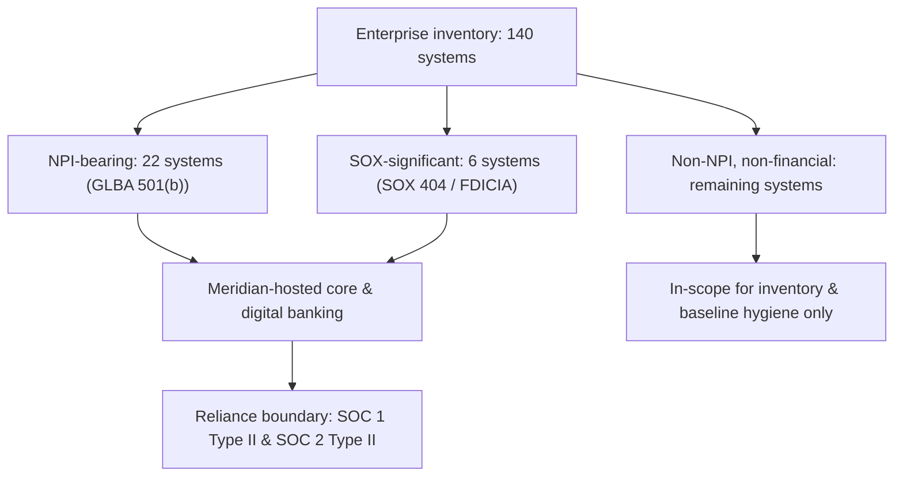

# 01.08 — Scope, Assumptions & Constraints

| Field | Value |
|---|---|
| Document ID | CCB-ISP-SCOPE-2026-108 |
| Version | 1.0 |
| Date | 2026-06-15 |
| Classification | Confidential — Nonpublic Information (NPI) // Illustrative Portfolio Sample |
| Owner | Rachel Alvarez — CISO / Information Security Officer (ISO) |
| Author | Advisory Team (Financial-Services GRC) |
| Status | Approved |

## Purpose

This document baselines the **scope boundary** of the Cornerstone Community Bank Information Security Program engagement and records the **assumptions** and **constraints** that shape how the program is designed, assessed, and reported. It converts the regulatory drivers established in 01.01–01.07 (GLBA §501(b), the Interagency Safeguards Guidelines, the FFIEC IT Examination Handbook, NIST CSF 2.0, SOX §404, and FDICIA Part 363) into an explicit, defensible statement of what is *in scope* and *out of scope* for the ~12-month program running from kickoff on **2026-01-12** through the SOX opinion in **2027-02**.

A clear scope statement matters for three reasons: (1) it defines the population of systems the risk assessment (Phase 03) and asset inventory (Phase 02) must cover; (2) it fixes the boundary of reliance on **Meridian Core Services, LLC** and the SOC 1 / SOC 2 reports; and (3) it gives the FDIC and Ohio DFI examiners, and the Whitmore & Associates SOX auditors, a documented basis for what the program does and does not assert.

## Scope at a Glance

Cornerstone maintains **140 systems** in the enterprise inventory. Of these, **22 systems** store, process, or transmit customer **NPI** (the asset GLBA §501(b) requires the Bank to protect), and **6 systems** are financially significant and therefore in scope for SOX ITGC / FDICIA ICFR. These populations overlap: a system can be both NPI-bearing and SOX-significant.

## In-Scope

| # | Scope element | Population / boundary | Primary driver |
|---|---|---|---|
| 1 | Full enterprise system inventory | 140 systems | FFIEC Information Security; NIST CSF ID.AM |
| 2 | NPI-bearing systems | 22 systems | GLBA §501(b); Interagency Safeguards |
| 3 | SOX ITGC-significant systems | 6 systems, 4 ITGC domains | SOX §404; FDICIA Part 363 |
| 4 | Written Information Security Program (WISP) + 14 core policies | Enterprise-wide | Interagency Safeguards; FFIEC Management |
| 5 | GLBA §501(b) risk assessment | All NPI systems + supporting processes | NIST SP 800-30; FFIEC |
| 6 | FFIEC / NIST CSF 2.0 maturity assessment | 6 Functions, 22 Categories, 106 Subcategories | FFIEC Cybersecurity Assessment; CSF 2.0 |
| 7 | Service-provider oversight of Meridian | Core + digital banking platform | Interagency Third-Party Guidance (2023) |
| 8 | Independent testing | External pen test (Redwood); internal audit | FFIEC Audit; GLBA testing requirement |
| 9 | Board oversight & annual GLBA report | Board / Audit Committee | Interagency Safeguards; GLBA |

## Out-of-Scope

| # | Excluded element | Rationale | Coverage instead |
|---|---|---|---|
| 1 | Meridian's internal control environment | Operated by service provider, not Cornerstone | Reliance on SOC 1 Type II / SOC 2 Type II + CUECs |
| 2 | Cornerstone Bancorp holding-company entity controls beyond ICFR | Program scoped to the Bank subsidiary | Holding-company governance referenced, not tested here |
| 3 | Financial-statement substantive audit | Domain of Whitmore & Associates | Coordinated, not performed by program |
| 4 | PCI DSS full assessment | Referenced framework, card operations limited | Crosswalk reference only |
| 5 | Physical branch security operations (guards, cash) | Managed by Bank Operations / BSA | Physical safeguards addressed at control-design level |
| 6 | Non-NPI, non-financial systems deep-dive controls | Lower inherent risk | Captured in inventory; baseline hygiene only |

## Key Assumptions

| ID | Assumption | Impact if invalid |
|---|---|---|
| A-01 | Meridian's SOC 1 Type II and SOC 2 Type II reports are current, unqualified, and cover the relevant period | Direct testing of core/digital controls would be required; timeline extends |
| A-02 | Complementary User Entity Controls (CUECs) in the Meridian reports are implemented and operating at Cornerstone | SOX ITGC reliance weakened; potential deficiency |
| A-03 | System inventory (140) is complete and reconciled before Phase 02 close | Risk assessment population is understated |
| A-04 | The 22 NPI and 6 SOX populations are stable through the engagement | Rework of risk and ITGC scoping |
| A-05 | Executive sponsors (Alvarez, Porter, Nakamura, Barrett, Foster) remain engaged and resourced | Milestone slippage; governance gaps |
| A-06 | FFIEC CAT sunset (2025-08-31) does not require re-baselining once CSF 2.0 mapping is set | Assessment spine changes mid-engagement |
| A-07 | No material acquisition, core conversion, or reorganization occurs during the engagement | Scope boundary shifts materially |

## Constraints

| ID | Constraint | Type | Management approach |
|---|---|---|---|
| C-01 | FFIEC IT examination fieldwork begins **2026-11**; report due **2026-12-15** | Timeline | Front-load risk assessment and control design; exam-readiness gate in Phase 08 |
| C-02 | SOX ITGC testing window **2026-07 → 2026-09** must precede the FY2026 opinion (**2027-02**) | Timeline | Freeze ITGC scope by end of Phase 04 |
| C-03 | Reliance on a third party (Meridian) for core and digital banking | Structural | Enhanced vendor oversight; CUEC validation |
| C-04 | Finite internal resources (~240 employees; lean security team under CISO) | Resource | Advisory Team augmentation; prioritize by inherent risk |
| C-05 | NPI classification limits sharing of live data in testing | Data | Use masked / synthetic data; illustrative sample only |
| C-06 | Multiple concurrent regulators (FDIC, Ohio DFI, SEC via Bancorp) | Regulatory | Single obligations calendar (01.11); coordinated messaging |
| C-07 | Board reporting cadence fixes decision points | Governance | Milestones aligned to committee calendar (01.10) |

## Meridian Reliance Boundary — Detail

Because core banking and digital banking (online + mobile) are outsourced to **Meridian Core Services, LLC**, the program does not directly test controls that operate inside Meridian's environment. Instead, Cornerstone relies on Meridian's **SOC 1 Type II** (for ITGC / financial-reporting relevance) and **SOC 2 Type II** (for security, availability, and confidentiality) reports, and validates the **Complementary User Entity Controls (CUECs)** that the reports assume Cornerstone operates on its side of the boundary.

| Boundary layer | Responsibility | Program treatment |
|---|---|---|
| Core processing engine | Meridian | Reliance on SOC 1 Type II |
| Digital banking platform | Meridian | Reliance on SOC 2 Type II |
| CUECs (user access admin, data input, reconciliations) | Cornerstone | Directly tested (Phase 06) |
| Vendor governance & SLA monitoring | Cornerstone | Enhanced oversight (Phase 07) |
| Incident notification interface | Shared | Contractual; supports 36-hour rule |

The reliance boundary is deliberately explicit so that the FFIEC examiners and the Whitmore & Associates SOX auditors can see precisely where the Bank's testing ends and provider reliance begins — a common examination focus for institutions with outsourced cores.

## Scope Integrity Risks

| ID | Risk to scope | Likelihood | Mitigation |
|---|---|---|---|
| S-01 | Undiscovered NPI outside the 22 identified systems | Medium | Data-flow mapping in Phase 02; classification sweep |
| S-02 | SOX population understated (missing a significant system) | Low | CFO + auditor confirmation before Phase 06 |
| S-03 | Shadow IT / unmanaged endpoints | Medium | Inventory reconciliation to source-of-record |
| S-04 | Qualified or lapsed Meridian SOC report | Low | Annual SOC review; bridge letters |

## Scope Change Control

Any change to the in-scope populations (140 / 22 / 6), the Meridian reliance boundary, or the assessment spine is a **scope change** requiring CISO approval and, where it affects SOX or GLBA assertions, notification to the Audit Committee Chair (Robert Hanley) and the SOX sponsors (Linda Barrett, CFO). Changes are logged in the Phase 01 CHANGELOG and reflected in the risk assessment population before Phase 03 closes.

## Cross-References

- **01.01–01.06** — Regulatory register, program charter, and framework selection (drivers for this scope).
- **01.07 — CISO & Board Oversight Structure** — governance authority behind scope approval.
- **01.09 — Stakeholder Register** — owners of in-scope and boundary elements.
- **01.11 — Regulatory Obligations Calendar** — obligations tied to in-scope drivers.
- **Phase 02 — Asset Inventory & Data Classification** — operationalizes the 140 / 22 populations.
- **Phase 03 — Risk Assessment** — consumes the scoped population.
- **Phase 06 — SOX ITGC & FDICIA** — the 6 financially significant systems.
- **Phase 07 — Third-Party / Vendor Risk** — Meridian reliance boundary.

---

[⬅ Previous](01.07-ciso-and-board-oversight-structure.md) · [🏠 Phase README](01.00-README.md) · [Next ➡](01.09-stakeholder-register.md)
