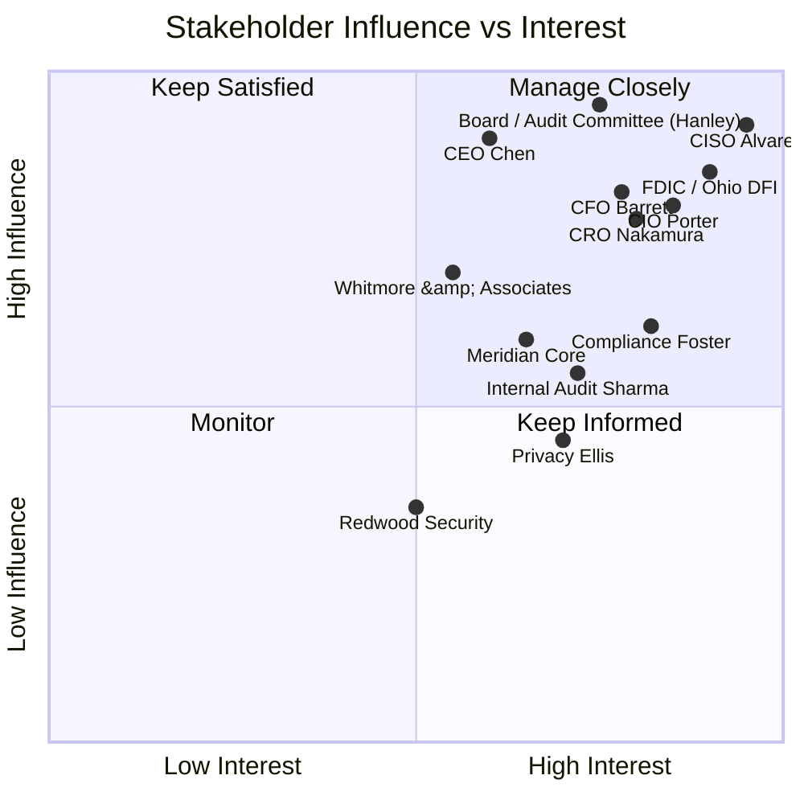

# 01.09 — Stakeholder Register

| Field | Value |
|---|---|
| Document ID | CCB-ISP-STKREG-2026-109 |
| Version | 1.0 |
| Date | 2026-06-15 |
| Classification | Confidential — Nonpublic Information (NPI) // Illustrative Portfolio Sample |
| Owner | Rachel Alvarez — CISO / Information Security Officer (ISO) |
| Author | Advisory Team (Financial-Services GRC) |
| Status | Approved |

## Purpose

This register identifies every stakeholder with a role in, interest in, or influence over the Cornerstone Community Bank Information Security Program, and defines how each will be engaged across the ~12-month engagement (kickoff **2026-01-12** through SOX opinion **2027-02**). It supports the Interagency Safeguards requirement for **board and senior-management oversight**, the FFIEC expectation that roles and responsibilities be clearly defined, and the practical need to align internal leaders, external assurance providers, the outsourced core provider, and regulators around a single program.

Stakeholders are classified by **influence** (ability to direct or block the program) and **interest** (degree to which program outcomes affect them), which drives the engagement approach — from *manage closely* to *keep informed*.

## Influence / Interest Model

## Internal Stakeholders

| Stakeholder | Role | Interest | Influence | Engagement approach |
|---|---|---|---|---|
| **Margaret Chen** | President & CEO, Cornerstone Bancorp | Enterprise risk posture; SOX §302/404 certification | High | Keep satisfied — executive briefings at phase gates; co-signs GLBA report |
| **David Okonkwo** | President, Cornerstone Community Bank | Bank operations, exam outcome | High | Manage closely — steering committee; exam-readiness reviews |
| **Rachel Alvarez** | CISO / ISO — program owner | Direct owner of the WISP and all deliverables | Very High | Program lead — drives all phases; primary author-of-record |
| **James Porter** | CIO | IT operations, ITGC, remediation | High | Manage closely — co-sponsor for ITGC and technical controls |
| **Steven Nakamura** | CRO | Enterprise & inherent risk, risk assessment | High | Manage closely — owns risk-assessment governance |
| **Linda Barrett** | CFO | SOX §404 sponsor; ICFR; FDICIA Part 363 | High | Manage closely — SOX scoping and opinion coordination |
| **Angela Foster** | Chief Compliance Officer (Compliance/BSA) | Regulatory obligations, GLBA compliance | High | Manage closely — owns obligations calendar (01.11) |
| **Karen Ellis** | Privacy Officer (Reg P) | NPI privacy notices, sharing controls | Medium | Keep informed — consulted on NPI classification and Reg P |
| **Marcus Doyle** | IT Security Manager (reports to CISO) | Day-to-day control operation and evidence | Medium | Program execution — delivery lead for technical safeguards |
| **Priya Sharma** | Director of Internal Audit | Independent testing; reports to Audit Committee | Medium-High | Keep satisfied — independence preserved; Phase 08 lead |
| **Robert Hanley** | Board Audit Committee Chair | Oversight, GLBA report, exam results | Very High | Manage closely — quarterly reporting; approval authority |
| **Board / Audit Committee** | Governance & oversight body | Program approval; annual GLBA report | Very High | Formal reporting at each governance checkpoint |

## External Stakeholders

| Stakeholder | Role | Interest | Influence | Engagement approach |
|---|---|---|---|---|
| **Whitmore & Associates, LLP** | Independent registered public accounting firm (SOX 404 / ICFR + financial audit) | ITGC evidence quality; opinion basis | High | Coordinate closely — SOX walkthroughs, evidence, timing |
| **Redwood Security Partners, LLC** | Independent penetration testing & vulnerability assessment | Scope, findings, remediation | Medium | Manage as vendor — Phase 08 pen test (2026-10); rules of engagement |
| **Meridian Core Services, LLC** | Outsourced core & digital banking provider | SOC reports, CUECs, SLAs, continuity | Medium-High | Enhanced oversight — service-provider governance; SOC reliance |
| **FDIC** | Primary federal regulator (state non-member bank) | Safety & soundness; FFIEC IT exam | Very High | Keep satisfied — examiner coordination; 36-hour incident notice |
| **Ohio DFI** | State chartering regulator | State supervision | High | Keep satisfied — coordinated with FDIC on exam cycle |
| **SEC (via Cornerstone Bancorp, Nasdaq: CCBK)** | Securities regulator of the public holding company | ICFR disclosures, 10-K | High | Keep informed — through SOX/ICFR process and Bancorp reporting |
| **Advisory Team (Financial-Services GRC)** | Program delivery / advisory | Successful, defensible program | Medium | Embedded — author-of-record for deliverables |

## RACI — Program-Level

| Activity | Alvarez (CISO) | Porter (CIO) | Nakamura (CRO) | Barrett (CFO) | Foster (Compliance) | Sharma (Audit) | Board / Hanley |
|---|---|---|---|---|---|---|---|
| WISP & policy design | A/R | C | C | I | C | I | I |
| GLBA §501(b) risk assessment | A | C | R | I | C | I | I |
| SOX ITGC testing & remediation | R | R | C | A | I | C | I |
| FFIEC / NIST CSF 2.0 assessment | A/R | C | C | I | C | I | I |
| Regulatory obligations tracking | C | I | C | I | A/R | I | I |
| Independent testing (pen / audit) | C | C | I | I | I | A/R | I |
| Annual GLBA board report | A/R | I | C | I | C | C | A (receives) |

*A = Accountable, R = Responsible, C = Consulted, I = Informed.*

## Engagement Cadence Summary

| Group | Channel | Frequency |
|---|---|---|
| Board / Audit Committee | Formal report + presentation | Quarterly + at phase gates |
| Executive sponsors (CEO/President/CIO/CRO/CFO/Compliance) | Steering committee | Monthly |
| Delivery team (CISO, Doyle, Advisory) | Working sessions | Weekly |
| External assurance (Whitmore, Redwood) | Coordination meetings | Per phase (SOX, pen test windows) |
| Meridian | Vendor governance meeting | Quarterly + issue-driven |
| Regulators (FDIC / Ohio DFI) | Exam coordination; mandatory notices | Exam cycle + as-needed (36-hour rule) |

## Stakeholder Communication Preferences

| Stakeholder group | Preferred format | Detail level |
|---|---|---|
| Board / Audit Committee | Executive report pack + presentation | Strategic, risk-posture focused |
| Executive sponsors | Dashboard + monthly memo | Milestones, decisions, exceptions |
| Delivery team | Working docs, trackers | Task-level, evidentiary |
| External assurance (Whitmore, Redwood) | Formal scope & evidence packages | Control- and finding-level |
| Meridian | Governance meeting + scorecards | SLA, SOC, incident status |
| Regulators | Formal correspondence | Statutory, legally reviewed |

## Escalation & Conflict Resolution

Where stakeholders disagree on scope, risk acceptance, or remediation priority, resolution follows the governance hierarchy: delivery-level issues resolve at the steering committee (chaired by the CISO); risk-acceptance decisions escalate to the CRO and, where material, to the Board / Audit Committee. SOX and ICFR disputes route to the CFO and Whitmore & Associates. Regulatory-notification decisions are reserved to the CISO with Counsel and the CEO/President, per the escalation plan in 01.12. This preserves Internal Audit's (Sharma) independence — Audit is consulted and informed but does not own remediation it may later test.

## Cross-References

- **01.07 — CISO & Board Oversight Structure** — formal reporting lines behind this register.
- **01.08 — Scope, Assumptions & Constraints** — the boundary these stakeholders govern.
- **01.10 — Engagement Roadmap & Milestones** — where stakeholders engage in the timeline.
- **01.12 — Communications & Escalation Plan** — cadences and escalation paths.
- **Phase 07 — Third-Party / Vendor Risk** — Meridian oversight detail.
- **Phase 08 — Independent Testing** — Redwood and Internal Audit engagement.

---

[⬅ Previous](01.08-scope-assumptions-and-constraints.md) · [🏠 Phase README](01.00-README.md) · [Next ➡](01.10-engagement-roadmap-and-milestones.md)
