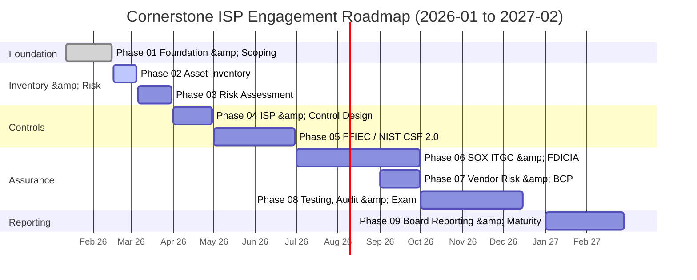
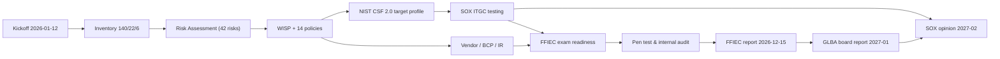

# 01.10 — Engagement Roadmap & Milestones

| Field | Value |
|---|---|
| Document ID | CCB-ISP-ROADMAP-2026-110 |
| Version | 1.0 |
| Date | 2026-06-15 |
| Classification | Confidential — Nonpublic Information (NPI) // Illustrative Portfolio Sample |
| Owner | Rachel Alvarez — CISO / Information Security Officer (ISO) |
| Author | Advisory Team (Financial-Services GRC) |
| Status | Approved |

## Purpose

This roadmap sequences the ~12-month Cornerstone Community Bank Information Security Program across the **nine phases** of the program, from kickoff on **2026-01-12** through the SOX §404 opinion on the FY2026 10-K in **2027-02**. It fixes the milestones, phase gates, and decision points that the Board / Audit Committee, executive sponsors, and external assurance providers use to track progress, and it aligns the internal work to the two hard external deadlines: the **FFIEC IT examination** (fieldwork **2026-11**, report **2026-12-15**) and the **SOX / FDICIA ICFR opinion** (**2027-02**).

## Roadmap Timeline

## Phase-to-Milestone Mapping

| Phase | Title | Window | Key deliverable | Gate / decision |
|---|---|---|---|---|
| 01 | Program Foundation & Regulatory Scoping | 2026-01 → 02 | Charter, register, scope, governance | Board endorsement of charter & scope |
| 02 | Information Asset Inventory & Data Classification | 2026-02 → 03 | 140-system inventory; 22 NPI classified | Inventory baseline approved |
| 03 | Risk Assessment (GLBA 501(b) + Inherent Risk) | 2026-03 | 42 risks (8 High, 18 Mod, 16 Low) | Risk acceptance / treatment decisions |
| 04 | Information Security Program & Control Design | 2026-04 | WISP + 14 core policies (board-approved) | Board approval of WISP |
| 05 | FFIEC Cybersecurity Assessment & NIST CSF 2.0 | 2026-05 → 06 | Current vs target profile; 28 gaps | Target profile ratified |
| 06 | SOX IT General Controls (ITGC) & FDICIA | 2026-07 → 09 | 48 key ITGCs tested; 3 deficiencies remediated | ITGC design/operating effectiveness sign-off |
| 07 | Third-Party / Vendor Risk & Business Continuity | 2026-09 | 85 vendors, 12 critical; BCP/DR + IR plan | Meridian enhanced-oversight approval |
| 08 | Independent Testing, Audit & Exam Readiness | 2026-10 → 12 | Pen test (14 findings); FFIEC exam Satisfactory | FFIEC report received 2026-12-15 |
| 09 | Board Reporting, Program Maturity & Improvement | 2027-01 → 02 | GLBA board report; SOX unqualified opinion | Annual GLBA report; ICFR effective |

## Key Milestones & Dates

| Milestone | Date | Owner | Dependency |
|---|---|---|---|
| Engagement kickoff | 2026-01-12 | Alvarez | Charter approval |
| Phase 01 foundation baselined | 2026-02-15 | Alvarez | Scope + governance set |
| Asset inventory baseline (140 / 22 / 6) | 2026-03-05 | Porter | Phase 01 close |
| GLBA §501(b) risk assessment complete | 2026-03-31 | Nakamura | Inventory baseline |
| WISP + 14 policies board-approved | 2026-04-30 | Alvarez | Risk assessment |
| NIST CSF 2.0 target profile ratified | 2026-06-30 | Alvarez | Maturity gap analysis |
| SOX ITGC testing window | 2026-07-01 → 09-30 | Barrett | Control design frozen |
| Vendor / BCP / DR / IR complete | 2026-09-30 | Nakamura | ITGC scoping |
| External penetration test | 2026-10 | Sharma / Redwood | Rules of engagement |
| Internal audit complete | 2026-11 | Sharma | Pen test remediation start |
| FFIEC IT exam fieldwork | 2026-11 | Alvarez | Exam-readiness gate |
| FFIEC IT exam report received | 2026-12-15 | Alvarez | Fieldwork close |
| Annual GLBA report to Board | 2027-01 | Alvarez | Program results consolidated |
| SOX §404 opinion (FY2026 10-K) | 2027-02 | Barrett / Whitmore | ITGC + ICFR effective |

## Critical Path & Dependencies

The **inventory → risk → WISP → CSF → ITGC → exam** chain is the critical path: any slippage in the asset inventory (Phase 02) cascades to the risk assessment population and ultimately to exam readiness. The two immovable anchors are the **FFIEC report date (2026-12-15)** and the **SOX opinion (2027-02)**; all internal milestones are back-planned from these.

## Governance Checkpoints

| Checkpoint | Audience | Timing |
|---|---|---|
| Charter & scope endorsement | Board / Audit Committee | 2026-01 |
| WISP approval | Board / Audit Committee | 2026-04 |
| Mid-program status | Executive steering | 2026-06 |
| Pre-exam readiness review | Executive + Audit Committee | 2026-10 |
| Exam results debrief | Board / Audit Committee | 2026-12 |
| Annual GLBA report | Board / Audit Committee | 2027-01 |

## Cross-References

- **01.08 — Scope, Assumptions & Constraints** — the timeline constraints driving this roadmap.
- **01.09 — Stakeholder Register** — owners referenced in the milestone table.
- **01.11 — Regulatory Obligations Calendar** — recurring obligations overlaid on this roadmap.
- **01.13 — Phase Summary & Transition** — closeout of Phase 01 into Phase 02.
- **Phases 02–09 READMEs** — detailed scope of each roadmap phase.

---

[⬅ Previous](01.09-stakeholder-register.md) · [🏠 Phase README](01.00-README.md) · [Next ➡](01.11-regulatory-obligations-calendar.md)
