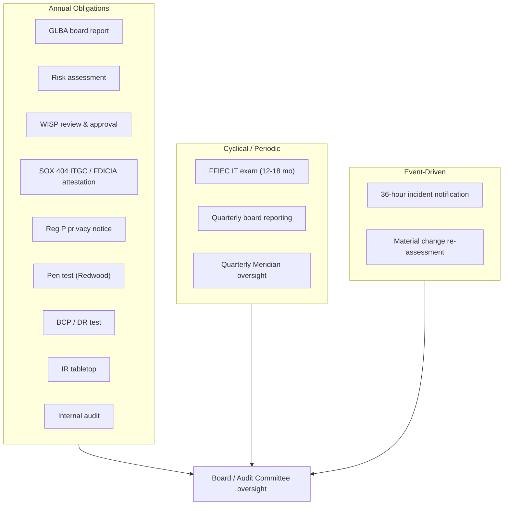

# 01.11 — Regulatory Obligations Calendar

| Field | Value |
|---|---|
| Document ID | CCB-ISP-REGCAL-2026-111 |
| Version | 1.0 |
| Date | 2026-06-15 |
| Classification | Confidential — Nonpublic Information (NPI) // Illustrative Portfolio Sample |
| Owner | Angela Foster — Chief Compliance Officer (Compliance/BSA) |
| Author | Advisory Team (Financial-Services GRC) |
| Status | Approved |

## Purpose

This calendar consolidates the **recurring regulatory and program obligations** that Cornerstone Community Bank must satisfy under GLBA §501(b) and the Interagency Safeguards Guidelines, Regulation P, the FFIEC IT Examination program, SOX §404, FDICIA Part 363, and the 2022 Computer-Security Incident Notification Rule. It gives Compliance, the CISO, and the Board a single authoritative view of **what is due, how often, who owns it, and when it is next due**, so that no statutory or supervisory deadline is missed across the ~12-month engagement and into steady-state operation.

The Bank answers to three regulators — the **FDIC** (primary federal), the **Ohio DFI** (state charter), and, through **Cornerstone Bancorp (Nasdaq: CCBK)**, the **SEC** — so obligations are tagged to their driver to keep multi-regulator coordination clean.

## Obligations Calendar

| # | Obligation | Driver | Frequency | Owner | Next due |
|---|---|---|---|---|---|
| 1 | Annual GLBA §501(b) board report on the information security program | Interagency Safeguards Guidelines | Annual | Alvarez (CISO) | 2027-01 |
| 2 | Annual information security risk assessment | GLBA §501(b); FFIEC; NIST SP 800-30 | Annual | Nakamura (CRO) | 2027-03 (next cycle) |
| 3 | WISP review, update & board approval | Interagency Safeguards | Annual | Alvarez (CISO) | 2027-04 |
| 4 | SOX §404 ITGC testing & ICFR assertion | SOX §404; FDICIA Part 363 | Annual | Barrett (CFO) | 2026-07 → 09 (opinion 2027-02) |
| 5 | FDICIA Part 363 management + external ICFR attestation | FDICIA Part 363 (≥$1B assets) | Annual | Barrett (CFO) | 2027-02 (with 10-K) |
| 6 | FFIEC IT examination cycle (safety & soundness) | FFIEC / FDIC / Ohio DFI | Exam cycle (12–18 mo, risk-based) | Alvarez (CISO) | Fieldwork 2026-11; report 2026-12-15 |
| 7 | Regulation P annual privacy notice to customers | GLBA Privacy Rule / Reg P | Annual | Ellis (Privacy Officer) | 2026 annual cycle |
| 8 | External penetration test & vulnerability assessment | FFIEC Audit; GLBA testing | Annual | Sharma / Redwood | 2026-10 |
| 9 | BCP / DR test (RTO/RPO validation) | FFIEC Business Continuity Mgmt | Annual | Nakamura (CRO) | 2026-09 |
| 10 | Incident response tabletop exercise | FFIEC Information Security | Annual | Alvarez (CISO) | 2026-09 |
| 11 | Service-provider (Meridian) SOC 1/2 review & oversight | Interagency Third-Party Guidance (2023) | Annual (+ on receipt) | Foster (Compliance) | On SOC report receipt; quarterly governance |
| 12 | Computer-Security Incident Notification (36-hour rule) | 2022 FDIC/OCC/Fed rule | As-needed (qualifying incident) | Alvarez (CISO) | Event-driven — within 36 hours |
| 13 | Board / Audit Committee cybersecurity reporting | Interagency Safeguards; FFIEC | Quarterly | Alvarez (CISO) | Next quarterly meeting |
| 14 | Internal audit of information security program | FFIEC Audit | Annual | Sharma (Internal Audit) | 2026-11 |

## Recurring Cadence Overview

## Frequency Summary

| Cadence | Obligations | Count |
|---|---|---|
| Annual | GLBA report, risk assessment, WISP, SOX/FDICIA, Reg P, pen test, BCP/DR, IR tabletop, internal audit | 9 |
| Quarterly | Board cyber reporting; Meridian oversight | 2 |
| Exam cycle | FFIEC IT examination | 1 |
| Event-driven | 36-hour incident notification; material-change reassessment | 2 |

## The 36-Hour Incident Notification Obligation

The 2022 Computer-Security Incident Notification Rule requires Cornerstone to notify its **primary federal regulator (the FDIC)** as soon as possible and **no later than 36 hours** after determining that a **"notification incident"** has occurred — a computer-security incident that has materially disrupted or degraded, or is reasonably likely to materially disrupt or degrade, the Bank's operations, ability to deliver services to a material portion of its customer base, or its business lines. Because core and digital banking run on Meridian's platform, a qualifying incident may originate at the service provider; Meridian is contractually required to notify Cornerstone promptly so the 36-hour clock can be met. The determination, notification, and downstream Ohio DFI / SEC coordination are governed by the escalation flow in **01.12**.

## Annual Cycle Timeline (Steady State)

Once the initial engagement concludes with the FY2026 SOX opinion in **2027-02**, the obligations settle into a repeating annual rhythm. The table below shows the steady-state month-by-month cadence used for forward planning.

| Month | Recurring obligation(s) |
|---|---|
| January | Annual GLBA §501(b) board report |
| February | SOX §404 / FDICIA ICFR attestation (with 10-K) |
| March | Annual information security risk assessment |
| April | WISP review & board approval |
| May–June | FFIEC / NIST CSF 2.0 maturity refresh |
| July–September | SOX ITGC testing window |
| September | BCP/DR test; IR tabletop |
| October | External penetration test (Redwood) |
| November | Internal audit; FFIEC exam support (per cycle) |
| Ongoing | Reg P notices; quarterly board & Meridian oversight; 36-hour rule (event-driven) |

## Escalation Triggers for Missed or At-Risk Obligations

| Trigger | Threshold | Escalates to |
|---|---|---|
| Obligation at risk of slipping | 30 days before due | CISO / Compliance |
| Obligation overdue | Past due date | Executive sponsor + Audit Committee Chair |
| Regulatory filing deadline (36-hour) | Real-time | CISO + Counsel + CEO/President |
| Repeat exam finding | On identification | Board / Audit Committee |

Compliance (Foster) maintains the live tracker and reports obligation status in the quarterly board pack, with any red items escalated per the thresholds above and the communications plan in 01.12.

## Ownership & Regulator Map

| Regulator | Obligations owned/coordinated | Primary internal contact |
|---|---|---|
| FDIC (primary federal) | FFIEC IT exam; 36-hour notice; safety & soundness | Alvarez (CISO) |
| Ohio DFI (state charter) | State supervision; coordinated exam | Foster (Compliance) |
| SEC (via Bancorp CCBK) | SOX §404 / ICFR disclosure in 10-K | Barrett (CFO) |

## Cross-References

- **01.08 — Scope, Assumptions & Constraints** — the drivers behind these obligations.
- **01.10 — Engagement Roadmap & Milestones** — obligations overlaid on the engagement timeline.
- **01.12 — Communications & Escalation Plan** — the 36-hour notification flow and reporting cadences.
- **Phase 06 — SOX ITGC & FDICIA** — annual ICFR obligation detail.
- **Phase 07 — Third-Party / Vendor Risk** — Meridian SOC and oversight obligations.
- **Phase 09 — Board Reporting** — annual GLBA report production.

---

[⬅ Previous](01.10-engagement-roadmap-and-milestones.md) · [🏠 Phase README](01.00-README.md) · [Next ➡](01.12-communications-and-escalation-plan.md)
