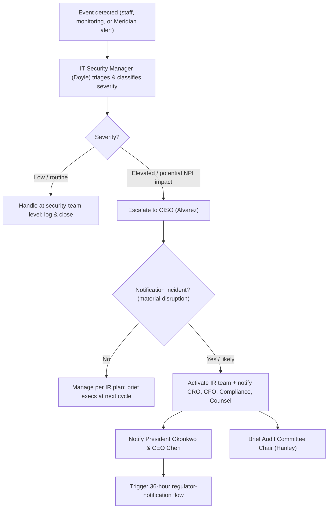
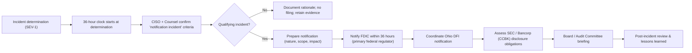

# 01.12 — Communications & Escalation Plan

| Field | Value |
|---|---|
| Document ID | CCB-ISP-COMMS-2026-112 |
| Version | 1.0 |
| Date | 2026-06-15 |
| Classification | Confidential — Nonpublic Information (NPI) // Illustrative Portfolio Sample |
| Owner | Rachel Alvarez — CISO / Information Security Officer (ISO) |
| Author | Advisory Team (Financial-Services GRC) |
| Status | Approved |

## Purpose

This plan defines how information about the Cornerstone Community Bank Information Security Program flows — routine reporting cadences to the Board, executives, and steering committee; the internal **incident escalation path**; and the **36-hour regulator-notification flow** required by the 2022 Computer-Security Incident Notification Rule. It ensures the right people receive the right information at the right time, that decisions escalate to the appropriate authority, and that statutory notification deadlines are met even when an incident originates at the outsourced core provider, **Meridian Core Services, LLC**.

## Reporting Cadences

| Forum | Audience | Owner | Frequency | Content |
|---|---|---|---|---|
| Board / Audit Committee report | Directors; Hanley (Chair) | Alvarez | Quarterly + annual GLBA report | Program status, risk posture, exam/audit results, incidents |
| Executive briefing | CEO Chen, President Okonkwo, CIO Porter, CRO Nakamura, CFO Barrett, Compliance Foster | Alvarez | Monthly | Milestones, risks, decisions needed |
| Program steering committee | Executive sponsors + delivery leads | Alvarez / Doyle | Monthly | Phase progress, dependencies, issues |
| Delivery working session | CISO team, Doyle, Advisory Team | Doyle | Weekly | Tasks, evidence, blockers |
| Vendor governance (Meridian) | Foster, Nakamura, Meridian | Foster | Quarterly + issue-driven | SLAs, SOC reports, incidents, CUECs |
| External assurance sync | Whitmore (SOX), Redwood (pen test), Sharma | Alvarez / Sharma | Per phase / window | Scope, evidence, findings, remediation |

## Communication Channels & Classification

| Channel | Use | Classification handling |
|---|---|---|
| Governance report pack | Board / committee reporting | Confidential — NPI; distribution-controlled |
| Executive memo / dashboard | Monthly status | Confidential; internal only |
| Secure email / portal | Working documents, evidence | NPI masked; encrypted in transit |
| Incident bridge (voice + secure chat) | Active incident coordination | Restricted to responders + counsel |
| Regulator correspondence | FDIC / Ohio DFI notices | Formal, legal-reviewed, logged |

## Internal Incident Escalation Path

## Escalation Severity & Authority

| Severity | Definition | Escalates to | Decision authority |
|---|---|---|---|
| SEV-3 (Low) | No NPI impact; routine | Security team (Doyle) | IT Security Manager |
| SEV-2 (Elevated) | Potential NPI or service impact | CISO (Alvarez) | CISO |
| SEV-1 (Major) | Confirmed / likely material disruption; possible notification incident | Executives + Counsel + Board Chair | CISO + CEO/President |
| Regulatory | Qualifying "notification incident" | FDIC (36-hour); Ohio DFI; SEC coordination | CEO/President + Counsel |

## The 36-Hour Regulator-Notification Flow

Key points of the flow:

- **Clock trigger.** The 36-hour period begins when the Bank *determines* a notification incident has occurred — not at first detection. The CISO, supported by Counsel, makes and documents the determination.
- **Meridian dependency.** Because core and digital banking are outsourced, Meridian is contractually obligated to notify Cornerstone promptly of incidents affecting the Bank so the Bank can meet its own 36-hour obligation.
- **Multi-regulator sequencing.** The FDIC (primary federal) is notified first within the 36-hour window; Ohio DFI is coordinated in parallel; SEC / holding-company disclosure is assessed for materiality via the Bancorp (CCBK) reporting process.
- **Documentation.** Every determination — including *non-*qualifying ones — is documented with rationale and evidence retained.

## Roles in Communications & Escalation

| Role | Responsibility |
|---|---|
| Alvarez (CISO) | Owns incident classification, determination, and regulator notification |
| Doyle (IT Security Manager) | First-line triage, severity assignment, evidence capture |
| Nakamura (CRO) | Enterprise risk impact; board risk messaging |
| Foster (Compliance) | Regulatory notification content; Ohio DFI coordination |
| Barrett (CFO) | SEC / ICFR materiality; disclosure assessment |
| Okonkwo (President) / Chen (CEO) | Executive decisions; external stakeholder posture |
| Hanley (Audit Committee Chair) | Board oversight; receives major-incident briefings |
| Ellis (Privacy Officer) | Customer notification assessment where NPI is implicated |

## Customer & External Communications

Where an incident implicates customer NPI, the Privacy Officer (Ellis) and Compliance (Foster) assess customer-notification obligations under applicable state breach-notification law and GLBA interagency guidance, coordinated with the regulator notifications above. External statements (press, customers, counterparties) are controlled by the President/CEO with Counsel; no responder communicates externally without authorization. All external communications are logged with timestamps to support the post-incident review and any examiner inquiry.

| Audience | Trigger | Owner | Timing |
|---|---|---|---|
| Affected customers | Confirmed NPI compromise | Ellis / Foster | Per applicable breach law |
| FDIC (primary federal) | Notification incident | Alvarez | Within 36 hours |
| Ohio DFI | Notification incident | Foster | Coordinated with FDIC |
| SEC / market (via CCBK) | Material to Bancorp | Barrett / Counsel | Per disclosure rules |
| Media / public | Executive decision | CEO / President | As authorized |

## Communication Governance & Testing

The escalation and notification paths in this plan are validated annually through the incident-response **tabletop exercise** (Phase 08) and reviewed after any live incident in the post-incident review. Updates to contact rosters, regulator points of contact, and Meridian notification clauses are maintained by the CISO's office and reconciled against the obligations calendar (01.11) each quarter, ensuring the plan remains current for the FFIEC examination and SOX assurance cycles.

## Cross-References

- **01.09 — Stakeholder Register** — the audiences and owners referenced here.
- **01.10 — Engagement Roadmap & Milestones** — governance checkpoints feeding these cadences.
- **01.11 — Regulatory Obligations Calendar** — the 36-hour rule and reporting obligations.
- **Phase 07 — Third-Party / Vendor Risk & Business Continuity** — Meridian notification clauses; IR plan.
- **Phase 08 — Independent Testing** — tabletop exercises validating this escalation path.
- **Phase 09 — Board Reporting** — annual GLBA report and incident summaries.

---

[⬅ Previous](01.11-regulatory-obligations-calendar.md) · [🏠 Phase README](01.00-README.md) · [Next ➡](01.13-phase-summary-and-transition.md)
