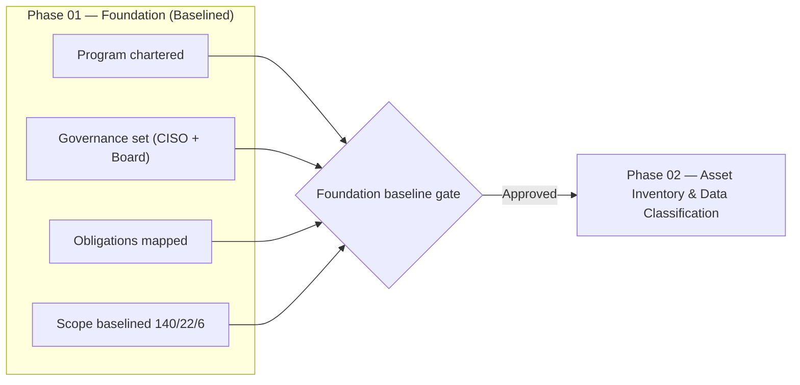

# 01.13 — Phase Summary & Transition

| Field | Value |
|---|---|
| Document ID | CCB-ISP-PHASE01-2026-113 |
| Version | 1.0 |
| Date | 2026-06-15 |
| Classification | Confidential — Nonpublic Information (NPI) // Illustrative Portfolio Sample |
| Owner | Rachel Alvarez — CISO / Information Security Officer (ISO) |
| Author | Advisory Team (Financial-Services GRC) |
| Status | Approved |

## Purpose

This document closes out **Phase 01 — Program Foundation & Regulatory Scoping** of the Cornerstone Community Bank Information Security Program. It recaps the outcomes of the phase, confirms that the program foundation is **baselined**, and formally hands off to **Phase 02 — Information Asset Inventory & Data Classification**. It gives the Board / Audit Committee, executive sponsors, and the FFIEC / SOX assurance providers a documented record that the program is chartered, its governance is set, its regulatory obligations are mapped, and its scope is baselined against the enterprise population of **140 systems (22 NPI, 6 SOX-significant)**.

## Phase 01 Outcomes

| Outcome | Status | Evidence (Phase 01 documents) |
|---|---|---|
| Program chartered with executive & board sponsorship | Complete | 01.01–01.03 charter & mandate |
| Regulatory & framework register established | Complete | 01.04–01.06 register (GLBA, FFIEC, NIST CSF 2.0, SOX, FDICIA) |
| Governance & board oversight structure defined | Complete | 01.07 CISO & board oversight |
| Scope baselined (in/out; Meridian boundary) | Complete | 01.08 scope, assumptions & constraints |
| Stakeholders identified & engagement approach set | Complete | 01.09 stakeholder register |
| 12-month roadmap & milestones sequenced | Complete | 01.10 engagement roadmap |
| Regulatory obligations calendar mapped | Complete | 01.11 obligations calendar |
| Communications & escalation (incl. 36-hour) defined | Complete | 01.12 communications & escalation plan |

## Foundation Baseline Confirmation

The four foundation pillars — **chartered program, established governance, mapped obligations, and baselined scope** — are confirmed complete. The foundation baseline gate is **approved**, authorizing transition to Phase 02.

## Baseline Metrics Carried Forward

| Metric | Value | Consumed by |
|---|---|---|
| Total systems in enterprise inventory | 140 | Phase 02 (inventory), Phase 03 (risk population) |
| NPI-bearing systems | 22 | Phase 02 classification; GLBA risk assessment |
| SOX / ITGC-significant systems | 6 | Phase 06 ITGC scoping |
| Outsourced core / digital provider | Meridian Core Services, LLC | Phase 07 vendor risk |
| Reliance basis | SOC 1 Type II / SOC 2 Type II | Phases 06–07 |
| Regulators | FDIC, Ohio DFI, SEC (via CCBK) | All phases |
| Engagement window | 2026-01-12 → 2027-02 | Roadmap 01.10 |

## Open Items into Phase 02

| ID | Item | Owner | Target |
|---|---|---|---|
| T-01 | Reconcile and validate the 140-system inventory to source-of-record | Porter (CIO) | Phase 02 (2026-03-05) |
| T-02 | Confirm the 22 NPI systems via data-flow mapping | Ellis / Alvarez | Phase 02 |
| T-03 | Confirm the 6 SOX-significant systems with CFO / auditor | Barrett / Whitmore | Phase 02 → 06 |
| T-04 | Validate Meridian CUECs against SOC reports | Foster | Phase 02 → 07 |
| T-05 | Stand up data-classification scheme (NPI tiers) | Alvarez | Phase 02 |

## Lessons & Observations from Phase 01

| Observation | Implication for later phases |
|---|---|
| Multi-regulator environment (FDIC, Ohio DFI, SEC) requires coordinated messaging | Single obligations calendar and comms plan prevent conflicting notifications |
| Heavy reliance on Meridian concentrates outsourcing risk | Phase 07 enhanced oversight and CUEC validation are pivotal |
| SOX and GLBA populations overlap but are not identical | Careful scoping in Phase 02/06 avoids over- or under-testing |
| Immovable exam (2026-12-15) and SOX (2027-02) dates | Back-planning discipline must hold across all phases |
| Lean internal security team | Advisory augmentation and prioritization by inherent risk are essential |

## Phase 01 Deliverable Register

| Doc | Title | Status |
|---|---|---|
| 01.07 | CISO & Board Oversight Structure | Approved |
| 01.08 | Scope, Assumptions & Constraints | Approved |
| 01.09 | Stakeholder Register | Approved |
| 01.10 | Engagement Roadmap & Milestones | Approved |
| 01.11 | Regulatory Obligations Calendar | Approved |
| 01.12 | Communications & Escalation Plan | Approved |
| 01.13 | Phase Summary & Transition | Approved |

## Sign-Off

| Role | Name | Decision |
|---|---|---|
| CISO / ISO (program owner) | Rachel Alvarez | Foundation baselined — approved |
| CRO | Steven Nakamura | Risk governance concurrence |
| Chief Compliance Officer | Angela Foster | Obligations mapped — concur |
| Audit Committee Chair | Robert Hanley | Board oversight acknowledged |

## Transition to Phase 02

Phase 02 operationalizes the scope baselined here by building the **Information Asset Inventory** and applying a **data-classification scheme** that identifies and tiers NPI across the 140-system population. The scoped counts (140 / 22 / 6), the Meridian reliance boundary, the stakeholder owners, and the obligations calendar all flow directly into Phase 02 as inputs. On completion of the inventory baseline, Phase 03 (Risk Assessment) consumes the classified population to identify and rate risks.

| Handoff element | From Phase 01 | To Phase 02 |
|---|---|---|
| System population | Scope baseline (01.08) | Detailed inventory records |
| NPI identification | 22 systems (scope) | Data-flow-validated classification |
| Ownership | Stakeholder register (01.09) | Asset owners assigned |
| Obligations | Calendar (01.11) | Inventory-driven safeguards mapping |

## Cross-References

- **01.00 — Phase README** — Phase 01 overview and document index.
- **01.08 — Scope, Assumptions & Constraints** — the scope baseline confirmed here.
- **01.09 — Stakeholder Register** — owners of the open transition items.
- **01.10 — Engagement Roadmap & Milestones** — phase sequencing and gate.
- **01.11 — Regulatory Obligations Calendar** — obligations carried into steady state.
- **Phase 02 — Information Asset Inventory & Data Classification** — the receiving phase.

---

[⬅ Previous](01.12-communications-and-escalation-plan.md) · [🏠 Phase README](01.00-README.md) · [Next ➡](../02-asset-inventory-data-classification/02.00-README.md)
