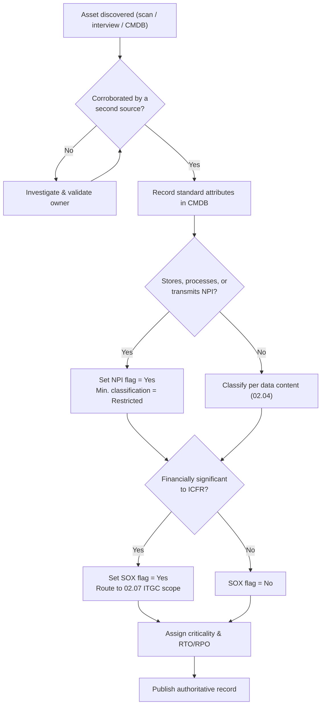

# 02.01 — Asset Inventory Methodology

| Field | Value |
|---|---|
| Document ID | CCB-INV-METH-2026-201 |
| Version | 1.0 |
| Date | 2026-06-15 |
| Classification | Confidential — Nonpublic Information (NPI) // Illustrative Portfolio Sample |
| Owner | Marcus Doyle, IT Security Manager |
| Author | Advisory Team (Financial-Services GRC) |
| Status | Approved |

## Purpose

This document defines the methodology Cornerstone Community Bank ("Cornerstone," "the Bank") uses to discover, catalogue, classify, and maintain its inventory of information assets, systems, and applications. A complete and accurate asset inventory is the foundation of the GLBA §501(b) information security program: the Bank cannot protect Nonpublic Personal Information (NPI), scope its risk assessment, or design proportionate safeguards without knowing what assets exist, who owns them, where they live, and what data they hold.

The methodology aligns to the **NIST CSF 2.0 Identify (ID)** function — principally the **Asset Management (ID.AM)** category — and to the **FFIEC IT Examination Handbook** (Information Security and Architecture, Infrastructure & Operations booklets). It supports downstream Phase 03 risk assessment scoping, Phase 04 control design, and Phase 06 SOX ITGC system identification.

## Scope

The inventory covers all information assets and technology components that store, process, or transmit Cornerstone data, whether hosted on-premises, in the cloud, or by a third party. As of this baseline the enterprise inventory contains **140 systems**, of which **22 systems handle NPI** and **6 systems are financially significant** (SOX ITGC in-scope). Core banking and digital banking are outsourced to **Meridian Core Services, LLC**; Meridian-hosted components are inventoried as logical assets with the service provider recorded as custodian.

| In scope | Out of scope |
|---|---|
| Business applications and databases | Personal devices without Bank data (BYOD not enrolled) |
| Servers, endpoints, network devices | Consumer-owned customer devices |
| Cloud/SaaS services (M365, IAM, EDR/SIEM) | Physical facilities (tracked in facilities register) |
| Third-party hosted systems (Meridian core, digital banking) | Ephemeral non-persistent test data with no NPI |
| Information asset categories (records, files, data stores) | Marketing collateral already published as Public |

## Discovery and Cataloguing Approach

Cornerstone uses a layered, multi-source discovery method so that no single technique becomes a single point of failure. Assets identified by one method are corroborated by at least one other before the record is marked authoritative.

| Method | Description | Primary use |
|---|---|---|
| CMDB reconciliation | The configuration management database is the authoritative register; all sources reconcile to it | System of record |
| Automated discovery scans | Network discovery, vulnerability scanner asset feed, and EDR agent census identify live hosts and installed software | Endpoints, servers, network devices |
| Cloud & SaaS enumeration | Microsoft 365 admin center, IAM directory, and cloud tenant APIs enumerate SaaS tenants and identities | Cloud/SaaS |
| Business process interviews | Structured interviews with department heads and data owners surface shadow applications and manual data stores | Information assets, spreadsheets, third-party portals |
| Contract & vendor register review | Third-party contracts and the vendor inventory identify externally hosted systems | Outsourced systems (Meridian) |
| Data-flow mapping | Tracing NPI collection-to-disposal (Doc 02.05) validates which systems touch NPI | NPI flag validation |

## Attributes Tracked per Asset

Each system record in the CMDB carries a standard attribute set. The attributes drive risk scoping, classification, and control applicability.

| Attribute | Description | Example |
|---|---|---|
| Asset ID | Unique CMDB identifier | SYS-0007 |
| Asset / system name | Common name | Loan Origination System (LOS) |
| Business owner | Accountable business executive | VP Lending |
| IT custodian | Technical steward operating the asset | IT Infrastructure / Meridian |
| Data classification | Highest tier of data held (per 02.04) | Restricted / NPI |
| Hosting model | On-premises, cloud/SaaS, or vendor-hosted | Vendor-hosted (Meridian) |
| Business criticality | Critical / High / Medium / Low, tied to RTO/RPO | Critical |
| NPI flag | Whether the asset stores/processes/transmits NPI | Yes |
| SOX flag | Whether the asset is financially significant (ITGC in-scope) | Yes |
| Authentication model | SSO/IAM-federated, local, or MFA-gated | IAM-federated + MFA |
| Environment | Production, DR, test/UAT | Production |
| Lifecycle status | Active, planned, decommissioning, retired | Active |

## Criticality and Flagging Logic

Business criticality is assigned from recovery objectives and customer/financial impact; NPI and SOX flags are assigned from data content and financial-reporting relevance respectively. These flags determine which systems are pulled into the NPI mapping (02.05) and SOX significant-systems identification (02.07).

## Refresh Cadence and Governance

The inventory is a living register, not a point-in-time snapshot. Maintenance is driven by both scheduled reviews and event triggers.

| Activity | Cadence | Responsible |
|---|---|---|
| Automated discovery scan reconciliation | Weekly | IT Security (Marcus Doyle) |
| Data-owner attestation of departmental assets | Quarterly | Business owners |
| Full inventory review and completeness attestation | Annual | CISO (Rachel Alvarez) |
| Event-driven update (new system, decommission, M&A, vendor change) | On change (via change management) | IT custodian |
| NPI/SOX flag re-validation | Annual and on material change | IT Security + Internal Audit |

Change management is the primary event trigger: no system may enter production, and no system may be retired, without a corresponding CMDB record update. Internal Audit (Priya Sharma) independently samples the inventory during the annual audit to validate completeness and accuracy.

## Alignment to NIST CSF 2.0 — Identify (Asset Management)

| CSF 2.0 Subcategory | How Cornerstone satisfies it |
|---|---|
| ID.AM-01 — Hardware inventoried | Discovery scans + EDR agent census reconciled to CMDB |
| ID.AM-02 — Software/platform inventoried | Software census from EDR and SaaS enumeration |
| ID.AM-03 — Data flows mapped | NPI data-flow mapping (02.05) |
| ID.AM-04 — Services from suppliers inventoried | Vendor register; Meridian recorded as custodian |
| ID.AM-05 — Assets prioritized by criticality | Criticality tiers with RTO/RPO |
| ID.AM-07 — Data classified | Four-tier scheme (02.04) applied to every asset |
| ID.AM-08 — Assets managed through lifecycle | Lifecycle status field + decommissioning workflow |

## Cross-References

- **02.00-README.md** — Phase 02 overview and objectives.
- **02.02-information-asset-inventory.md** — the enterprise information-asset inventory produced by this methodology.
- **02.03-system-and-application-inventory.md** — the 140-system catalogue.
- **02.04-data-classification-scheme.md** — the classification tiers referenced by the NPI flag.
- **02.05-npi-data-mapping-and-flows.md** — NPI validation feeding the NPI flag.
- **02.07-sox-significant-systems-identification.md** — SOX flag downstream consumer.
- **Phase 03 — Risk Assessment** — consumes the inventory to scope GLBA §501(b) risks.
- **Phase 06 — SOX ITGC & FDICIA** — consumes SOX-flagged systems.

---

[⬅ Previous](02.00-README.md) · [🏠 Phase README](02.00-README.md) · [Next ➡](02.02-information-asset-inventory.md)
