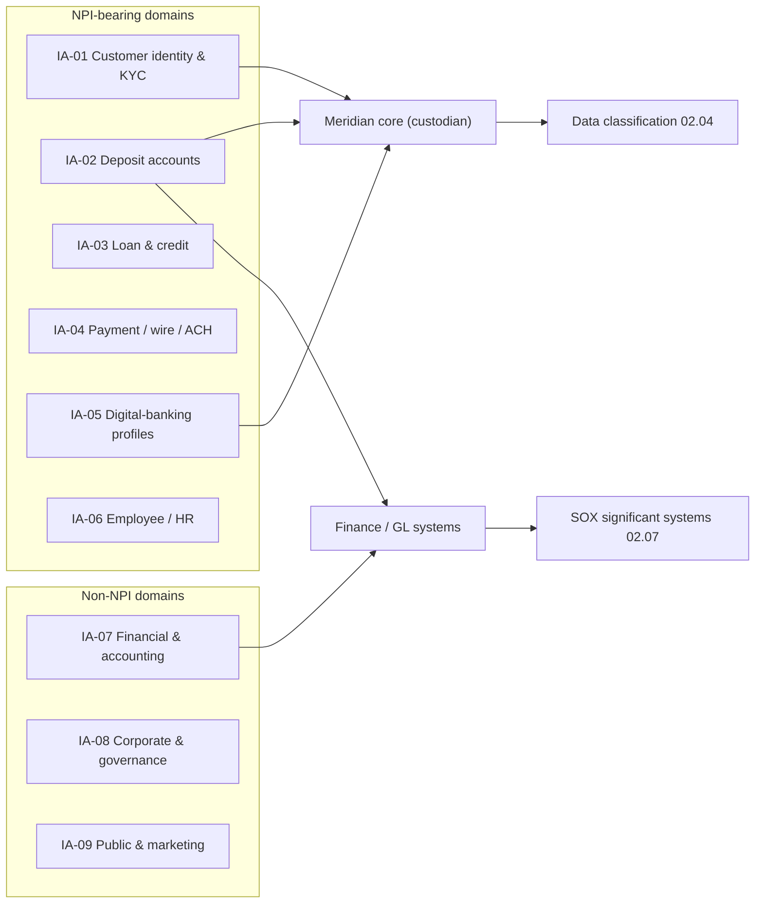

# 02.02 — Information Asset Inventory

| Field | Value |
|---|---|
| Document ID | CCB-INV-INFO-2026-202 |
| Version | 1.0 |
| Date | 2026-06-15 |
| Classification | Confidential — Nonpublic Information (NPI) // Illustrative Portfolio Sample |
| Owner | Marcus Doyle, IT Security Manager |
| Author | Advisory Team (Financial-Services GRC) |
| Status | Approved |

## Purpose

This document presents Cornerstone Community Bank's enterprise **information-asset inventory** — the catalogue of the categories of information the Bank creates, receives, stores, and transmits, independent of the specific systems that host them. Where Doc 02.03 inventories *systems and applications*, this document inventories the *information itself*: the data domains, their owners, their classification, and where they live.

The information-asset view is required so that GLBA NPI can be protected at the data level regardless of platform, so that Regulation P sharing categories map to real data domains, and so that data classification (02.04) and NPI flows (02.05) have a clear subject to describe. It supports NIST CSF 2.0 **ID.AM-03 (data flows)** and **ID.AM-07 (data classified)**.

## Information Asset Taxonomy

Cornerstone organizes its information into nine enterprise data domains. Each domain has a single accountable business owner (data owner) and a highest-classification tier that governs its handling.

| Domain ID | Information asset category | Description | Data owner | Highest classification | Contains NPI |
|---|---|---|---|---|---|
| IA-01 | Customer identity & KYC records | Names, SSN/TIN, DOB, addresses, government IDs, CIP/CDD documentation | Chief Compliance Officer (Angela Foster) | Restricted / NPI | Yes |
| IA-02 | Deposit account data | Account numbers, balances, transaction history, statements | President, Bank (David Okonkwo) | Restricted / NPI | Yes |
| IA-03 | Loan & credit data | Applications, credit reports, underwriting, collateral, payment history | VP Lending | Restricted / NPI | Yes |
| IA-04 | Payment & wire/ACH data | Wire instructions, ACH files, originator/beneficiary details | Treasury / Operations | Restricted / NPI | Yes |
| IA-05 | Digital-banking credentials & profiles | Enrolled-user credentials, MFA data, device profiles, e-consent | CIO (James Porter) | Restricted / NPI | Yes |
| IA-06 | Employee & HR records | Personnel files, payroll, benefits, background checks | HR Director | Restricted / NPI | Yes (employee) |
| IA-07 | Financial & accounting records | General ledger, financial statements, ICFR evidence, regulatory reports | CFO (Linda Barrett) | Confidential | No (SOX-relevant) |
| IA-08 | Corporate & governance records | Board minutes, policies, contracts, risk & audit workpapers | CRO (Steven Nakamura) | Confidential | No |
| IA-09 | Public & marketing information | Published rates, marketing collateral, website content, press releases | Marketing | Public | No |

## Ownership and Custodianship Model

Data ownership is separated from custodianship. The **data owner** is the accountable business executive who authorizes access and classification; the **custodian** operates the storage and applies technical controls. For outsourced domains, Meridian Core Services is the custodian while the Bank retains ownership and accountability.

| Domain | Data owner (accountable) | Primary custodian (operational) |
|---|---|---|
| IA-01 Customer identity & KYC | Chief Compliance Officer | Meridian Core Services / IT |
| IA-02 Deposit account data | President, Bank | Meridian Core Services |
| IA-03 Loan & credit data | VP Lending | Loan Origination System custodian / IT |
| IA-04 Payment & wire/ACH data | Treasury / Operations | Wire & ACH platform custodians |
| IA-05 Digital-banking profiles | CIO | Meridian digital-banking platform |
| IA-06 Employee & HR records | HR Director | HRIS custodian / IT |
| IA-07 Financial & accounting records | CFO | Finance systems custodian / IT |
| IA-08 Corporate & governance records | CRO | IT / M365 |
| IA-09 Public & marketing | Marketing | Web/CMS custodian |

## Inventory Summary and Counts

The information domains are realized across the enterprise's 140 systems. The table summarizes the concentration of NPI and financial-reporting relevance by domain, which drives the downstream NPI mapping (02.05) and SOX scoping (02.07).

| Metric | Count |
|---|---|
| Enterprise information domains | 9 |
| Domains containing NPI | 6 (IA-01 through IA-06) |
| Domains that are SOX/ICFR-relevant | 3 (IA-02, IA-04, IA-07) |
| Total systems in enterprise inventory | 140 |
| Systems handling NPI | 22 |
| Financially significant (SOX) systems | 6 |
| Retail & small-business customers represented | ~85,000 |
| Enrolled digital-banking users represented | ~62,000 |

## Retention and Disposal Linkage

Each information domain is subject to a retention schedule owned by the data owner and enforced by the custodian. Records are disposed under NIST SP 800-88 media-sanitization standards when their retention period expires. Retention specifics for regulatory records (BSA/AML, Reg P, financial reporting) are governed by the Bank's records-retention policy referenced in Phase 04.

| Domain | Illustrative retention driver | Disposal standard |
|---|---|---|
| IA-01 Customer identity & KYC | BSA/CIP — 5 years after account closure | NIST SP 800-88 |
| IA-02 / IA-03 Account & loan data | Regulatory + loan-life retention | NIST SP 800-88 |
| IA-04 Payment / wire / ACH | Payments recordkeeping rules | NIST SP 800-88 |
| IA-07 Financial & accounting | SOX/FDICIA evidence retention (7 years) | NIST SP 800-88 |
| IA-09 Public & marketing | No NPI; standard business retention | Standard deletion |

## Cross-References

- **02.01-asset-inventory-methodology.md** — how these assets were discovered and catalogued.
- **02.03-system-and-application-inventory.md** — the systems that realize these information domains.
- **02.04-data-classification-scheme.md** — the classification tiers assigned to each domain.
- **02.05-npi-data-mapping-and-flows.md** — where NPI domains flow across systems.
- **02.07-sox-significant-systems-identification.md** — SOX-relevant domains (IA-02, IA-04, IA-07).
- **Phase 04 — Information Security Program** — records-retention and handling policies.

---

[⬅ Previous](02.01-asset-inventory-methodology.md) · [🏠 Phase README](02.00-README.md) · [Next ➡](02.03-system-and-application-inventory.md)
