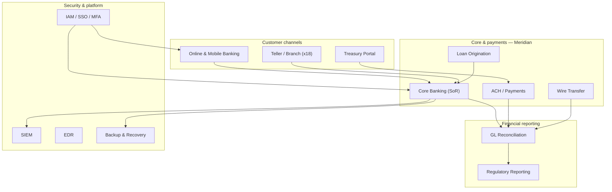

# 02.03 — System and Application Inventory

| Field | Value |
|---|---|
| Document ID | CCB-INV-SYS-2026-203 |
| Version | 1.0 |
| Date | 2026-06-15 |
| Classification | Confidential — Nonpublic Information (NPI) // Illustrative Portfolio Sample |
| Owner | James Porter, Chief Information Officer |
| Author | Advisory Team (Financial-Services GRC) |
| Status | Approved |

## Purpose

This document presents a representative catalogue of Cornerstone Community Bank's enterprise system and application inventory. The full inventory contains **140 systems**; of these, **22 handle NPI** and **6 are financially significant** (SOX ITGC in-scope). The systems below are the material, customer-facing, and financially significant platforms; the remaining entries are lower-criticality supporting utilities (departmental tools, print/mail, monitoring agents, and infrastructure services) summarized in the profile section.

The catalogue provides the authoritative source for Phase 03 risk scoping, Phase 06 SOX ITGC identification, and Phase 07 third-party risk. Core banking and digital banking are outsourced to **Meridian Core Services, LLC** (SOC 1 Type II and SOC 2 Type II reports on file), which is recorded as custodian for its hosted systems.

## Legend

| Field | Values |
|---|---|
| Hosting | Vendor (Meridian), Vendor (other SaaS), On-prem, Hybrid |
| Criticality | Critical, High, Medium, Low |
| NPI? | Yes / No — stores, processes, or transmits NPI |
| SOX? | Yes / No — financially significant (ITGC in-scope) |

## Representative System Catalogue

| Sys ID | System / application | Function | Hosting | Criticality | NPI? | SOX? |
|---|---|---|---|---|---|---|
| SYS-0001 | Meridian Core Banking Platform | System of record — deposits, loans, GL posting | Vendor (Meridian) | Critical | Yes | Yes |
| SYS-0002 | Online Banking (Meridian digital) | Retail internet banking | Vendor (Meridian) | Critical | Yes | No |
| SYS-0003 | Mobile Banking App | Mobile channel | Vendor (Meridian) | Critical | Yes | No |
| SYS-0004 | Loan Origination System (LOS) | Consumer/commercial loan origination & underwriting | Hybrid | High | Yes | Yes |
| SYS-0005 | Wire Transfer Platform | Domestic/international wire origination | Vendor (SaaS) | Critical | Yes | Yes |
| SYS-0006 | ACH / Payments Processing | ACH origination & receipt, NACHA files | Vendor (Meridian) | Critical | Yes | Yes |
| SYS-0007 | Treasury Management Portal | Commercial cash management, positive pay | Vendor (SaaS) | High | Yes | No |
| SYS-0008 | GL Reconciliation & Certification | Account reconciliation, ICFR certification | On-prem | High | No | Yes |
| SYS-0009 | Financial Reporting / Regulatory (Call Report) | Financial close & regulatory reporting | On-prem | High | No | Yes |
| SYS-0010 | Microsoft 365 (Exchange, SharePoint, Teams) | Email, files, collaboration | Vendor (SaaS) | High | Yes | No |
| SYS-0011 | Identity & Access Management (IAM/SSO) | Directory, SSO, MFA, provisioning | Hybrid | Critical | Yes | Yes |
| SYS-0012 | EDR / Endpoint Protection | Endpoint detection & response | Vendor (SaaS) | High | No | No |
| SYS-0013 | SIEM / Log Management | Security monitoring & correlation | Hybrid | High | Yes | No |
| SYS-0014 | Enterprise Backup & Recovery | Backup, immutable copies, restore | On-prem | Critical | Yes | No |
| SYS-0015 | Teller / Branch Platform | Teller transactions at 18 branches | Hybrid | Critical | Yes | No |
| SYS-0016 | Card Management / Debit Processing | Debit card issuance & authorization | Vendor (SaaS) | High | Yes | No |
| SYS-0017 | BSA/AML & Fraud Monitoring | Transaction monitoring, SAR case management | Vendor (SaaS) | High | Yes | No |
| SYS-0018 | Document Imaging / ECM | Imaged loan & account documents | On-prem | Medium | Yes | No |
| SYS-0019 | CRM / Customer Onboarding | Customer relationship & onboarding | Vendor (SaaS) | Medium | Yes | No |
| SYS-0020 | HRIS / Payroll | Employee records & payroll | Vendor (SaaS) | Medium | Yes | No |
| SYS-0021 | Vulnerability Management Scanner | Scanning & asset feed | On-prem | Medium | No | No |
| SYS-0022 | Network Firewalls / IPS | Perimeter & segmentation enforcement | On-prem | Critical | No | No |

## SOX-Significant Systems (Preview)

Six systems are financially significant and carry the SOX flag. They are identified here and formally scoped in Doc 02.07.

| Sys ID | System | Financial-reporting relevance |
|---|---|---|
| SYS-0001 | Meridian Core Banking | System of record; GL posting; SOC 1 reliance |
| SYS-0004 | Loan Origination System | Loan balances feeding the GL |
| SYS-0005 | Wire Transfer Platform | Cash movement; completeness/accuracy |
| SYS-0006 | ACH / Payments | Cash movement; NACHA processing |
| SYS-0008 | GL Reconciliation & Certification | Reconciliation controls over ICFR |
| SYS-0011 | IAM / SSO | Access-to-programs-and-data ITGC foundation |

## Inventory Profile (140 Systems)

The catalogue above lists the 22 material systems by name. The remaining ~118 systems are lower-criticality supporting components. The profile below characterizes the full population.

| Category | Approx. count | NPI-bearing | Notes |
|---|---|---|---|
| Customer-facing / channel systems | 8 | 8 | Online, mobile, teller, card, treasury |
| Core & payments (system of record + rails) | 6 | 6 | Meridian core, ACH, wire, LOS, treasury, card |
| Financial & reporting systems | 5 | 0 | GL, reconciliation, reporting, close |
| Security & IAM tooling | 10 | 3 | IAM, EDR, SIEM, scanner, firewalls, backup |
| Enterprise productivity (M365, ECM, CRM, HRIS) | 12 | 6 | Some NPI in mail/files/HR |
| Infrastructure & network services | 45 | 0 | DNS, AD, patching, monitoring, servers |
| Departmental & supporting utilities | 54 | 0 | Reporting tools, print/mail, spreadsheets |
| **Total** | **140** | **22** | **6 SOX-significant** |

## Cross-References

- **02.01-asset-inventory-methodology.md** — how systems were discovered and flagged.
- **02.02-information-asset-inventory.md** — information domains realized by these systems.
- **02.04-data-classification-scheme.md** — classification applied per system.
- **02.05-npi-data-mapping-and-flows.md** — the 22 NPI systems and their flows.
- **02.06-network-architecture-and-segmentation.md** — where these systems sit on the network.
- **02.07-sox-significant-systems-identification.md** — the 6 SOX-significant systems.
- **Phase 07 — Third-Party Risk** — Meridian and other vendor-hosted systems.

---

[⬅ Previous](02.02-information-asset-inventory.md) · [🏠 Phase README](02.00-README.md) · [Next ➡](02.04-data-classification-scheme.md)
