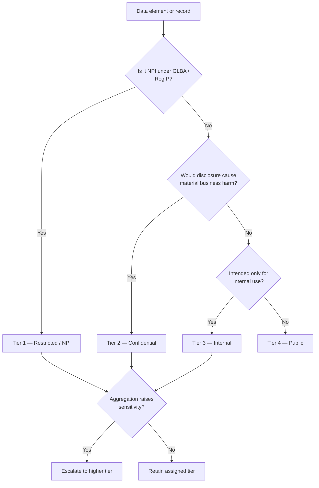

# 02.04 — Data Classification Scheme

| Field | Value |
|---|---|
| Document ID | CCB-INV-CLASS-2026-204 |
| Version | 1.0 |
| Date | 2026-06-15 |
| Classification | Confidential — Nonpublic Information (NPI) // Illustrative Portfolio Sample |
| Owner | Rachel Alvarez, Chief Information Security Officer |
| Author | Advisory Team (Financial-Services GRC) |
| Status | Approved |

## Purpose

This document defines Cornerstone Community Bank's enterprise **data classification scheme**: the tiers into which all Bank information is sorted, the definitions and examples for each tier, and the mandatory handling, labeling, encryption, and access rules that follow from classification. Classification is the mechanism by which the Bank applies **proportionate** safeguards — the strongest controls follow the most sensitive data.

The scheme is anchored to the **GLBA definition of Nonpublic Personal Information (NPI)** and the Interagency Guidelines Establishing Information Security Standards (GLBA §501(b)), and supports NIST CSF 2.0 **ID.AM-07 (data classified)** and the Protect (PR) function's data-security controls. It governs every information domain in Doc 02.02 and every system in Doc 02.03.

## The GLBA NPI Anchor

Under GLBA and Regulation P, **Nonpublic Personal Information (NPI)** is personally identifiable financial information a consumer provides to obtain a financial product or service, that results from a transaction, or that the Bank otherwise obtains — that is not publicly available. Examples include name tied to an account, Social Security Number, account numbers, balances, transaction history, and credit information. All NPI is classified at the Bank's highest tier, **Restricted / NPI**, and receives the strongest safeguards. This is the data GLBA §501(b) obligates the Bank to protect.

## The Four-Tier Scheme

| Tier | Name | Definition | Illustrative examples |
|---|---|---|---|
| Tier 1 | Restricted / NPI | Customer or employee NPI and other data whose unauthorized disclosure causes severe harm or regulatory violation | SSN/TIN, account numbers, balances, credit reports, wire/ACH instructions, KYC IDs, credentials, employee PII |
| Tier 2 | Confidential | Sensitive internal or business data not defined as NPI, whose disclosure causes material harm | Financial statements pre-release, ICFR evidence, board minutes, contracts, risk & audit workpapers, security configurations |
| Tier 3 | Internal | Everyday internal information intended for employees, not for public release | Internal policies, procedures, org charts, non-sensitive email, project plans |
| Tier 4 | Public | Information approved for public release with no confidentiality expectation | Published rates, marketing materials, website content, press releases |

## Handling, Labeling, Encryption, and Access Rules

Each tier carries mandatory control requirements. Controls escalate with sensitivity; Restricted/NPI receives the full stack.

| Control area | Restricted / NPI | Confidential | Internal | Public |
|---|---|---|---|---|
| Labeling | Mandatory "Restricted — NPI" label on documents and system banners | Mandatory "Confidential" label | Optional "Internal" label | No label required |
| Encryption at rest | Required (AES-256) | Required | Recommended | Not required |
| Encryption in transit | Required (TLS 1.2+; strong ciphers) | Required | Required on external links | Not required |
| Access model | Least-privilege, role-based, MFA, documented approval | Role-based, approval required | Authenticated employee access | Open |
| Authentication | MFA mandatory (IAM-federated) | MFA for remote/privileged | Standard SSO | None |
| Storage location | Approved systems only; no local/unmanaged storage | Approved systems | Managed systems | Any |
| Transmission | Encrypted channels only; no external email without secure/encrypted delivery | Encrypted channels | Standard internal | Any |
| Removable media | Prohibited unless encrypted & authorized | Encrypted only | Discouraged | Permitted |
| Disposal | NIST SP 800-88 sanitization; certificate of destruction | NIST SP 800-88 | Secure delete | Standard deletion |
| Logging & monitoring | Full audit logging to SIEM; DLP monitoring | Audit logging | Standard | Minimal |

## Classification Assignment and Aggregation

Data owners assign classification; the highest-sensitivity element governs the whole record or system. Aggregation is respected: a collection of Internal fields that together reveal NPI is classified Restricted. Every system in Doc 02.03 inherits the highest tier of the data it holds.

## Roles and Responsibilities

| Role | Classification responsibility |
|---|---|
| Data owner (business executive) | Assigns classification; approves access; authorizes exceptions |
| CISO (Rachel Alvarez) | Owns the scheme; defines control requirements per tier |
| Privacy Officer (Karen Ellis) | Ensures NPI classification aligns to Reg P and privacy notices |
| IT custodian | Applies technical controls (encryption, access, logging) per tier |
| All employees | Handle, label, and transmit data per the tier rules; report misclassification |
| Internal Audit (Priya Sharma) | Tests classification accuracy and control application |

## Exceptions and Review

Classification exceptions require documented data-owner and CISO approval, a compensating control, and an expiry date; they are logged and reviewed quarterly. The scheme itself is reviewed at least annually or upon regulatory change (e.g., changes to Reg P or GLBA Safeguards expectations).

## Cross-References

- **02.02-information-asset-inventory.md** — information domains and their assigned tiers.
- **02.03-system-and-application-inventory.md** — systems inheriting the highest tier of their data.
- **02.05-npi-data-mapping-and-flows.md** — how Restricted/NPI data flows and is protected.
- **02.06-network-architecture-and-segmentation.md** — network zones enforcing tier-based access.
- **Phase 04 — Information Security Program** — data-security policy and encryption standards.
- **GLBA / Regulation P** — NPI definition anchoring Tier 1.

---

[⬅ Previous](02.03-system-and-application-inventory.md) · [🏠 Phase README](02.00-README.md) · [Next ➡](02.05-npi-data-mapping-and-flows.md)
