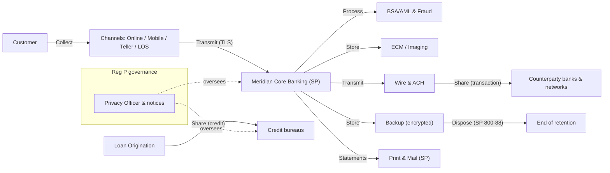

# 02.05 — NPI Data Mapping and Flows

| Field | Value |
|---|---|
| Document ID | CCB-INV-NPI-2026-205 |
| Version | 1.0 |
| Date | 2026-06-15 |
| Classification | Confidential — Nonpublic Information (NPI) // Illustrative Portfolio Sample |
| Owner | Karen Ellis, Privacy Officer |
| Author | Advisory Team (Financial-Services GRC) |
| Status | Approved |

## Purpose

This document maps how Cornerstone Community Bank's customer and employee **Nonpublic Personal Information (NPI)** moves through the enterprise — where it is **collected, stored, processed, transmitted, shared, and disposed** — across the **22 systems** that handle NPI. It links NPI lifecycle stages to the Regulation P sharing categories and identifies **Meridian Core Services, LLC** as the principal service provider (SOC 1 Type II / SOC 2 Type II) that processes NPI on the Bank's behalf.

The mapping operationalizes the GLBA §501(b) obligation to protect NPI, satisfies NIST CSF 2.0 **ID.AM-03 (data flows mapped)**, and feeds the Phase 03 risk assessment and Phase 07 third-party oversight. Systems referenced use the IDs assigned in Doc 02.03.

## NPI Lifecycle Stages

| Stage | Definition | Primary systems |
|---|---|---|
| Collect | NPI captured from the customer or a third party | Online/Mobile Banking, Teller/Branch, LOS, CRM/Onboarding |
| Store | NPI at rest in a system of record or repository | Meridian Core, ECM/Imaging, Backup |
| Process | NPI used in a transaction, decision, or workflow | Core, LOS, BSA/AML, Card, Payments |
| Transmit | NPI moved between systems or to a counterparty | Wire, ACH, Meridian secure link, IAM federation |
| Share | NPI disclosed to a third party under Reg P | Meridian (service provider), card networks, credit bureaus |
| Dispose | NPI sanitized at end of retention | Backup, ECM, all systems (NIST SP 800-88) |

## NPI System Register (22 Systems)

The following systems carry the NPI flag. Each is characterized by the NPI it holds and its lifecycle role.

| Sys ID | System | NPI held | Lifecycle role |
|---|---|---|---|
| SYS-0001 | Meridian Core Banking | Accounts, balances, SSN/TIN, transactions | Store, Process, Share (SP) |
| SYS-0002 | Online Banking | Credentials, account data, transactions | Collect, Transmit |
| SYS-0003 | Mobile Banking | Credentials, device, account data | Collect, Transmit |
| SYS-0004 | Loan Origination System | Credit reports, income, SSN, collateral | Collect, Process |
| SYS-0005 | Wire Transfer Platform | Originator/beneficiary, account, amount | Process, Transmit |
| SYS-0006 | ACH / Payments | Account/routing, NACHA entries | Process, Transmit |
| SYS-0007 | Treasury Management Portal | Commercial account & payment data | Collect, Transmit |
| SYS-0010 | Microsoft 365 | NPI in email/files (incidental) | Store, Transmit |
| SYS-0011 | IAM / SSO | Identity attributes, credentials | Process, Transmit |
| SYS-0013 | SIEM | NPI within log content | Store (transient) |
| SYS-0014 | Backup & Recovery | Copies of all NPI stores | Store, Dispose |
| SYS-0015 | Teller / Branch Platform | Account, transaction, ID data | Collect, Process |
| SYS-0016 | Card Management / Debit | PAN, cardholder, authorizations | Process, Transmit, Share |
| SYS-0017 | BSA/AML & Fraud Monitoring | Transactions, customer profiles | Process |
| SYS-0018 | Document Imaging / ECM | Imaged NPI documents | Store |
| SYS-0019 | CRM / Onboarding | Contact, KYC, account intent | Collect, Store |
| SYS-0020 | HRIS / Payroll | Employee PII, SSN, pay | Store, Process |
| SYS-0023 | Statement / Print & Mail | Statements with account/NPI | Transmit, Share (SP) |
| SYS-0024 | Credit Bureau Interface | Credit pull/report data | Transmit, Share |
| SYS-0025 | eSignature / Disclosures | Signed NPI documents | Collect, Store |
| SYS-0026 | Data Warehouse / Reporting | Aggregated customer NPI | Store, Process |
| SYS-0027 | Secure File Transfer (SFTP) | NPI files to/from partners | Transmit, Share |

## Regulation P Sharing Categories

NPI sharing is governed by Regulation P. Cornerstone's sharing is limited to permitted service-provider and legally required disclosures; the Bank does not sell NPI. The categories below map real flows to Reg P exceptions.

| Reg P category | Description | Applies at Cornerstone | Example flow |
|---|---|---|---|
| §14/§15 — Service providers & joint marketing | Sharing to perform services on the Bank's behalf | Yes | NPI to Meridian for core processing |
| Processing/servicing transactions | Sharing necessary to effect a transaction the consumer requests | Yes | Wire/ACH to counterparty banks; card networks |
| Legally required / regulatory | Sharing required by law or regulator | Yes | BSA/SAR filings; subpoenas; exams |
| Credit reporting | Sharing/pulling consumer credit data | Yes | Credit bureau interface (SYS-0024) |
| Nonaffiliated third-party marketing (opt-out) | Sharing for third-party marketing | No | Not practiced — no opt-out sharing |

## NPI Data-Flow Diagram

## Meridian as Service Provider

Meridian Core Services is the Bank's principal NPI processor. NPI is transmitted to Meridian over a dedicated, encrypted connection; Meridian stores and processes deposit, loan, and digital-banking NPI on the Bank's behalf. Oversight relies on Meridian's SOC 1 Type II (ICFR) and SOC 2 Type II (security/availability/confidentiality) reports, contractual GLBA safeguards clauses, and annual due diligence documented in Phase 07.

| Oversight element | Detail |
|---|---|
| NPI processed | Deposits, loans, digital-banking profiles, GL |
| Connectivity | Dedicated encrypted link (see 02.06) |
| Assurance | SOC 1 Type II + SOC 2 Type II reviewed annually |
| Contract | GLBA safeguards, breach notification, right to audit |
| Reg P basis | §14/§15 service-provider exception |

## Disposal

At end of retention, NPI is sanitized under **NIST SP 800-88**. Media destruction is evidenced by certificates; backup copies age out per the backup retention schedule; Meridian-held NPI is disposed under contractual return-or-destroy terms upon exit.

## Cross-References

- **02.02-information-asset-inventory.md** — NPI information domains (IA-01..IA-06).
- **02.03-system-and-application-inventory.md** — the 22 NPI systems.
- **02.04-data-classification-scheme.md** — Restricted/NPI tier controls applied to these flows.
- **02.06-network-architecture-and-segmentation.md** — segmentation and Meridian connectivity.
- **Phase 03 — Risk Assessment** — NPI flows as risk inputs.
- **Phase 07 — Third-Party Risk** — Meridian oversight and SOC reliance.

---

[⬅ Previous](02.04-data-classification-scheme.md) · [🏠 Phase README](02.00-README.md) · [Next ➡](02.06-network-architecture-and-segmentation.md)
