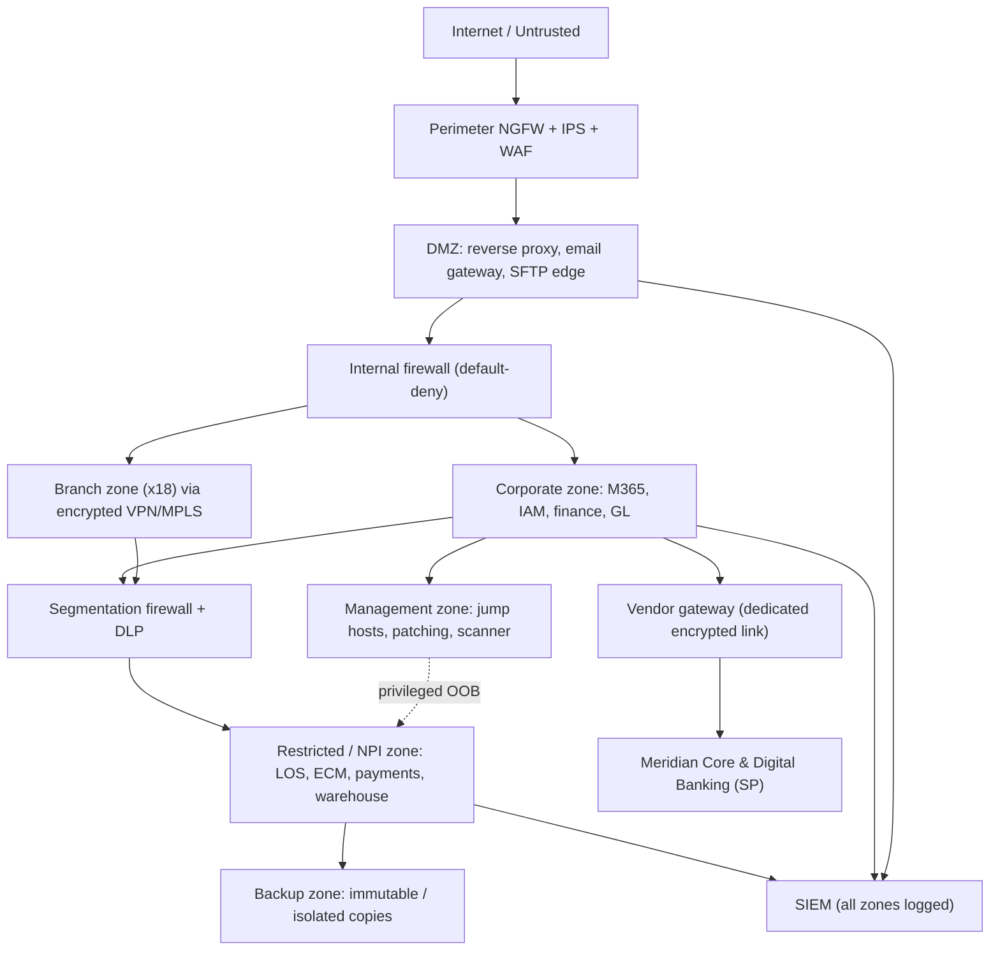

# 02.06 — Network Architecture and Segmentation

| Field | Value |
|---|---|
| Document ID | CCB-INV-NET-2026-206 |
| Version | 1.0 |
| Date | 2026-06-15 |
| Classification | Confidential — Nonpublic Information (NPI) // Illustrative Portfolio Sample |
| Owner | James Porter, Chief Information Officer |
| Author | Advisory Team (Financial-Services GRC) |
| Status | Approved |

## Purpose

This document describes Cornerstone Community Bank's network architecture and segmentation model: the security zones that partition the environment, the controls enforced at each boundary, and the secure connectivity to **Meridian Core Services, LLC** for outsourced core and digital banking. Segmentation limits the blast radius of a compromise, isolates NPI-bearing systems (Doc 02.05) into protected zones, and enforces the tier-based access rules of the classification scheme (Doc 02.04).

The architecture aligns to the **FFIEC IT Handbook** (Architecture, Infrastructure & Operations; Information Security booklets) and NIST CSF 2.0 **Protect (PR)** — network security and data-in-transit protection. It covers the HQ in Riverton, Ohio, the **18 branches**, and vendor connectivity.

## Security Zones

The environment is divided into logically and physically separated zones. Traffic between zones is default-deny and permitted only by explicit firewall rule.

| Zone | Purpose | Representative systems | Trust level |
|---|---|---|---|
| Internet / Untrusted | Public internet | Customer devices, external partners | Untrusted |
| DMZ | Internet-facing services & reverse proxies | Web/reverse proxy, secure email gateway, SFTP edge | Low |
| Corporate | Internal business systems & staff | M365 endpoints, IAM, finance systems, GL | Medium |
| Branch (x18) | Teller and branch operations | Teller platform, branch endpoints | Medium |
| Restricted / NPI data | High-value NPI stores & payments | LOS, ECM, data warehouse, payment interfaces | High |
| Management | Out-of-band administration | Jump hosts, patching, vuln scanner, config mgmt | High (privileged) |
| Backup | Isolated backup & recovery | Backup servers, immutable/air-gapped copies | High (isolated) |
| Vendor connectivity | Dedicated links to service providers | Meridian core & digital-banking gateway | Controlled |

## Boundary Controls

Each boundary enforces layered controls. Perimeter and inter-zone traffic passes through next-generation firewalls with IPS; privileged access requires jump-host mediation and MFA.

| Boundary | Primary controls |
|---|---|
| Internet ↔ DMZ | NGFW + IPS, DDoS protection, WAF, TLS termination, reverse proxy |
| DMZ ↔ Corporate | Default-deny firewall, application-layer inspection, no direct DB access |
| Corporate ↔ Restricted/NPI | Micro-segmentation, least-privilege ACLs, MFA, full SIEM logging, DLP |
| Corporate ↔ Branch | Segmented WAN, encrypted site-to-site VPN/MPLS, branch-local containment |
| Any ↔ Management | Out-of-band, jump-host only, privileged MFA, session recording |
| Any ↔ Backup | One-way/isolated paths, immutable storage, restricted admin |
| Corporate ↔ Vendor (Meridian) | Dedicated encrypted circuit, mutual authentication, restricted endpoints |

## Network Architecture Diagram

## Meridian Secure Connectivity

Core banking and digital banking are hosted by Meridian. Connectivity uses a dedicated, encrypted circuit terminating at a controlled vendor gateway rather than the general internet path. Only specifically authorized systems (core, digital-banking front ends, and their integration endpoints) may traverse the link; all traffic is mutually authenticated and logged to the SIEM.

| Attribute | Detail |
|---|---|
| Connection type | Dedicated encrypted circuit + backup encrypted tunnel |
| Authentication | Mutual TLS / certificate-based, restricted source/destination |
| Data protected | Deposit, loan, digital-banking, and GL NPI (per 02.05) |
| Monitoring | SIEM logging, IPS inspection at the vendor boundary |
| Assurance | Meridian SOC 1 Type II & SOC 2 Type II (Phase 07) |
| Resilience | Redundant circuits supporting core RTO/RPO objectives |

## Branch Connectivity (x18)

The 18 branches connect to HQ over encrypted site-to-site links (VPN/MPLS). Each branch is a segmented zone: a compromise at one branch is contained and cannot laterally reach the Restricted/NPI zone without passing the segmentation firewall and MFA controls. Teller platforms reach the Meridian core only through the corporate and vendor-gateway path.

## Monitoring, Resilience, and Governance

All zone boundaries feed the SIEM (SYS-0013) for correlation and alerting; EDR (SYS-0012) covers endpoints across corporate and branch zones. The backup zone maintains immutable copies isolated from production to support ransomware recovery. Firewall rule sets are reviewed periodically and on change; segmentation effectiveness is validated by the external penetration test in Phase 08. Architecture changes flow through change management and update the CMDB (Doc 02.01).

## Cross-References

- **02.01-asset-inventory-methodology.md** — CMDB and change-driven updates to network assets.
- **02.03-system-and-application-inventory.md** — systems mapped to zones.
- **02.04-data-classification-scheme.md** — tier-based access enforced by segmentation.
- **02.05-npi-data-mapping-and-flows.md** — NPI flows secured across these boundaries.
- **02.07-sox-significant-systems-identification.md** — SOX systems within the Restricted/NPI and vendor zones.
- **Phase 07 — Third-Party Risk / BCP** — Meridian resilience, RTO/RPO.
- **Phase 08 — Independent Testing** — penetration test validation of segmentation.

---

[⬅ Previous](02.05-npi-data-mapping-and-flows.md) · [🏠 Phase README](02.00-README.md) · [Next ➡](02.07-sox-significant-systems-identification.md)
