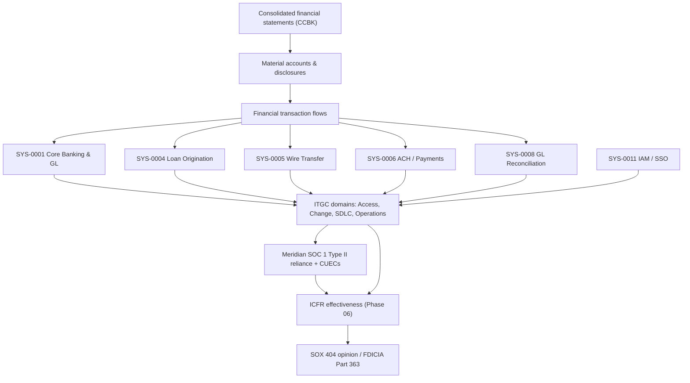

# 02.07 — SOX-Significant Systems Identification

| Field | Value |
|---|---|
| Document ID | CCB-INV-SOX-2026-207 |
| Version | 1.0 |
| Date | 2026-06-15 |
| Classification | Confidential — Nonpublic Information (NPI) // Illustrative Portfolio Sample |
| Owner | Linda Barrett, Chief Financial Officer |
| Author | Advisory Team (Financial-Services GRC) |
| Status | Approved |

## Purpose

This document formally identifies and scopes the **6 financially significant systems** at Cornerstone Community Bank that are in scope for **SOX Section 404 IT General Controls (ITGC)**. Cornerstone is a wholly-owned subsidiary of **Cornerstone Bancorp, Inc.** (Nasdaq: **CCBK**), a publicly traded SEC registrant; consequently management and the external auditor (**Whitmore & Associates, LLP**) must assess and attest to internal control over financial reporting (ICFR). Because the Bank holds **~$1.2 billion** in assets, **FDICIA Part 363** ICFR requirements apply in parallel.

The 6 systems named here were previewed in the enterprise inventory (Doc 02.03) and are now given a materiality-based scoping rationale, a mapping to the four ITGC control domains, and a statement of **SOC 1 Type II** reliance on the outsourced core provider, **Meridian Core Services, LLC**. This document is the authoritative scoping input to **Phase 06 (SOX ITGC & FDICIA)**, where the **48 key IT general controls** are designed and tested.

## Scoping Methodology

Systems were scoped top-down from financially significant accounts and material line items in the Cornerstone Bancorp consolidated financial statements, then traced to the applications that initiate, authorize, record, process, or report the underlying transactions. A system is in scope where a control failure could, individually or in aggregate, produce a **material misstatement** in the financial statements.

| Scoping factor | Question applied | Threshold for inclusion |
|---|---|---|
| Financial materiality | Does the system support a material account or disclosure? | Material to consolidated F/S |
| Transaction relevance | Does it initiate, process, or record financial transactions? | Direct posting or feed to GL |
| Automated control reliance | Does ICFR rely on system-computed values or automated controls? | Reliance present |
| Reporting dependency | Does financial close or regulatory reporting depend on its data? | Feeds close/consolidation |
| Access foundation | Does it govern access to in-scope financial systems? | Enterprise access control |

Lower-tier systems (e.g., BSA/AML monitoring, CRM, EDR) handle NPI or operational risk but do **not** drive financial-statement assertions and are therefore excluded from SOX ITGC scope, though they remain in the GLBA safeguards and Phase 03 risk populations.

## The Six SOX-Significant Systems

| Sys ID | System | Financial-statement relevance | Key assertions | Hosting |
|---|---|---|---|---|
| SYS-0001 | Meridian Core Banking Platform & GL | System of record; deposit/loan subledgers; GL posting & consolidation source | Existence, Completeness, Accuracy | Vendor (Meridian) |
| SYS-0004 | Loan Origination System (LOS) | Loan balances, terms, and servicing data feeding the GL loan portfolio | Valuation, Completeness, Accuracy | Hybrid |
| SYS-0005 | Wire Transfer Platform | Cash movement; completeness and cutoff of outgoing/incoming wires | Existence, Cutoff, Accuracy | Vendor (SaaS) |
| SYS-0006 | ACH / Payments Processing | Cash movement; NACHA file completeness and settlement accuracy | Completeness, Accuracy, Cutoff | Vendor (Meridian) |
| SYS-0008 | GL Reconciliation & Certification | Account reconciliation and ICFR certification over the close | Accuracy, Completeness, Valuation | On-prem |
| SYS-0011 | Identity & Access Management (IAM/SSO) | Access-to-programs-and-data foundation for all in-scope systems | Restricted access (all assertions) | Hybrid |

These six correspond exactly to the SOX-flagged systems in the enterprise inventory (Doc 02.03). The core banking platform (SYS-0001) subsumes the financial-consolidation and GL-posting functions; regulatory reporting (SYS-0009) draws from the certified GL and reconciliation outputs and is covered through those upstream in-scope controls.

## Mapping to ITGC Domains

Each in-scope system is assessed against the four ITGC domains that support ICFR. An **X** indicates the domain is a primary control area for that system in Phase 06.

| Sys ID | System | Access to Programs & Data | Program Changes | Program Development / SDLC | Computer Operations |
|---|---|---|---|---|---|
| SYS-0001 | Meridian Core Banking & GL | X | X | X (SOC 1) | X |
| SYS-0004 | Loan Origination System | X | X | X | X |
| SYS-0005 | Wire Transfer Platform | X | X | — | X |
| SYS-0006 | ACH / Payments Processing | X | X | X (SOC 1) | X |
| SYS-0008 | GL Reconciliation & Certification | X | X | — | X |
| SYS-0011 | IAM / SSO | X | X | — | X |

Access to Programs and Data (provisioning, privileged access, periodic recertification, segregation of duties) applies to all six because IAM (SYS-0011) is the enterprise access foundation. Program Changes and Computer Operations (batch scheduling, backup, job monitoring) apply universally. SDLC applies where custom or configurable development affects financial logic; for Meridian-hosted platforms, SDLC and much of Operations are covered by the provider's SOC 1 controls.

## SOC 1 Type II Reliance on Meridian

Core banking, GL posting, digital banking, and ACH processing are **outsourced to Meridian Core Services, LLC**. Management relies on Meridian's **SOC 1 Type II** report for the design and operating effectiveness of the outsourced ITGCs, supplemented by the **SOC 2 Type II** report for security, availability, and confidentiality.

| Reliance element | Cornerstone action |
|---|---|
| SOC 1 Type II report | Obtain, review scope/period, and confirm coverage of relevant control objectives |
| Complementary User Entity Controls (CUECs) | Identify CUECs and confirm Cornerstone-side controls operate (access approval, review of core reports) |
| Bridge / gap letter | Obtain a bridge letter covering the period between the SOC report date and Cornerstone's fiscal year-end |
| Exceptions | Assess any noted exceptions for impact on ICFR and document conclusions |
| Sub-service organizations | Confirm carve-out vs. inclusive method and evaluate downstream sub-processors |

## SOX Scoping and Control Flow

## Governance and Accountability

**Linda Barrett (CFO)** sponsors the SOX 404 program jointly with the CEO of the Holding Company and owns this scoping. **James Porter (CIO)** owns IT execution of the ITGCs; **Rachel Alvarez (CISO)** owns the access and security control environment. **Priya Sharma (Director of Internal Audit)** provides independent testing support, and results are reported to the **Audit Committee** chaired by **Robert Hanley**. The scope is revalidated at least annually and upon any material change to the system landscape (Doc 02.01 change-driven updates).

## Materiality and Rationale by System

The scoping decisions above are grounded in the financial significance of each platform. The rationale below documents why each system crosses the materiality threshold and would remain in scope on re-assessment.

| Sys ID | Materiality rationale | Illustrative account impact |
|---|---|---|
| SYS-0001 | System of record posting all deposit and loan activity to the GL; a control failure touches nearly every material account. | Cash, deposits, loans, interest income/expense |
| SYS-0004 | Originates and services the loan portfolio; drives loan balances and valuation feeding the GL. | Loans, allowance, fee income |
| SYS-0005 | Executes high-value wire movement; completeness and cutoff errors misstate cash. | Cash, due-to/due-from |
| SYS-0006 | Processes ACH volume via NACHA files; batch failures affect cash completeness. | Cash, deposits |
| SYS-0008 | Reconciliation and certification are the detective backstop over the close. | All reconciled GL accounts |
| SYS-0011 | Governs who can access and change the above; the access control foundation for ICFR. | Restricted-access assertion (all) |

## Exclusions and Boundary Cases

Several high-value systems were evaluated and **excluded** from SOX ITGC scope because they do not drive financial-statement assertions, even where they carry NPI or operational risk. These remain in the GLBA safeguards population and Phase 03 risk assessment.

| System | Why excluded from SOX scope |
|---|---|
| SYS-0002/03 Online & Mobile Banking | Customer channel into the core; the core (SYS-0001) carries the accounting record |
| SYS-0007 Treasury Portal | Commercial cash-management front end; posting occurs in core/ACH |
| SYS-0017 BSA/AML Monitoring | Compliance/risk function; no financial-statement posting |
| SYS-0009 Regulatory Reporting | Draws from certified GL/reconciliation; covered by upstream in-scope controls |

## Cross-References

- **02.03-system-and-application-inventory.md** — source inventory and SOX preview of the same six systems.
- **02.05-npi-data-mapping-and-flows.md** — NPI carried by several in-scope systems.
- **02.06-network-architecture-and-segmentation.md** — placement of SOX systems in the Restricted/NPI and vendor zones.
- **02.08-third-party-hosted-systems.md** — hosting and SOC-report boundaries for Meridian-operated in-scope systems.
- **Phase 06 — SOX ITGC & FDICIA** — 48 key controls, testing, and the 3 remediated deficiencies.
- **Phase 07 — Third-Party Risk** — Meridian enhanced oversight and SOC report management.

---

[⬅ Previous](02.06-network-architecture-and-segmentation.md) · [🏠 Phase README](02.00-README.md) · [Next ➡](02.08-third-party-hosted-systems.md)
