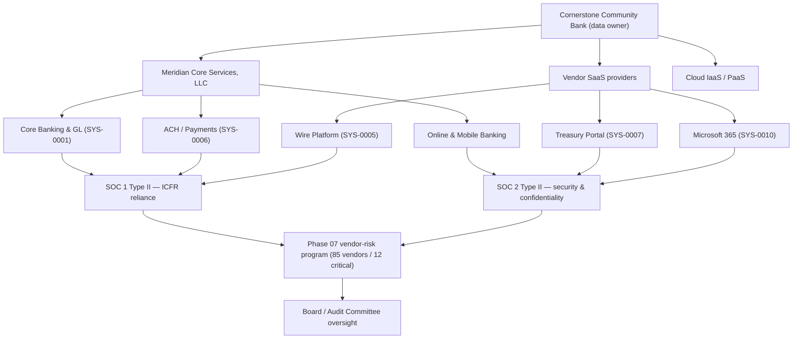

# 02.08 — Third-Party Hosted Systems

| Field | Value |
|---|---|
| Document ID | CCB-INV-TPH-2026-208 |
| Version | 1.0 |
| Date | 2026-06-15 |
| Classification | Confidential — Nonpublic Information (NPI) // Illustrative Portfolio Sample |
| Owner | Marcus Doyle, IT Security Manager |
| Author | Advisory Team (Financial-Services GRC) |
| Status | Approved |

## Purpose

This document catalogues the Cornerstone Community Bank systems that are **hosted, operated, or materially processed by third parties** — the outsourced core provider, SaaS applications, and cloud services. For each, it records the data held, the assurance report relied upon (**SOC 1** vs **SOC 2**), and the **shared-responsibility boundary** between Cornerstone and the provider. Because core banking and digital banking are **outsourced to Meridian Core Services, LLC**, third-party hosting is a defining feature of the Bank's architecture and a central concern of GLBA **service-provider oversight**.

The catalogue is the asset-side feed into the **Phase 07 vendor-risk program**, which covers **85 third parties** with **12 rated critical/high-risk**. It aligns to the **FFIEC Outsourcing Technology Services** booklet and the **Interagency Guidance on Third-Party Relationships (2023)**.

## Scope of Third-Party Hosting

Cornerstone operates a hybrid estate: on-prem systems, vendor-hosted SaaS, and the outsourced Meridian platform. Of the 140 enterprise systems, the material third-party-hosted platforms are catalogued below; the remainder are on-prem or infrastructure services (Doc 02.03 profile).

| Hosting model | Description | Example systems |
|---|---|---|
| Outsourced core (Meridian) | Provider operates the system of record and digital banking end-to-end | SYS-0001, SYS-0002, SYS-0003, SYS-0006 |
| Vendor SaaS | Multi-tenant application hosted and operated by the vendor | SYS-0005, SYS-0007, SYS-0010, SYS-0016, SYS-0017 |
| Hybrid (vendor + on-prem) | Vendor application with on-prem integration/components | SYS-0004, SYS-0011, SYS-0013 |
| Cloud IaaS/PaaS | Cornerstone-managed workloads on provider infrastructure | Select DR and analytics workloads |

## Third-Party Hosted System Catalogue

| Sys ID | System | Provider type | Data held | Assurance relied upon | NPI? | SOX? |
|---|---|---|---|---|---|---|
| SYS-0001 | Meridian Core Banking & GL | Outsourced core | Deposit, loan, GL, customer NPI | SOC 1 Type II + SOC 2 Type II | Yes | Yes |
| SYS-0002 | Online Banking (Meridian) | Outsourced digital | Credentials, account & transaction NPI | SOC 2 Type II | Yes | No |
| SYS-0003 | Mobile Banking (Meridian) | Outsourced digital | Credentials, device, transaction NPI | SOC 2 Type II | Yes | No |
| SYS-0004 | Loan Origination System | Hybrid SaaS | Applicant PII/NPI, income, credit data | SOC 2 Type II | Yes | Yes |
| SYS-0005 | Wire Transfer Platform | Vendor SaaS | Payment instructions, account numbers | SOC 1 Type II + SOC 2 Type II | Yes | Yes |
| SYS-0006 | ACH / Payments (Meridian) | Outsourced core | NACHA files, account & routing NPI | SOC 1 Type II + SOC 2 Type II | Yes | Yes |
| SYS-0007 | Treasury Management Portal | Vendor SaaS | Commercial account & payment NPI | SOC 2 Type II | Yes | No |
| SYS-0010 | Microsoft 365 | Vendor SaaS | Email, files (may contain NPI) | SOC 2 Type II | Yes | No |
| SYS-0016 | Card Management / Debit | Vendor SaaS | PAN, cardholder NPI (PCI DSS) | SOC 2 Type II + PCI AOC | Yes | No |
| SYS-0017 | BSA/AML & Fraud Monitoring | Vendor SaaS | Transaction & customer NPI, SAR data | SOC 2 Type II | Yes | No |

## SOC 1 vs SOC 2 Reliance

The assurance report relied upon depends on why the system matters. **SOC 1 (SSAE 18 / ISAE 3402)** addresses controls relevant to **financial reporting** and supports SOX ITGC reliance. **SOC 2** addresses the Trust Services Criteria (security, availability, processing integrity, confidentiality, privacy) and supports GLBA safeguards and security assurance.

| Report | Purpose at Cornerstone | Systems relying on it |
|---|---|---|
| SOC 1 Type II | ICFR / SOX ITGC reliance on outsourced financial processing | SYS-0001, SYS-0005, SYS-0006 |
| SOC 2 Type II | Security, availability, confidentiality assurance for NPI systems | All hosted NPI systems |
| Bridge / gap letter | Cover the period from SOC report date to fiscal year-end | Meridian, wire, ACH |
| Complementary controls (CUECs) | Cornerstone-side controls the SOC report assumes are in place | All SOC-reliant systems |

## Shared-Responsibility Boundaries

Outsourcing transfers operation but **not accountability**. The Bank retains responsibility for its data, its users, and its oversight obligations. The boundary is documented per provider so control gaps do not fall between the parties.

| Responsibility area | Cornerstone | Provider |
|---|---|---|
| Data ownership & classification | Owns | — |
| Application & infrastructure operation | Oversees | Operates |
| User provisioning / access approval (CUEC) | Approves & recertifies | Enforces technically |
| Patching & vulnerability management | Endpoints/integration | Hosted platform |
| Backup & recovery of hosted data | Validates RTO/RPO | Executes |
| Incident notification | Receives & reports (36-hr rule) | Detects & notifies |
| Assurance reporting | Reviews SOC reports | Produces SOC reports |

## Hosting and Assurance Flow

## Feed into the Phase 07 Vendor-Risk Program

Each hosted system maps to a vendor record in the third-party inventory. Meridian is designated **critical** and placed under **enhanced oversight** (annual SOC review, financial-condition monitoring, BCP/DR alignment with defined RTO/RPO, and contractual right-to-audit). SaaS providers handling NPI or payments are classified critical/high and receive proportionate due diligence. This asset-to-vendor mapping ensures the 12 critical relationships in Phase 07 are traceable back to the systems and data they operate.

## Assurance Review Cadence

Each hosted system's assurance is reviewed on a defined cadence so reliance stays current between annual SOC report cycles. Reviews are logged and available to Internal Audit and examiners.

| Activity | Frequency | Owner |
|---|---|---|
| SOC 1 / SOC 2 report review | Annually (per report period) | Marcus Doyle (IT Security Mgr) |
| Bridge / gap-letter collection | At fiscal year-end | Linda Barrett (CFO) / Vendor Mgmt |
| CUEC operating-effectiveness check | Annually | Business owners |
| Financial-condition monitoring (critical) | Ongoing / annual | Vendor Management |
| Right-to-audit / questionnaire refresh | Annually or on change | Rachel Alvarez (CISO) |
| PCI AOC review (card systems) | Annually | Marcus Doyle (IT Security Mgr) |

## Concentration and Resilience Considerations

Because a single provider — **Meridian** — operates the core, digital banking, and ACH, Cornerstone carries **concentration risk**. This is addressed through enhanced oversight, contractual resilience commitments (defined RTO/RPO), and BCP/DR alignment carried into Phase 07.

| Consideration | Treatment |
|---|---|
| Provider concentration (Meridian) | Enhanced oversight, exit/continuity planning, redundant circuits (Doc 02.06) |
| Data residency & NPI location | Confirmed via contract and SOC 2 scope |
| Sub-service organizations | Evaluated via carve-out/inclusive SOC method |
| Incident notification | Contractual timelines supporting the 36-hour regulator rule |
| Business continuity | Provider RTO/RPO validated against Bank requirements |

## Cross-References

- **02.03-system-and-application-inventory.md** — hosting attribute and vendor custodianship per system.
- **02.05-npi-data-mapping-and-flows.md** — NPI residing on hosted systems.
- **02.06-network-architecture-and-segmentation.md** — vendor connectivity and gateway controls.
- **02.07-sox-significant-systems-identification.md** — SOC 1 reliance for the in-scope financial systems.
- **02.10-asset-ownership-and-accountability.md** — technical custodianship of hosted systems.
- **Phase 07 — Third-Party Risk / BCP** — full vendor inventory, due diligence, and enhanced oversight.

---

[⬅ Previous](02.07-sox-significant-systems-identification.md) · [🏠 Phase README](02.00-README.md) · [Next ➡](02.09-data-retention-and-disposal.md)
