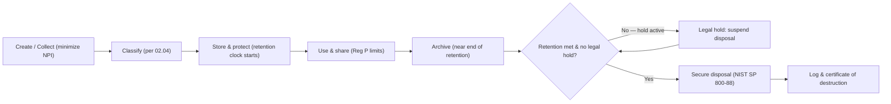

# 02.09 — Data Retention and Disposal

| Field | Value |
|---|---|
| Document ID | CCB-INV-RET-2026-209 |
| Version | 1.0 |
| Date | 2026-06-15 |
| Classification | Confidential — Nonpublic Information (NPI) // Illustrative Portfolio Sample |
| Owner | Rachel Alvarez, Chief Information Security Officer |
| Author | Advisory Team (Financial-Services GRC) |
| Status | Approved |

## Purpose

This document establishes Cornerstone Community Bank's **data retention and secure disposal** requirements: how long each category of record is retained, the legal and regulatory drivers behind each schedule, how media and data are securely sanitized at end of life per **NIST SP 800-88**, and how **legal holds** suspend disposal. Retention is a core GLBA safeguard — NPI must not be kept longer than necessary, yet financial and BSA records must be preserved for mandated periods. Balancing these obligations reduces both regulatory exposure and the attack surface represented by stale NPI across the **22 NPI-bearing systems**.

The schedule aligns to **GLBA §501(b)**, **Regulation P**, **BSA recordkeeping**, **SOX**, and the **FFIEC** Information Security and Records Management expectations. It governs data across on-prem, hosted, and backup environments (Docs 02.06, 02.08).

## Retention Principles

| Principle | Statement |
|---|---|
| Purpose limitation | Data is retained only as long as a business, legal, or regulatory purpose exists. |
| Minimum necessary | NPI collection and retention are minimized to what the function requires. |
| Longest applicable period | Where multiple rules apply, the **longest** required retention governs. |
| Defensible disposal | Disposal is authorized, documented, and irreversible per NIST SP 800-88. |
| Hold precedence | An active legal hold **overrides** and suspends any scheduled disposal. |

## Retention Schedule by Data Type

| Data category | Representative records | Retention period | Primary driver |
|---|---|---|---|
| Deposit account records | Signature cards, statements, ledgers | 5 years after account closed | BSA / Reg CC / state law |
| Loan files | Applications, notes, servicing, collateral | Life of loan + 5 years | Safety & soundness / ECOA |
| BSA/AML records | CTRs, SARs, CIP, monitoring alerts | 5 years (SAR: 5 yrs from filing) | BSA / 31 CFR 1020 |
| Wire & ACH records | Payment orders, NACHA files, logs | 5 years | BSA funds-transfer recordkeeping |
| GL & financial records | GL detail, reconciliations, close packages | 7 years | SOX / FDICIA / tax |
| Audit & ICFR evidence | ITGC testing, workpapers, attestations | 7 years | SOX 404 / PCAOB reliance |
| Privacy notices (Reg P) | Delivered notices, opt-out records | 5 years after relationship ends | Regulation P |
| Customer NPI (non-record) | Transient NPI, marketing data | Until purpose ends, then purge | GLBA minimization |
| Email & collaboration | Business email, SharePoint content | 7 years (business), per class | SOX / litigation readiness |
| Security logs / SIEM | Auth, access, security events | 1 year online + archive to 7 yrs | FFIEC / IR support |
| HR & payroll records | Employee files, payroll | 7 years post-termination | IRS / labor law |
| Backups | Point-in-time system backups | Rolling per RTO/RPO cycle | BCP / recovery |

## Legal and Regulatory Drivers

| Driver | Retention relevance |
|---|---|
| GLBA §501(b) / Safeguards | Protect NPI throughout retention; minimize and dispose securely |
| Regulation P | Retain privacy notice and opt-out evidence |
| BSA recordkeeping | 5-year floor for CTRs, SARs, CIP, and funds-transfer records |
| SOX / FDICIA Part 363 | Preserve financial records and ICFR evidence (~7 years) |
| FTC Disposal Rule / FACTA | Proper disposal of consumer report information |
| NIST SP 800-88 | Media sanitization standard for disposal |
| State of Ohio / DFI | State recordkeeping overlays and examination access |

## Secure Disposal per NIST SP 800-88

Disposal method is selected by media type and the confidentiality of the data, applying **Clear**, **Purge**, or **Destroy** per NIST SP 800-88 Rev. 1. NPI and Confidential media default to **Purge or Destroy**; media leaving Bank custody must be **Destroy** with a certificate.

| Media / data | Method | Verification |
|---|---|---|
| HDD / SSD (in service, reuse) | Purge (crypto-erase / secure erase) | Tool log + sample verification |
| HDD / SSD (retired) | Destroy (shred/degauss as applicable) | Certificate of destruction |
| Paper NPI (loan files, printouts) | Cross-cut shred / bonded destruction | Vendor destruction certificate |
| Backup tapes / removable media | Purge or Destroy | Chain-of-custody + certificate |
| Cloud / SaaS-hosted data | Contractual deletion + crypto-erase | Provider attestation |
| Mobile devices / endpoints | Remote wipe + Purge on decommission | MDM / asset record |
| Debit/card media (PCI) | Destroy | Certificate + PCI evidence |

## Data Lifecycle

## Legal Holds

When litigation, examination, subpoena, or investigation is reasonably anticipated, **Angela Foster (Chief Compliance Officer)** and Legal issue a **legal hold** that suspends disposal for the affected records across production, backups, and hosted systems. Holds are tracked in a register with scope, custodians, and release date; disposal cannot resume until the hold is formally released. Hold status **overrides** every schedule in this document.

| Legal-hold step | Owner | Evidence |
|---|---|---|
| Identify trigger & scope | Compliance / Legal | Hold notice |
| Notify custodians & IT | Compliance | Acknowledgements |
| Suspend disposal (incl. backups) | IT custodians | System/hold register |
| Preserve & collect | IT / Legal | Chain of custody |
| Release hold | Compliance / Legal | Release memo |

## Governance and Accountability

**Rachel Alvarez (CISO)** owns this retention and disposal standard; **Karen Ellis (Privacy Officer)** governs Reg P retention; **Angela Foster (CCO)** governs BSA recordkeeping and legal holds; **James Porter (CIO)** and IT custodians execute technical disposal. Data stewards (Doc 02.10) apply the schedule to their domains. Disposal actions are logged and available to Internal Audit (Priya Sharma) and examiners.

## Retention in Backups and Hosted Environments

Retention obligations follow the data into backups and third-party-hosted systems. Backups age off on a rolling cycle aligned to BCP RTO/RPO, while long-term record preservation is met from designated systems of record — not from operational backups. For hosted/SaaS data (Doc 02.08), deletion is contractual and confirmed by provider attestation.

| Environment | Retention handling | Disposal mechanism |
|---|---|---|
| Production systems of record | Full retention period per schedule | Purge/Destroy at end of life |
| Operational backups | Rolling cycle (not the retention system of record) | Age-off + crypto-erase |
| Archive / cold storage | Long-term regulatory retention | Destroy with certificate |
| Meridian-hosted data | Per contract + SOC coverage | Provider deletion attestation |
| SaaS (M365, wire, treasury) | Per contract & class | Contractual deletion + crypto-erase |

## Roles and Exceptions

Exceptions to the standard schedule (extended retention for business need, early disposal requests) require documented approval and must never override a legal hold or a regulatory minimum.

| Scenario | Approval required | Constraint |
|---|---|---|
| Extended retention | Data steward + CISO | Must remain protected as NPI |
| Early disposal request | Business owner + Compliance | Cannot breach regulatory minimum |
| Legal-hold override attempt | Not permitted | Hold always prevails |
| New data type onboarded | CISO + Privacy Officer | Assign schedule before production |

## Cross-References

- **02.04-data-classification-scheme.md** — classification tiers driving disposal method.
- **02.05-npi-data-mapping-and-flows.md** — where NPI subject to these schedules resides.
- **02.08-third-party-hosted-systems.md** — contractual deletion for hosted/SaaS data.
- **02.10-asset-ownership-and-accountability.md** — stewards who apply the schedule.
- **Phase 04 — Information Security Program** — records-management and disposal policy.
- **Phase 07 — Third-Party Risk / BCP** — backup retention and vendor deletion obligations.

---

[⬅ Previous](02.08-third-party-hosted-systems.md) · [🏠 Phase README](02.00-README.md) · [Next ➡](02.10-asset-ownership-and-accountability.md)
