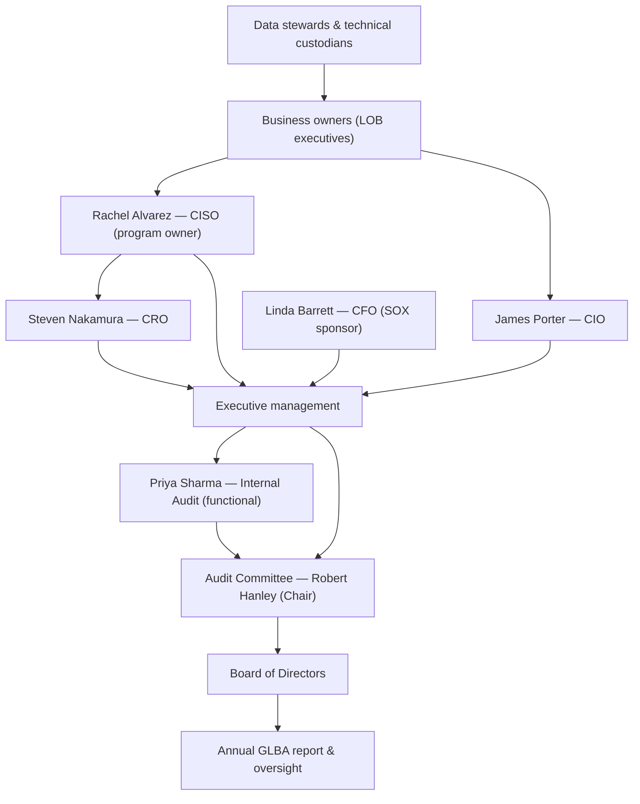

# 02.10 — Asset Ownership and Accountability

| Field | Value |
|---|---|
| Document ID | CCB-INV-OWN-2026-210 |
| Version | 1.0 |
| Date | 2026-06-15 |
| Classification | Confidential — Nonpublic Information (NPI) // Illustrative Portfolio Sample |
| Owner | James Porter, Chief Information Officer |
| Author | Advisory Team (Financial-Services GRC) |
| Status | Approved |

## Purpose

This document establishes **ownership and accountability** for Cornerstone Community Bank's information assets so that every material system and data domain has a named, accountable steward. It defines a **three-role model** — **business owner**, **technical custodian**, and **data steward** — assigns those roles for the key systems, and traces the accountability chain from operational roles up to the **Board of Directors / Audit Committee**. Clear ownership is a GLBA safeguards expectation and a prerequisite for risk treatment (Phase 03), control design (Phase 04), and SOX ITGC access recertification (Phase 06).

Assignments here are the authoritative source for the **enterprise RACI** and for the "owner" and "custodian" fields carried in the CMDB (Doc 02.01).

## The Three-Role Model

| Role | Accountable for | Typical holder |
|---|---|---|
| Business owner | Business value, risk acceptance, access approval, data use decisions | Line-of-business executive |
| Technical custodian | Secure operation, configuration, patching, backup, availability | IT / provider under IT oversight |
| Data steward | Data quality, classification, retention application, privacy compliance | Domain subject-matter lead |

The roles are separated so that no single individual both owns the risk and operates the control unchecked, supporting segregation of duties. For outsourced systems (Doc 02.08), the technical-custodian role is **shared**: the provider operates, but a named Cornerstone custodian retains oversight accountability.

## Ownership Assignments — Key Systems

| Sys ID | System | Business owner | Technical custodian | Data steward |
|---|---|---|---|---|
| SYS-0001 | Meridian Core Banking & GL | Linda Barrett (CFO) | James Porter (CIO) / Meridian | Operations Manager |
| SYS-0002/03 | Online & Mobile Banking | David Okonkwo (Bank President) | James Porter (CIO) / Meridian | Digital Banking Lead |
| SYS-0004 | Loan Origination System | Lending Executive | Marcus Doyle (IT Security Mgr) | Loan Operations Lead |
| SYS-0005 | Wire Transfer Platform | Linda Barrett (CFO) | Marcus Doyle (IT Security Mgr) | Payments Operations Lead |
| SYS-0006 | ACH / Payments | Linda Barrett (CFO) | James Porter (CIO) / Meridian | Payments Operations Lead |
| SYS-0008 | GL Reconciliation & Certification | Linda Barrett (CFO) | Finance Systems Admin | Controller |
| SYS-0010 | Microsoft 365 | James Porter (CIO) | Marcus Doyle (IT Security Mgr) | Records Manager |
| SYS-0011 | IAM / SSO | Rachel Alvarez (CISO) | Marcus Doyle (IT Security Mgr) | IAM Administrator |
| SYS-0017 | BSA/AML & Fraud Monitoring | Angela Foster (CCO) | Marcus Doyle (IT Security Mgr) | BSA Analyst |
| SYS-0020 | HRIS / Payroll | HR Director | Marcus Doyle (IT Security Mgr) | HR Data Steward |

## Data-Domain Stewardship

Beyond systems, stewardship is assigned by **data domain** so NPI accountability follows the data across systems.

| Data domain | Data steward | Business owner | Privacy oversight |
|---|---|---|---|
| Customer NPI (deposit/loan) | Operations Manager | David Okonkwo (Bank President) | Karen Ellis (Privacy Officer) |
| Payments & wire data | Payments Operations Lead | Linda Barrett (CFO) | Karen Ellis (Privacy Officer) |
| Financial / GL records | Controller | Linda Barrett (CFO) | — |
| BSA/AML data | BSA Analyst | Angela Foster (CCO) | Karen Ellis (Privacy Officer) |
| Employee data | HR Data Steward | HR Director | Karen Ellis (Privacy Officer) |

## Role Responsibilities (RACI Summary)

| Activity | Business owner | Technical custodian | Data steward | CISO |
|---|---|---|---|---|
| Approve access / recertify | A | R | C | C |
| Classify data & apply retention | C | R | A | C |
| Patch, back up, operate securely | I | A | I | C |
| Accept residual risk | A | C | C | R |
| Report incidents | C | R | C | A |

Legend: **R** Responsible · **A** Accountable · **C** Consulted · **I** Informed.

## Accountability Chain to the Board

## Maintaining Ownership Records

Ownership is recorded in the CMDB and reviewed at least annually and on organizational or system change. Vacant or stale assignments are escalated by the CISO. When a system is onboarded (Doc 02.01), all three roles must be named before it enters production; when decommissioned, the data steward confirms retention and disposal (Doc 02.09) are satisfied before closure.

| Event | Ownership action | Owner |
|---|---|---|
| New system onboarded | Assign all three roles before production | CIO / CISO |
| Reorganization / personnel change | Reassign and update CMDB | Business owner |
| Annual review | Confirm assignments and access recertification | CISO |
| Decommission | Confirm retention/disposal, close record | Data steward |

## Governance and Accountability

**James Porter (CIO)** owns this accountability model jointly with **Rachel Alvarez (CISO)**, who owns the information security program overall. Business owners accept residual risk within their domains; **Steven Nakamura (CRO)** aggregates enterprise risk; and the **Audit Committee** (Robert Hanley, Chair) provides board-level oversight and receives the annual GLBA report. This model feeds directly into the enterprise RACI referenced in Phase 04.

## Shared Custodianship for Outsourced Systems

For Meridian-operated and SaaS systems (Doc 02.08), the technical-custodian role is split between the provider (who operates) and a named Cornerstone custodian (who oversees). Accountability for the data and its protection never transfers to the provider.

| System | Provider responsibility | Cornerstone custodian responsibility |
|---|---|---|
| SYS-0001 Core Banking | Operate platform, patch, back up | Oversee, review SOC/CUECs, approve access |
| SYS-0006 ACH / Payments | Process files, availability | Reconcile, monitor, review reporting |
| SYS-0005 Wire Platform | Host application, secure ops | Approve users, validate SOC coverage |
| SYS-0010 Microsoft 365 | Host service, tenant security | Configure, manage identities, retention |

## Escalation and Attestation

Ownership carries an attestation duty: business owners attest to access appropriateness at recertification, and stewards attest to classification and retention accuracy. Failures escalate through a defined path to ensure no accountability gap persists.

| Trigger | Escalates to | Outcome |
|---|---|---|
| Vacant or stale role | CISO (Rachel Alvarez) | Reassignment within defined window |
| Failed access recertification | Business owner + CISO | Access revoked / remediated |
| Classification/retention gap | Data steward + Privacy Officer | Correction and re-attestation |
| Unresolved accountability issue | CRO + Audit Committee | Board-level oversight |

## Cross-References

- **02.01-asset-inventory-methodology.md** — CMDB fields for owner and custodian.
- **02.03-system-and-application-inventory.md** — systems whose ownership is assigned here.
- **02.08-third-party-hosted-systems.md** — shared custodianship for hosted systems.
- **02.09-data-retention-and-disposal.md** — stewardship duties for retention and disposal.
- **Phase 04 — Information Security Program** — enterprise RACI and governance roles.
- **Phase 06 — SOX ITGC** — access recertification performed by business owners.

---

[⬅ Previous](02.09-data-retention-and-disposal.md) · [🏠 Phase README](02.00-README.md) · [Next ➡](02.11-phase-summary-and-transition.md)
