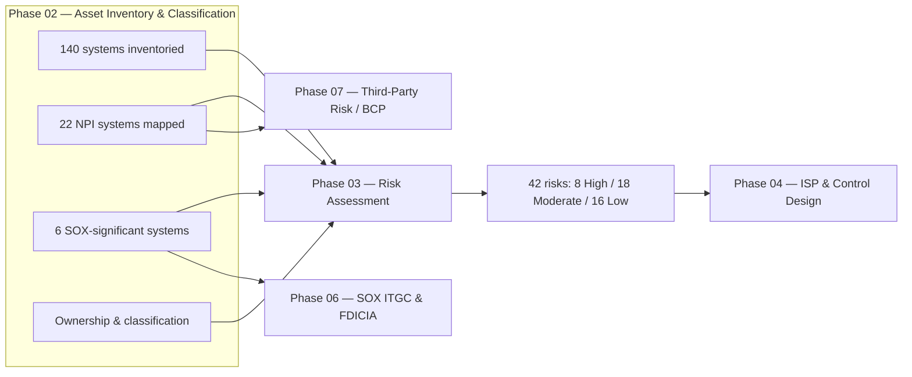

# 02.11 — Phase Summary and Transition

| Field | Value |
|---|---|
| Document ID | CCB-INV-SUM-2026-211 |
| Version | 1.0 |
| Date | 2026-06-15 |
| Classification | Confidential — Nonpublic Information (NPI) // Illustrative Portfolio Sample |
| Owner | James Porter, Chief Information Officer |
| Author | Advisory Team (Financial-Services GRC) |
| Status | Approved |

## Purpose

This document closes **Phase 02 — Information Asset Inventory & Data Classification** for Cornerstone Community Bank. It recaps the outcomes of the phase, confirms that the asset and data baseline is complete and approved, and formally hands off the resulting artifacts to **Phase 03 — Risk Assessment (GLBA 501(b) + Inherent Risk)**. A complete, classified, and owned inventory is the foundation on which the entire GLBA/FFIEC/SOX program is built: risk cannot be assessed, controls cannot be designed, and financially significant systems cannot be tested without knowing what assets exist, what data they hold, and who is accountable for them.

## Phase 02 Outcomes

Phase 02 established the authoritative asset baseline across eleven documents (02.01–02.11), spanning methodology, inventory, classification, NPI mapping, network placement, SOX scoping, hosting, retention, and ownership.

| Outcome | Result | Reference |
|---|---|---|
| Enterprise system inventory | **140 systems** catalogued and profiled | 02.02, 02.03 |
| NPI mapping | NPI identified across **22 systems** with flows | 02.04, 02.05 |
| Data classification scheme | Tiered scheme applied enterprise-wide | 02.04 |
| Network architecture & segmentation | Zones and boundary controls documented | 02.06 |
| SOX-significant systems | **6 systems** scoped for ITGC | 02.07 |
| Third-party hosted systems | Hosting, SOC reliance, boundaries mapped | 02.08 |
| Retention & disposal | Schedules + NIST SP 800-88 disposal | 02.09 |
| Ownership & accountability | Three-role model assigned; chain to Board | 02.10 |

## Baseline Confirmation

The asset and data baseline is confirmed complete and approved. The figures below are the canonical numbers carried forward to all subsequent phases and must not be contradicted.

| Baseline metric | Confirmed value |
|---|---|
| Total systems in inventory | 140 |
| Systems handling NPI | 22 |
| SOX-significant (ITGC in-scope) systems | 6 |
| Core banking / digital banking | Outsourced to Meridian Core Services, LLC |
| Meridian assurance available | SOC 1 Type II + SOC 2 Type II |
| Third parties (for Phase 07 scoping) | 85 total / 12 critical |
| Classification scheme | Tiered (Public → Confidential/NPI) |
| Ownership model | Business owner / technical custodian / data steward |

## Readiness Checklist

| Deliverable | Status | Owner |
|---|---|---|
| CMDB / inventory populated | Complete | James Porter (CIO) |
| Data classification applied | Complete | Rachel Alvarez (CISO) |
| NPI flows documented | Complete | Karen Ellis (Privacy Officer) |
| SOX scope defined | Complete | Linda Barrett (CFO) |
| Vendor/hosting mapping | Complete | Marcus Doyle (IT Security Mgr) |
| Retention & disposal schedule | Complete | Rachel Alvarez (CISO) |
| Ownership assignments | Complete | James Porter (CIO) |
| Phase 02 approved | Approved | Audit Committee oversight |

## Transition to Phase 03

Phase 03 consumes this baseline to identify and rate risks. Per the program storyline, the risk assessment will produce **42 risks** rated **8 High, 18 Moderate, 16 Low**, with an overall inherent risk profile of **Moderate**, using the **NIST SP 800-30** methodology against the GLBA §501(b) safeguards objectives.

## Handoff Artifacts

| Artifact | Delivered to Phase 03 for |
|---|---|
| System inventory (140) | Defining the risk population and asset-based threats |
| NPI map (22 systems) | Prioritizing GLBA safeguards and impact rating |
| Classification scheme | Setting confidentiality impact levels |
| SOX scope (6 systems) | Coordinating with Phase 06 ITGC risk |
| Hosting & SOC map | Seeding Phase 07 vendor inherent risk |
| Ownership assignments | Naming risk owners for treatment decisions |

## Governance and Sign-Off

Phase 02 is approved under the program governance model. **James Porter (CIO)** and **Rachel Alvarez (CISO)** attest to the completeness of the inventory and classification; **Linda Barrett (CFO)** confirms the SOX scope; **Steven Nakamura (CRO)** accepts the baseline as input to the enterprise risk assessment; and the **Audit Committee** (Robert Hanley, Chair) provides oversight. The baseline is now locked for Phase 03 and maintained under change management (Doc 02.01) thereafter.

## Traceability Across the Program

The Phase 02 baseline is referenced by every downstream phase. This traceability ensures that a change to the inventory or classification propagates to risk, controls, SOX, and vendor management under change management (Doc 02.01).

| Downstream phase | Consumes from Phase 02 | Program figure |
|---|---|---|
| Phase 03 — Risk Assessment | Inventory, NPI map, classification, owners | 42 risks (8H/18M/16L) |
| Phase 04 — ISP & Controls | Classification, ownership, RACI | WISP + 14 core policies |
| Phase 05 — FFIEC/NIST CSF 2.0 | Asset context for maturity scoring | 28 maturity gaps |
| Phase 06 — SOX ITGC & FDICIA | 6 SOX systems, SOC reliance | 48 key controls; 3 deficiencies |
| Phase 07 — Third-Party Risk | Hosting & SOC map | 85 vendors / 12 critical |

## Open Items and Maintenance

No blocking items remain; the baseline is approved. The following are steady-state maintenance activities that keep the inventory authoritative between phases.

| Maintenance activity | Cadence | Owner |
|---|---|---|
| CMDB reconciliation & discovery | Continuous / periodic | James Porter (CIO) |
| Classification & NPI review | Annual and on change | Rachel Alvarez (CISO) |
| SOX scope revalidation | Annual and on change | Linda Barrett (CFO) |
| Ownership attestation | Annual | Business owners |
| Vendor/hosting map refresh | Annual and on onboarding | Marcus Doyle (IT Security Mgr) |

## Cross-References

- **02.00-README.md** — phase overview and document index.
- **02.03-system-and-application-inventory.md** — the 140-system baseline.
- **02.05-npi-data-mapping-and-flows.md** — the 22 NPI systems.
- **02.07-sox-significant-systems-identification.md** — the 6 SOX systems.
- **02.10-asset-ownership-and-accountability.md** — risk owners for Phase 03.
- **Phase 03 — Risk Assessment** — consumes this baseline (42 risks; NIST SP 800-30).

---

[⬅ Previous](02.10-asset-ownership-and-accountability.md) · [🏠 Phase README](02.00-README.md) · [Next ➡](../03-risk-assessment/03.00-README.md)
