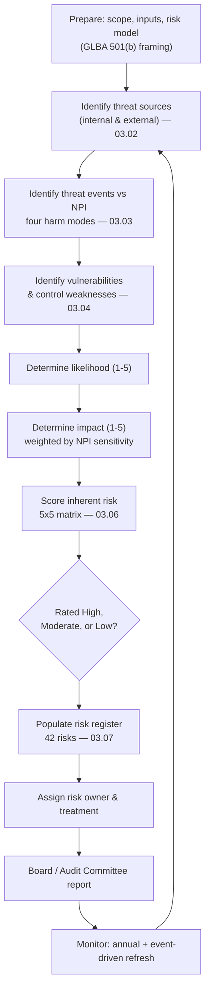

# 03.01 — Risk Assessment Methodology

| Field | Value |
|---|---|
| Document ID | CCB-RA-METH-2026-301 |
| Version | 1.0 |
| Date | 2026-06-15 |
| Classification | Confidential — Nonpublic Information (NPI) // Illustrative Portfolio Sample |
| Owner | Rachel Alvarez, Chief Information Security Officer (CISO/ISO) |
| Author | Advisory Team (Financial-Services GRC) |
| Status | Approved |

## Purpose

This document defines the methodology Cornerstone Community Bank ("Cornerstone," "the Bank") uses to conduct the information security risk assessment required by **GLBA §501(b)** and its implementing **Interagency Guidelines Establishing Information Security Standards** (the "Safeguards" rule). GLBA §501(b) obligates the Bank to *"identify reasonably foreseeable internal and external threats that could result in unauthorized access to or use of customer information, and assess the likelihood and potential damage of these threats, taking into consideration the sensitivity of customer information."* The statute further requires the Bank to assess the sufficiency of policies, procedures, and other safeguards in place to control the identified risks.

The methodology is deliberately repeatable and evidence-based so that the resulting **42-risk register** (rated **8 High, 18 Moderate, 16 Low**) can be defended to the Board, to internal audit, and to FFIEC examiners. It aligns to **NIST SP 800-30 Rev.1** (Guide for Conducting Risk Assessments) and to the **NIST CSF 2.0 Identify (ID.RA — Risk Assessment)** category.

## Regulatory Basis — What GLBA §501(b) Requires

The Interagency Guidelines decompose the §501(b) mandate into discrete, testable obligations. This methodology maps each to a work product in Phase 03.

| §501(b) / Interagency obligation | How the methodology satisfies it | Work product |
|---|---|---|
| Identify reasonably foreseeable **internal and external threats** | Structured threat catalogue built from intel sources and asset context | 03.02, 03.03 |
| Assess **likelihood and potential damage**, considering **sensitivity of customer information** | 5×5 likelihood × impact scoring anchored to NPI sensitivity | 03.03, 03.06 |
| Assess **sufficiency of safeguards** (control weaknesses) | Vulnerability/control-gap assessment | 03.04 |
| Consider the **security, confidentiality, and integrity** of customer information | Four harm-mode analysis (access, disclosure, alteration, destruction) | 03.03 |
| Produce a documented, board-reportable result | Inherent risk profile + scored register | 03.05, 03.06, 03.07 |
| Oversee **service providers** (Meridian) | Threats and controls assessed for the outsourced core | 03.03, Phase 07 |

## Scope and Inputs

The assessment covers all information assets that store, process, or transmit customer NPI, plus the systems and third-party relationships that could affect the security, confidentiality, or integrity of that NPI. The authoritative population is inherited from Phase 02: **140 systems** total, of which **22 handle NPI** and **6 are financially significant** (SOX ITGC). Core and digital banking are outsourced to **Meridian Core Services, LLC** and are assessed as in-scope logical assets with Meridian recorded as custodian.

| Input | Source (Phase 02) | Use in the assessment |
|---|---|---|
| Enterprise system inventory (140 systems) | 02.03 | Defines the asset population |
| NPI data map and flows (22 NPI systems) | 02.05 | Anchors sensitivity and locates NPI |
| Data classification scheme | 02.04 | Sets impact weighting for NPI/Restricted data |
| Network architecture & segmentation | 02.06 | Identifies exposure and blast radius |
| Third-party hosted systems | 02.08 | Scopes Meridian and vendor threats |
| Asset ownership register | 02.10 | Assigns risk owners |
| Threat intelligence (FS-ISAC, CISA, FBI, vendors) | 03.02 | Populates the threat catalogue |

## The Risk Model — Threat × Vulnerability × Impact

Cornerstone uses an **asset-based, threat-oriented** model consistent with NIST SP 800-30. Risk is expressed as a function of the **likelihood** that a threat source successfully exploits a vulnerability, and the **impact** to the security, confidentiality, or integrity of NPI (and to the Bank) if it does.

> **Risk = f(Likelihood, Impact)**, where **Likelihood = f(Threat capability/frequency, Vulnerability/control weakness, existing control effectiveness)** and **Impact = f(NPI sensitivity, volume, harm mode, business/regulatory consequence)**.

Likelihood and impact are each scored on an anchored **1–5 ordinal scale** (defined fully in 03.06). Inherent risk is scored before accounting for the maturity of compensating controls; residual risk (carried into Phase 05) reflects control effectiveness. The Phase 03 register reports **inherent** ratings with control context noted.

| Scale | 1 | 2 | 3 | 4 | 5 |
|---|---|---|---|---|---|
| **Likelihood** | Rare | Unlikely | Possible | Likely | Almost certain |
| **Impact** | Insignificant | Minor | Moderate | Major | Severe |

## Assessment Process (NIST SP 800-30 Aligned)

The process phases map directly onto SP 800-30's four steps — **Prepare, Conduct (identify threats → vulnerabilities → likelihood → impact → risk), Communicate, and Maintain.**

## Likelihood and Impact Determination

Likelihood is not a raw guess; it is triangulated from threat-source frequency (how often the event is observed across FS-ISAC/CISA reporting and the Bank's own telemetry), threat-source capability, and the presence and strength of existing controls. Impact is weighted by the **sensitivity of the customer information** at stake — a control weakness on a system holding full NPI records for 85,000 customers scores higher impact than the same weakness on a low-sensitivity system. This weighting operationalizes the §501(b) instruction to consider "the sensitivity of customer information."

| Factor influencing likelihood | Increases likelihood | Decreases likelihood |
|---|---|---|
| Threat frequency (intel/telemetry) | Actively exploited in the wild | No observed activity |
| Threat-source capability | Organized/funded actor | Opportunistic, low skill |
| Vulnerability/control weakness | Unpatched, no MFA, misconfig | Hardened, layered controls |
| Exposure | Internet-facing, third-party | Segmented, internal only |

## Cadence — Annual and Event-Driven

The risk assessment is refreshed on a fixed annual cycle and re-triggered whenever a material change could alter the risk picture. Point-in-time assessments alone do not satisfy the "adjust the program in light of relevant circumstances" requirement of the Interagency Guidelines.

| Trigger | Type | Action |
|---|---|---|
| Annual program cycle | Scheduled | Full reassessment; refresh register; Board report |
| New system or material system change | Event-driven | Targeted assessment before production |
| New/changed critical vendor (e.g., Meridian) | Event-driven | Third-party threat reassessment |
| Significant incident or near-miss | Event-driven | Reassess affected risks and controls |
| New/emerging threat (FS-ISAC/CISA advisory) | Event-driven | Threat-landscape update (03.02) |
| Regulatory or examination finding | Event-driven | Reassess implicated risks |

## Three Lines of Defense — Roles and Responsibilities

Ownership of the assessment is distributed across the Bank's three-lines model so that risk identification, oversight, and independent assurance remain appropriately separated.

| Line | Owner | Responsibility in the risk assessment |
|---|---|---|
| **1st line — Business/IT** | Asset & business owners, IT (James Porter, CIO) | Provide asset/threat context, own and remediate risks |
| **2nd line — Risk & Security** | CISO (Rachel Alvarez), CRO (Steven Nakamura) | Own the methodology, facilitate scoring, maintain the register, report to the Board |
| **3rd line — Internal Audit** | Director of Internal Audit (Priya Sharma) | Independently validate methodology, sampling, and conclusions |
| **Governance** | Board / Audit Committee (Robert Hanley, Chair) | Approve risk appetite; receive the annual GLBA report |

The CISO owns the methodology and the resulting register; the CRO ensures the assessment integrates with enterprise risk management and risk appetite; Internal Audit provides independent challenge. This document, and the assessment it governs, is approved by the CISO and reported to the Audit Committee.

## Cross-References

- **03.00-README.md** — Phase 03 overview and objectives.
- **03.02-threat-landscape-and-sources.md** — the threat catalogue and intelligence sources feeding this methodology.
- **03.03-npi-threat-assessment-glba.md** — the core §501(b) statutory threat analysis.
- **03.04-vulnerability-assessment.md** — control-weakness assessment (the "sufficiency of safeguards" test).
- **03.05-inherent-risk-profile-ffiec.md** — FFIEC inherent risk profile.
- **03.06-risk-scoring-and-criteria.md** — the full scoring model and 5×5 matrix.
- **03.07-risk-register.md** — the scored 42-risk register.
- **Phase 02 (02.03, 02.05, 02.06, 02.08)** — inventory, NPI map, architecture, and third-party inputs.
- **NIST SP 800-30 Rev.1 / NIST CSF 2.0 (ID.RA)** — external methodology alignment.

---

[⬅ Previous](03.00-README.md) · [🏠 Phase README](03.00-README.md) · [Next ➡](03.02-threat-landscape-and-sources.md)
