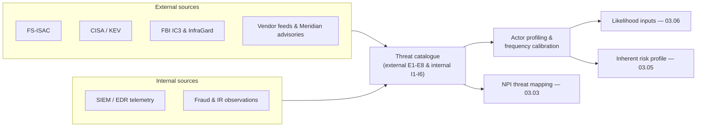

# 03.02 — Threat Landscape and Sources

| Field | Value |
|---|---|
| Document ID | CCB-RA-THREAT-2026-302 |
| Version | 1.0 |
| Date | 2026-06-15 |
| Classification | Confidential — Nonpublic Information (NPI) // Illustrative Portfolio Sample |
| Owner | Rachel Alvarez, Chief Information Security Officer (CISO/ISO) |
| Author | Advisory Team (Financial-Services GRC) |
| Status | Approved |

## Purpose

This document catalogues the **reasonably foreseeable internal and external threats** to the security, confidentiality, and integrity of Cornerstone Community Bank's customer NPI, and documents the threat-intelligence sources used to identify and calibrate them. It operationalizes the first substantive step of the GLBA §501(b) risk assessment: *identifying the threats* before their likelihood and impact are scored (03.03) against the Bank's control weaknesses (03.04).

The catalogue is framed for a **~$1.2 billion, 18-branch state-chartered community bank** with **~85,000 customers**, **~62,000 digital-banking users**, and an **outsourced core** (Meridian). It reflects the current financial-sector threat environment and feeds the inherent risk profile (03.05) and the scored register (03.07).

## Threat-Source Taxonomy

Consistent with NIST SP 800-30, threats are organized by **source** (who or what initiates the event) into adversarial, accidental, structural, and environmental categories. Adversarial and human-accidental sources dominate the community-bank profile.

| Source category | Description | Representative examples |
|---|---|---|
| Adversarial — external | Financially motivated or opportunistic outside attackers | Ransomware crews, phishing/BEC actors, fraud rings |
| Adversarial — internal | Malicious insiders with legitimate access | Rogue employee, departing employee exfiltration |
| Accidental — human | Non-malicious error by staff or vendors | Misdelivery, misconfiguration, lost device |
| Structural | Failures of IT, controls, or third parties | Core/vendor outage, unpatched software, control decay |
| Environmental | Natural or infrastructure events | Power loss, severe weather affecting Riverton HQ |

## External Threats

External adversarial threats are the highest-frequency source for a retail-facing community bank and drive several of the 8 High-rated risks. Each threat below is later mapped to specific NPI locations in 03.03.

| # | External threat | Description | Primary NPI harm mode |
|---|---|---|---|
| E1 | **Phishing / credential theft** | Deceptive email/SMS harvesting employee or customer credentials | Unauthorized access |
| E2 | **Ransomware** | Encryption/extortion malware disrupting operations and NPI availability | Destruction / disclosure (double-extortion) |
| E3 | **Account takeover (ATO)** | Fraudulent access to customer digital-banking accounts via stolen/credential-stuffed credentials | Unauthorized access / alteration |
| E4 | **Business email compromise (BEC)** | Impersonation of executives/vendors to induce fraudulent payments or data release | Disclosure / financial loss |
| E5 | **Third-party / Meridian compromise** | Breach or outage at the outsourced core or another critical vendor | Access / disclosure / destruction |
| E6 | **Distributed denial of service (DDoS)** | Volumetric attack against public/digital-banking channels | Availability (integrity of service) |
| E7 | **Web/application exploitation** | Exploitation of internet-facing app or API vulnerabilities | Access / alteration |
| E8 | **Card / payment fraud** | Fraud against debit/ACH/wire rails | Alteration / financial loss |

## Internal Threats

Internal threats arise from the Bank's own people, processes, and technology. They are lower frequency than external adversarial events but can carry high impact because insiders already hold legitimate access to NPI systems.

| # | Internal threat | Description | Primary NPI harm mode |
|---|---|---|---|
| I1 | **Malicious insider** | Employee or contractor deliberately exfiltrating or misusing NPI | Disclosure / alteration |
| I2 | **Human error** | Misaddressed email, wrong-recipient disclosure, accidental deletion | Disclosure / destruction |
| I3 | **Misconfiguration** | Insecure system, cloud, or access configuration exposing NPI | Unauthorized access |
| I4 | **Excessive / stale access** | Over-provisioned or orphaned accounts widening the attack surface | Unauthorized access |
| I5 | **Shadow IT / unsanctioned data movement** | NPI copied to unmanaged tools, spreadsheets, or personal storage | Disclosure |
| I6 | **Physical / device loss** | Lost/stolen laptop or unsecured branch document | Access / disclosure |

## Threat-Actor Profiles

Profiling the likely adversaries lets the Bank calibrate likelihood realistically rather than assuming worst-case nation-state capability against a community bank.

| Actor profile | Motivation | Capability | Relevance to Cornerstone |
|---|---|---|---|
| Organized cybercrime / ransomware affiliates | Financial | High | Primary external threat; targets midsize banks opportunistically |
| Fraud rings (ATO / card / BEC) | Financial | Medium–High | Directly target retail customers and digital banking |
| Opportunistic scanners / commodity malware | Financial / nuisance | Low–Medium | Constant background exploitation of exposed services |
| Malicious or negligent insider | Financial / grievance | Low–Medium | Legitimate access amplifies impact |
| Hacktivist | Ideological | Low | Low likelihood; mainly DDoS/defacement |
| Nation-state / supply chain | Espionage | High | Low direct likelihood; relevant via Meridian supply chain |

## Threat-Intelligence Sources

Cornerstone does not assess threats in isolation; it ingests external intelligence and correlates it with internal telemetry. This layered sourcing satisfies the "reasonably foreseeable" standard by grounding the catalogue in observed, sector-specific activity.

| Source | Type | What it provides | Cadence |
|---|---|---|---|
| **FS-ISAC** | Financial-sector ISAC | Sector-specific indicators, campaigns, threat briefings | Continuous / alerts |
| **CISA** | Government (US) | Advisories, KEV catalog, alerts (Shields Up) | Continuous / alerts |
| **FBI (IC3 / InfraGard)** | Government (US) | Fraud/BEC trends, bulletins, victim reporting data | Periodic / alerts |
| **Vendor threat feeds** | Commercial (EDR/SIEM, email security) | IOCs, malware/campaign telemetry | Continuous |
| **Meridian security advisories** | Service provider | Core/digital-banking platform threat and patch notices | On event |
| **Internal telemetry** | Bank (SIEM/EDR, fraud, IR) | Observed attempts against Cornerstone assets | Continuous |
| **Regulatory guidance** | FFIEC / FDIC / OCC | Emerging risk statements, examination priorities | Periodic |

## Intelligence-to-Assessment Flow

## Emerging and Watch-List Threats

Beyond the active catalogue, the Bank maintains a watch list of developing threats reviewed at each threat-landscape refresh so they can be promoted to the active catalogue if likelihood rises.

| Emerging threat | Why it is on the watch list | Current disposition |
|---|---|---|
| AI-assisted phishing / deepfake voice (vishing) | Lowers attacker cost; increases BEC/ATO believability | Monitor; reinforce verification controls |
| Quishing (QR-code phishing) | Bypasses some email-link defenses | Monitor; user awareness |
| Supply-chain / open-source dependency attacks | Indirect route via vendors and software | Monitor via TPRM (Phase 07) |
| MFA-fatigue / push-bombing | Erodes MFA effectiveness | Monitor; number-matching where available |

## Cross-References

- **03.01-risk-assessment-methodology.md** — the methodology this threat catalogue feeds.
- **03.03-npi-threat-assessment-glba.md** — maps these threats to the 22 NPI systems and four harm modes.
- **03.04-vulnerability-assessment.md** — the control weaknesses these threats would exploit.
- **03.05-inherent-risk-profile-ffiec.md** — External Threats category draws on this catalogue.
- **03.06-risk-scoring-and-criteria.md** — frequency/capability inputs to likelihood scoring.
- **Phase 02 (02.08)** — third-party hosted systems (Meridian) exposure context.
- **Phase 07 — Third-Party / Vendor Risk** — deeper Meridian and supply-chain threat treatment.

---

[⬅ Previous](03.01-risk-assessment-methodology.md) · [🏠 Phase README](03.00-README.md) · [Next ➡](03.03-npi-threat-assessment-glba.md)
