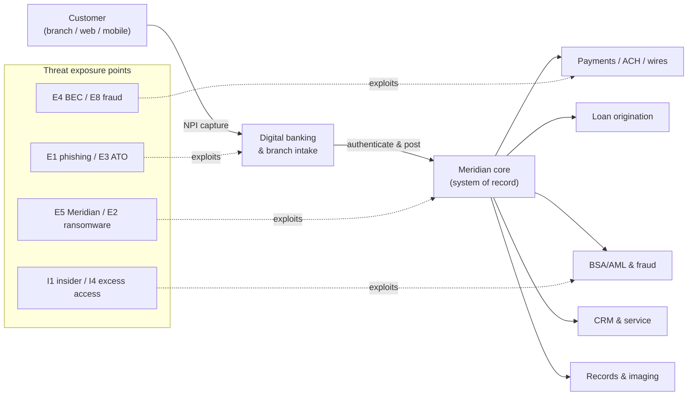

# 03.03 — NPI Threat Assessment (GLBA §501(b))

| Field | Value |
|---|---|
| Document ID | CCB-RA-NPI-2026-303 |
| Version | 1.0 |
| Date | 2026-06-15 |
| Classification | Confidential — Nonpublic Information (NPI) // Illustrative Portfolio Sample |
| Owner | Rachel Alvarez, Chief Information Security Officer (CISO/ISO) |
| Author | Advisory Team (Financial-Services GRC) |
| Status | Approved |

## Purpose

This document is the **core statutory analysis** of Cornerstone Community Bank's GLBA §501(b) risk assessment. It identifies the **reasonably foreseeable internal and external threats** to customer **Nonpublic Personal Information (NPI)** across the **22 NPI systems** and their data flows, and analyzes each threat against the four modes of harm that §501(b) is designed to prevent. Where 03.02 catalogued threats generically, this document *locates* them against specific NPI repositories and flows and assesses the potential damage to the **security, confidentiality, and integrity** of customer information — including the **outsourced core at Meridian Core Services, LLC**.

## The Four Harm Modes

GLBA §501(b) and the Interagency Guidelines require the Bank to protect against unauthorized access to or use of customer information that could result in substantial harm. Cornerstone decomposes this into four harm modes, aligned to the confidentiality, integrity, and availability triad.

| Harm mode | Definition | Triad dimension | Example against NPI |
|---|---|---|---|
| **Unauthorized access** | An unauthorized party gains entry to systems or data | Confidentiality | Credential theft into digital banking |
| **Unauthorized disclosure** | NPI is exposed or exfiltrated to an unauthorized party | Confidentiality | Insider exfiltration; misdirected email |
| **Unauthorized alteration** | NPI is modified without authorization | Integrity | Fraudulent account/transaction change via ATO |
| **Unauthorized destruction** | NPI is deleted or rendered unavailable | Availability / Integrity | Ransomware encryption of records |

## NPI Locations and Data Sensitivity

The 22 NPI systems (inherited from the Phase 02 NPI map, 02.05) are grouped below into logical NPI domains. Each domain is scored for NPI sensitivity, which drives the impact weighting in scoring (03.06).

| NPI domain | Representative systems | NPI held | Hosting | Sensitivity |
|---|---|---|---|---|
| Core banking records | Core deposit/loan system of record | Account, balance, SSN/TIN, identity | Vendor (Meridian) | Very High |
| Digital banking | Online + mobile banking platform | Credentials, account, transaction, PII | Vendor (Meridian) | Very High |
| Loan origination | LOS, underwriting, document store | Income, credit, identity, collateral | On-prem / vendor | High |
| Payments & wires | ACH, wire, card management | Account, routing, transaction | Vendor / on-prem | Very High |
| CRM & customer service | CRM, contact center records | Contact PII, service notes | Cloud/SaaS | High |
| Enterprise productivity | Email (M365), file shares | Ad hoc NPI in messages/documents | Cloud/SaaS | High |
| BSA/AML & fraud | Monitoring/case systems | Identity, transaction, SAR data | On-prem / vendor | Very High |
| Records & imaging | Document/imaging archive | Account-opening docs, statements | On-prem / vendor | High |

## Threat-to-NPI Mapping

The matrix below maps the external (E) and internal (I) threats from 03.02 to NPI domains and to their dominant harm mode(s). This mapping is the analytical heart of the §501(b) assessment; each cell later becomes one or more scored register entries (03.07).

| NPI domain | Dominant threats | Primary harm mode(s) |
|---|---|---|
| Core banking records | E5 (Meridian), E2 (ransomware), I1 (insider) | Access, Disclosure, Destruction |
| Digital banking | E3 (ATO), E1 (phishing), E6 (DDoS) | Access, Alteration, Availability |
| Loan origination | I2 (error), I5 (shadow IT), E7 (app exploit) | Disclosure, Access |
| Payments & wires | E4 (BEC), E8 (payment fraud), I1 (insider) | Alteration, Disclosure |
| CRM & customer service | I4 (excess access), E1 (phishing), I3 (misconfig) | Access, Disclosure |
| Enterprise productivity | E1 (phishing), I2 (error), I6 (device loss) | Disclosure, Access |
| BSA/AML & fraud | I1 (insider), I4 (excess access), E5 (vendor) | Disclosure, Alteration |
| Records & imaging | E2 (ransomware), I3 (misconfig), I6 (physical) | Destruction, Access |

## NPI Data-Flow Threat View

## Reasonably Foreseeable Threat Scenarios

For each NPI domain the Bank documents a concrete, foreseeable scenario. These scenarios (illustrative subset) demonstrate that the assessment considered realistic attack paths, not abstract categories, and they seed the High-rated risks in the register.

| Scenario | Threat path | NPI at risk | Harm mode | Foreseeability |
|---|---|---|---|---|
| Employee phishing → mailbox access | E1 → M365 mailbox with NPI | Enterprise productivity | Disclosure | High — sector-wide |
| Credential stuffing → ATO | E3 → digital banking | Digital banking | Access, Alteration | High — retail target |
| Ransomware on on-prem imaging | E2 → records/imaging | Records & imaging | Destruction | Moderate–High |
| Meridian outage/breach | E5 → core & digital | Core banking | Access, Destruction | Moderate; high impact |
| Vendor-impersonation BEC → wire | E4 → payments | Payments & wires | Alteration, loss | High |
| Departing employee data pull | I1 → CRM/LOS export | CRM / LOS | Disclosure | Moderate |

## Outsourced Core — Meridian Considerations

Because the system of record and digital banking are outsourced, a material share of NPI resides on infrastructure Cornerstone does not operate. GLBA §501(b) and the Interagency Guidance on Third-Party Relationships require the Bank to extend its risk assessment to the service provider. The Bank does not transfer accountability by outsourcing; it retains responsibility for the security of customer information Meridian holds.

| Consideration | Cornerstone treatment |
|---|---|
| Assurance reliance | Reviews Meridian **SOC 1 Type II** (ICFR) and **SOC 2 Type II** (security) reports annually |
| Complementary user entity controls (CUECs) | Identifies and operates the CUECs the SOC reports assume (e.g., access administration) |
| Concentration risk | Meridian is a single point for core + digital banking; assessed as critical/high-risk (Phase 07) |
| Incident coordination | Contractual notification; feeds the 36-hour regulator notification rule |
| Residual dependency | Availability/destruction risk (E5) rated with elevated impact given concentration |

## Substantial Harm and Notification Triggers

The §501(b) analysis explicitly considers whether a threat event could cause **substantial harm or inconvenience** to customers, because that standard governs both customer-notification obligations (Interagency Guidance on Response Programs) and the **36-hour Computer-Security Incident Notification Rule** to the FDIC. Threat scenarios that could reach these thresholds are flagged during scoring so that response planning (Phase 07 IR) is calibrated to them.

| Scenario class | Could cause substantial customer harm? | Potential regulator notice (36-hour rule)? |
|---|---|---|
| Mass NPI exposure/exfiltration (E1/I1) | Yes | Yes, if qualifying notification incident |
| Ransomware disrupting core/records (E2/E5) | Yes | Yes, if material service disruption |
| Account takeover with funds/data change (E3) | Yes (affected customers) | Case-by-case |
| Single lost encrypted device (I6/V-11) | Unlikely (encryption mitigates) | Typically no |

This linkage ensures the risk assessment is not an academic exercise: the highest-scored NPI threats are exactly those that would trigger customer notification and regulator reporting, and they therefore receive priority in control design and incident response.

## Confidentiality, Integrity, and Availability Summary

Consolidating the analysis, the greatest confidentiality exposure is to phishing, insider, and vendor threats against the very-high-sensitivity core, digital-banking, and BSA/AML domains; the greatest integrity exposure is to ATO and BEC/payment fraud; and the greatest availability exposure is to ransomware and Meridian concentration. These conclusions directly shape the inherent risk profile (03.05) and the distribution of the 42 scored risks (03.07).

## Cross-References

- **03.01-risk-assessment-methodology.md** — the §501(b) methodology framing this analysis.
- **03.02-threat-landscape-and-sources.md** — source catalogue for threats E1–E8 and I1–I6.
- **03.04-vulnerability-assessment.md** — control weaknesses that make these threats exploitable.
- **03.05-inherent-risk-profile-ffiec.md** — inherent risk profile informed by this NPI exposure.
- **03.06-risk-scoring-and-criteria.md** — scoring of these scenarios into the register.
- **03.07-risk-register.md** — the 42 scored risks derived here.
- **Phase 02 (02.05)** — the authoritative NPI data map and flows.
- **Phase 07** — Meridian third-party risk and SOC report reliance.

---

[⬅ Previous](03.02-threat-landscape-and-sources.md) · [🏠 Phase README](03.00-README.md) · [Next ➡](03.04-vulnerability-assessment.md)
