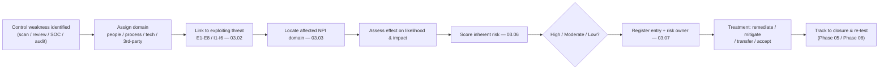

# 03.04 — Vulnerability Assessment

| Field | Value |
|---|---|
| Document ID | CCB-RA-VULN-2026-304 |
| Version | 1.0 |
| Date | 2026-06-15 |
| Classification | Confidential — Nonpublic Information (NPI) // Illustrative Portfolio Sample |
| Owner | Rachel Alvarez, Chief Information Security Officer (CISO/ISO) |
| Author | Advisory Team (Financial-Services GRC) |
| Status | Approved |

## Purpose

This document assesses the **vulnerabilities and control weaknesses** that could allow the threats identified in 03.02–03.03 to compromise customer NPI. It answers the GLBA §501(b) / Interagency Guidelines requirement to *assess the sufficiency of policies, procedures, customer information systems, and other safeguards in place to control the identified risks.* A vulnerability here means any weakness — in people, process, technology, or third-party relationships — that reduces the effectiveness of a safeguard and thereby raises the likelihood or impact of a threat event.

This assessment provides **vulnerability-to-risk traceability**: each material weakness is linked to the threat(s) that would exploit it and to the resulting register entry (03.07), so that scoring (03.06) and treatment are grounded in evidence.

## Assessment Approach and Evidence Sources

Vulnerabilities are identified from multiple corroborating sources rather than a single scan, mirroring the layered discovery approach used for the asset inventory. Findings are validated with the relevant asset owner before being carried into the register.

| Source | Contribution |
|---|---|
| Vulnerability scanning (internal/external) | Technical exposure, missing patches, exposed services |
| Configuration/hardening reviews | Deviations from CIS Benchmarks / baselines |
| Identity & access reviews | Excess privilege, stale accounts, MFA coverage gaps |
| Control self-assessments (1st line) | Process and procedural weaknesses |
| Meridian SOC 1/SOC 2 reports & CUEC review | Third-party control gaps and user-entity obligations |
| Prior audit / prior pen-test themes | Recurring or unremediated weakness patterns |

Note: the independent penetration test (Redwood Security Partners) is performed in **Phase 08** (2026-10). This Phase 03 assessment reflects the pre-test control posture; Phase 08 findings are reconciled back into the register on completion.

## Vulnerability Domains

Weaknesses are organized across four domains — **people, process, technology, and third party** — so that treatment can be routed to the right owner and no domain is overlooked.

| Domain | What it covers | Typical owner |
|---|---|---|
| People | Awareness, training, human error, insider risk | HR / CISO |
| Process | Policies, procedures, governance, change/access management | CISO / CRO |
| Technology | Patching, configuration, architecture, encryption, logging | CIO / IT Security |
| Third party | Vendor controls, concentration, contract/SLA gaps | CISO / Vendor Mgmt |

## Identified Vulnerabilities

The table below records the material control weaknesses identified in this assessment. Severity reflects the weakness's contribution to risk before treatment; it is an input to likelihood/impact scoring, not the final risk rating.

| ID | Domain | Vulnerability / control weakness | Severity |
|---|---|---|---|
| V-01 | People | Phishing susceptibility; awareness training not yet role-tailored | High |
| V-02 | People | Insider-risk monitoring limited; no formal joiner-mover-leaver DLP triggers | Moderate |
| V-03 | Process | Access recertification performed but not consistently quarterly for all NPI systems | Moderate |
| V-04 | Process | Change management strong for SOX systems; lighter for some non-SOX NPI systems | Moderate |
| V-05 | Process | Data-loss prevention (DLP) policy defined but coverage incomplete across egress channels | High |
| V-06 | Technology | **MFA gaps** — MFA enforced on remote/admin access but not uniformly on all internal NPI apps | High |
| V-07 | Technology | Patch cadence meets SLA for critical assets but backlog on some legacy on-prem systems | High |
| V-08 | Technology | **Legacy systems** — one imaging/records platform nearing end-of-support | Moderate |
| V-09 | Technology | Misconfiguration risk in cloud/SaaS tenants (M365); baseline hardening partially applied | Moderate |
| V-10 | Technology | Logging/monitoring coverage strong at perimeter; gaps in some internal east-west visibility | Moderate |
| V-11 | Technology | Encryption at rest broad but not universal on all legacy stores | Moderate |
| V-12 | Third party | **Vendor concentration** — Meridian single point for core + digital banking | High |
| V-13 | Third party | CUECs for Meridian identified but operating evidence not centrally tracked | Moderate |
| V-14 | Third party | Fourth-party (subservice) visibility limited beyond Meridian | Low |

## Vulnerability-to-Risk Traceability

Each vulnerability is linked to the exploiting threat(s) and to the NPI domain and register risk it drives. This traceability lets an examiner follow the chain from weakness → threat → NPI harm → scored risk → treatment.

| Vulnerability | Exploiting threat(s) | NPI domain affected | Contributes to risk rating |
|---|---|---|---|
| V-01 Phishing susceptibility | E1, E4 | Enterprise productivity, Payments | High |
| V-05 DLP coverage gaps | I1, I2, I5 | CRM, LOS, Productivity | High |
| V-06 MFA gaps | E1, E3, I4 | Digital banking, CRM, core | High |
| V-07 Patch backlog (legacy) | E2, E7 | Records & imaging, on-prem apps | High |
| V-08 Legacy end-of-support | E2, E7 | Records & imaging | Moderate |
| V-09 Cloud misconfiguration | I3, E1 | Enterprise productivity | Moderate |
| V-12 Vendor concentration | E5, E2 | Core banking, Digital banking | High |
| V-03 Access recertification cadence | I4, I1 | BSA/AML, CRM | Moderate |

## Vulnerability-to-Risk Flow

## Compensating Controls and Interim Mitigations

No identified weakness sits fully exposed; each is offset to some degree by existing compensating controls, which is why several map to Moderate rather than High risk. Documenting the compensating control is required before any weakness is accepted or deferred, so that residual exposure is understood rather than assumed away.

| Weakness | Compensating control(s) in place | Residual concern |
|---|---|---|
| V-06 MFA gaps (internal apps) | MFA on remote/admin; network segmentation; EDR | Lateral movement after internal foothold |
| V-07 Patch backlog (legacy) | Perimeter controls; virtual patching; SOC monitoring | Exploit window on unpatched legacy hosts |
| V-08 Legacy end-of-support | Isolation/segmentation; planned migration | Vendor support/patch availability ending |
| V-12 Vendor concentration (Meridian) | SOC 1/2 reliance; contractual SLAs; BCP/DR | Single point of failure for core + digital |
| V-05 DLP coverage gaps | Email security; access controls; awareness | Egress via uncovered channels |

## Remediation Ownership and Sequencing

High-severity weaknesses are routed to a named owner with an interim mitigation while permanent remediation is designed in Phase 04. Sequencing favors weaknesses that feed the 8 High-rated risks — phishing exposure, MFA, patching, and vendor concentration — so that the highest-exposure items are addressed first.

| Weakness | Owner | Interim mitigation | Permanent remediation phase |
|---|---|---|---|
| V-01 / V-05 Phishing & DLP | CISO / IT Security | Enhanced filtering, targeted training | Phase 04 controls; Phase 05 maturity |
| V-06 MFA gaps | CIO / IT Security | Prioritize NPI apps for MFA rollout | Phase 04 access controls |
| V-07 / V-08 Patch & legacy | CIO / IT Security | Virtual patching, isolation | Phase 04; migration roadmap |
| V-12 Vendor concentration | CISO / Vendor Mgmt | Enhanced Meridian oversight | Phase 07 TPRM / BCP-DR |

## Aggregate Observations

The dominant weaknesses cluster in three areas: **human/phishing exposure (V-01, V-05)**, **technology hygiene on legacy and internal NPI systems (V-06, V-07, V-08, V-11)**, and **vendor concentration on Meridian (V-12)**. None represents an uncontrolled exposure — compensating controls exist (perimeter defense, EDR, SOC monitoring, SOC report reliance) — but each raises likelihood or impact enough to warrant a tracked register entry. The concentration of High-severity weaknesses around phishing, MFA, patching, and vendor concentration is consistent with the **8 High-rated risks** in the final register and with the overall **Moderate** inherent risk profile (03.05).

## Cross-References

- **03.01-risk-assessment-methodology.md** — the "sufficiency of safeguards" requirement this document satisfies.
- **03.02-threat-landscape-and-sources.md** — threats (E/I) mapped to these weaknesses.
- **03.03-npi-threat-assessment-glba.md** — NPI domains affected.
- **03.05-inherent-risk-profile-ffiec.md** — inherent risk profile informed by these weaknesses.
- **03.06-risk-scoring-and-criteria.md** — how weaknesses feed likelihood/impact.
- **03.07-risk-register.md** — register entries traceable to these vulnerabilities.
- **Phase 04 — Control Design** — safeguards that remediate these weaknesses.
- **Phase 08 — Independent Testing** — pen-test validation (Redwood) reconciled back here.

---

[⬅ Previous](03.03-npi-threat-assessment-glba.md) · [🏠 Phase README](03.00-README.md) · [Next ➡](03.05-inherent-risk-profile-ffiec.md)
