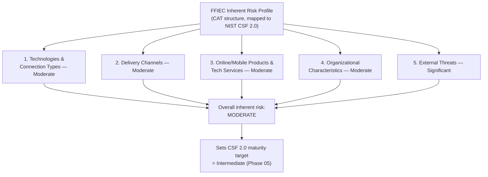

# 03.05 — Inherent Risk Profile (FFIEC)

| Field | Value |
|---|---|
| Document ID | CCB-RA-IRP-2026-305 |
| Version | 1.0 |
| Date | 2026-06-15 |
| Classification | Confidential — Nonpublic Information (NPI) // Illustrative Portfolio Sample |
| Owner | Steven Nakamura, Chief Risk Officer (CRO) |
| Author | Advisory Team (Financial-Services GRC) |
| Status | Approved |

## Purpose

This document establishes Cornerstone Community Bank's **inherent risk profile** using the structure of the **FFIEC Cybersecurity Assessment Tool (CAT)**. The CAT was **officially sunset on August 31, 2025**; consistent with the Bank's Phase 01 scoping decision, Cornerstone retains the CAT's proven **Inherent Risk Profile** structure — five categories — and **maps it forward to NIST CSF 2.0** as its go-forward cybersecurity assessment. Inherent risk is the risk *before* the mitigating effect of controls and cybersecurity maturity; it describes the Bank's exposure given its technologies, channels, products, characteristics, and threat environment.

The profile is deliberately conservative and evidence-based. Its conclusion — **overall inherent risk = Moderate**, with **External Threats rated higher (Significant)** — anchors the maturity target-setting in Phase 05 and contextualizes the scored register (03.07).

## FFIEC Inherent Risk Rating Scale

The CAT uses a five-level inherent risk scale. Cornerstone applies the same scale to each category and to the overall determination.

| Level | Meaning for Cornerstone |
|---|---|
| Least | Very limited use of technology; minimal exposure |
| Minimal | Limited, simple technology and channels |
| Moderate | Typical community-bank technology, channels, and exposure |
| Significant | Elevated exposure (e.g., high external-threat activity) |
| Most | Complex, high-volume, high-exposure environment |

## Category 1 — Technologies and Connection Types

This category reflects the number, type, and complexity of technologies and external connections. Cornerstone runs a **hybrid** environment: an **outsourced core and digital banking (Meridian)**, cloud/SaaS (M365, IAM, EDR/SIEM), on-premises systems across 18 branches, and third-party connections. The outsourced core reduces some in-house infrastructure complexity but introduces a critical external connection and concentration.

| Factor | Cornerstone position | Contribution |
|---|---|---|
| Core platform | Outsourced to Meridian (single critical connection) | Moderate |
| Cloud/SaaS services | M365, IAM, EDR/SIEM, several SaaS | Moderate |
| On-prem footprint | 18 branches, HQ data systems | Moderate |
| Third-party connections | ~85 third parties; 12 critical/high | Moderate |
| **Category rating** | | **Moderate** |

## Category 2 — Delivery Channels

This category reflects the variety and reach of channels through which products and services are delivered. Cornerstone offers branch, ATM, online, and mobile channels — a standard community-bank mix without high-risk channels such as large-scale foreign operations.

| Factor | Cornerstone position | Contribution |
|---|---|---|
| Branch / ATM | 18 branches; ATM network | Moderate |
| Online banking | ~62,000 enrolled digital users | Moderate |
| Mobile banking | Provided via Meridian platform | Moderate |
| **Category rating** | | **Moderate** |

## Category 3 — Online/Mobile Products and Technology Services

This category reflects payment and technology services offered, which drive fraud and cyber exposure. Cornerstone offers retail and small-business payments (ACH, wires, cards, bill pay) but does not act as a large payments processor or offer high-risk services (e.g., issuing/acquiring at scale, crypto, correspondent banking).

| Factor | Cornerstone position | Contribution |
|---|---|---|
| ACH / wire origination | Retail + small business volumes | Moderate |
| Card issuance | Debit cards | Moderate |
| P2P / bill pay | Standard consumer services | Moderate |
| Merchant/processing services | Not offered at scale | Minimal |
| **Category rating** | | **Moderate** |

## Category 4 — Organizational Characteristics

This category reflects organizational attributes — size, complexity, staffing, and change — that affect inherent risk. Cornerstone is a **~$1.2B**, **~240-employee**, **18-branch** bank; it is a subsidiary of a **publicly traded** holding company (Nasdaq: CCBK), which adds SOX/FDICIA obligations but the operational footprint remains that of a community bank with modest change velocity.

| Factor | Cornerstone position | Contribution |
|---|---|---|
| Size / complexity | ~$1.2B assets; single-state (Ohio) | Moderate |
| Staffing (security) | Dedicated CISO + IT Security team; lean | Moderate |
| Public-company status | Holding company SEC registrant (SOX 404, FDICIA) | Moderate |
| Change velocity (M&A, new systems) | Low–moderate | Minimal–Moderate |
| **Category rating** | | **Moderate** |

## Category 5 — External Threats

This category reflects the volume and sophistication of attacks targeting the institution. Financial institutions face persistent, high-frequency external attack activity — phishing, ransomware, ATO, BEC — documented in 03.02. Given the constant sector-wide targeting of retail-facing banks and the customer/digital footprint, this category is rated **Significant**, above the other four.

| Factor | Cornerstone position | Contribution |
|---|---|---|
| Attempted attacks (phishing, scanning) | High, continuous | Significant |
| Fraud/ATO pressure on retail channels | Elevated (85k customers, 62k digital) | Significant |
| Attack sophistication targeting midsize banks | Ransomware/BEC crews active sector-wide | Significant |
| **Category rating** | | **Significant** |

## Inherent Risk Profile Summary

Aggregating the five categories, four are **Moderate** and one (External Threats) is **Significant**. The overall inherent risk is determined as **Moderate** — the External Threats elevation is well-understood and does not, on its own, lift the enterprise profile above Moderate given the standard technology, channel, product, and organizational posture of a community bank.

| # | CAT Inherent Risk category | Rating |
|---|---|---|
| 1 | Technologies & Connection Types | Moderate |
| 2 | Delivery Channels | Moderate |
| 3 | Online/Mobile Products & Technology Services | Moderate |
| 4 | Organizational Characteristics | Moderate |
| 5 | External Threats | **Significant** |
| — | **Overall inherent risk** | **Moderate** |

## Mapping to NIST CSF 2.0

Because the CAT is sunset, each inherent risk category is mapped forward to the NIST CSF 2.0 Functions that the Bank will use to set and measure maturity in Phase 05. Higher inherent risk in a category raises the target maturity for the corresponding Functions.

| CAT category | Primary CSF 2.0 Functions | Implication for target maturity |
|---|---|---|
| Technologies & Connection Types | Identify (ID.AM), Protect (PR.AA, PR.IR) | Robust asset/connection management |
| Delivery Channels | Protect (PR.AA), Detect (DE.CM) | Strong channel authentication & monitoring |
| Online/Mobile Products & Services | Protect (PR.DS), Detect (DE.CM) | Payment-fraud detection, data protection |
| Organizational Characteristics | Govern (GV), Identify (ID.RA) | Governance, risk management maturity |
| External Threats (Significant) | Detect (DE), Respond (RS), Recover (RC) | Elevated detection/response/recovery target |

The External Threats elevation is the primary driver for prioritizing Detect, Respond, and Recover maturity in the Phase 05 target profile (target = **Intermediate**), addressing the **28 maturity gaps** identified there.

## Cross-References

- **03.01-risk-assessment-methodology.md** — methodology and inputs.
- **03.02-threat-landscape-and-sources.md** — external threat evidence for Category 5.
- **03.03-npi-threat-assessment-glba.md** — NPI exposure informing the profile.
- **03.04-vulnerability-assessment.md** — control weaknesses (context for inherent vs residual).
- **03.06-risk-scoring-and-criteria.md** — scoring that produces the 42-risk distribution.
- **Phase 01** — decision to map the sunset CAT forward to NIST CSF 2.0.
- **Phase 05 — FFIEC/NIST CSF 2.0 Assessment** — maturity target-setting and 28 gaps.

---

[⬅ Previous](03.04-vulnerability-assessment.md) · [🏠 Phase README](03.00-README.md) · [Next ➡](03.06-risk-scoring-and-criteria.md)
