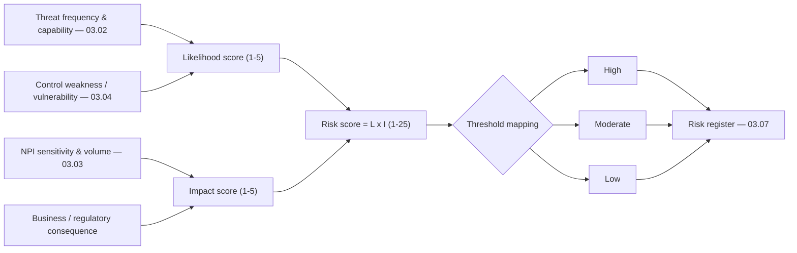

# 03.06 — Risk Scoring and Criteria

| Field | Value |
|---|---|
| Document ID | CCB-RA-SCORE-2026-306 |
| Version | 1.0 |
| Date | 2026-06-15 |
| Classification | Confidential — Nonpublic Information (NPI) // Illustrative Portfolio Sample |
| Owner | Steven Nakamura, Chief Risk Officer (CRO) |
| Author | Advisory Team (Financial-Services GRC) |
| Status | Approved |

## Purpose

This document defines the **scoring model and rating criteria** used to convert the threat, NPI, and vulnerability analyses (03.02–03.04) into consistent, comparable risk ratings. It specifies the **likelihood** and **impact** scales, the **5×5 risk matrix**, the **High / Moderate / Low** thresholds, worked examples, and the alignment to the Bank's **risk appetite**. It closes by **reconciling the model to the final population of 42 risks — 8 High, 18 Moderate, 16 Low.** A transparent, documented scoring model is what allows the Board, Internal Audit, and FFIEC examiners to rely on the register as an objective basis for prioritizing safeguards under GLBA §501(b).

## Scoring Model Overview

Each risk is scored on two anchored 1–5 axes. The **risk score is the product** of the two axes (Likelihood × Impact, range 1–25); the score maps to a **risk level** (High / Moderate / Low) via fixed thresholds. Scoring reflects **inherent** risk (before crediting control maturity); residual ratings are tracked separately in Phase 05.

## Likelihood Scale (1–5)

Likelihood expresses the probability that a threat source successfully exploits a vulnerability within a 12-month horizon, considering threat frequency/capability and existing control strength.

| Score | Rating | Definition | Indicative frequency |
|---|---|---|---|
| 1 | Rare | Not expected; requires exceptional conditions | < once in 5+ years |
| 2 | Unlikely | Could occur but not expected | ~ once in 3–5 years |
| 3 | Possible | Might occur at some point | ~ once a year |
| 4 | Likely | Expected to occur | Several times a year |
| 5 | Almost certain | Expected to occur frequently / already observed | Monthly or continuous |

## Impact Scale (1–5)

Impact expresses the potential damage to the security, confidentiality, or integrity of NPI and to the Bank if the event occurs. It is explicitly weighted by **NPI sensitivity and volume**, operationalizing the §501(b) instruction to consider the sensitivity of customer information.

| Score | Rating | NPI / customer harm | Financial / regulatory | Operational |
|---|---|---|---|---|
| 1 | Insignificant | No NPI affected | Negligible | No disruption |
| 2 | Minor | Limited, low-sensitivity data | Minor cost | Brief, contained |
| 3 | Moderate | Moderate NPI volume/sensitivity | Notable cost; possible reporting | Localized disruption |
| 4 | Major | Large NPI volume or high sensitivity | Regulatory notification; reputational harm | Significant disruption |
| 5 | Severe | Mass NPI exposure/destruction | Enforcement; 36-hour notice; material loss | Enterprise disruption |

## The 5×5 Risk Matrix

The matrix maps every Likelihood × Impact combination to a risk level. Cells show the numeric score; color-word bands show the level.

| Likelihood \ Impact | 1 Insignificant | 2 Minor | 3 Moderate | 4 Major | 5 Severe |
|---|---|---|---|---|---|
| **5 Almost certain** | 5 — Low | 10 — Moderate | 15 — High | 20 — High | 25 — High |
| **4 Likely** | 4 — Low | 8 — Moderate | 12 — Moderate | 16 — High | 20 — High |
| **3 Possible** | 3 — Low | 6 — Moderate | 9 — Moderate | 12 — Moderate | 15 — High |
| **2 Unlikely** | 2 — Low | 4 — Low | 6 — Moderate | 8 — Moderate | 10 — Moderate |
| **1 Rare** | 1 — Low | 2 — Low | 3 — Low | 4 — Low | 5 — Low |

## Rating Thresholds

The numeric score bands and their governance treatment are fixed as follows.

| Risk level | Score range | Governance treatment | Target response |
|---|---|---|---|
| **High** | 15–25 | Escalate to CISO/CRO and Audit Committee; formal treatment plan | Remediate / mitigate promptly; track to closure |
| **Moderate** | 6–12 | Managed by risk owner with 2nd-line oversight | Mitigate or accept with rationale; monitor |
| **Low** | 1–5 | Routine management; monitor | Accept / monitor; no dedicated plan required |

Note: a score of 10 (Almost certain × Minor, or Unlikely × Severe) and 12 both fall within Moderate; 15 is the first High band. Boundary cases are reviewed by the 2nd line to confirm the placement reflects true exposure.

## Worked Examples

The following worked examples show the model applied to representative risks from 03.03–03.04, demonstrating how scores and levels are derived.

| Example risk | Likelihood | Impact | Score | Level | Rationale |
|---|---|---|---|---|---|
| Employee phishing → mailbox NPI disclosure (E1/V-01) | 4 Likely | 4 Major | 16 | **High** | High-frequency threat; large NPI mailbox exposure |
| Account takeover on digital banking (E3/V-06) | 4 Likely | 4 Major | 16 | **High** | Retail targeting; MFA gaps; customer harm |
| Ransomware on legacy imaging (E2/V-07,V-08) | 3 Possible | 5 Severe | 15 | **High** | Destruction of records; recovery burden |
| Meridian core outage/breach (E5/V-12) | 2 Unlikely | 5 Severe | 10 | **Moderate** | Low likelihood via SOC-assured vendor; severe if realized |
| Cloud (M365) misconfiguration exposes NPI (I3/V-09) | 3 Possible | 3 Moderate | 9 | **Moderate** | Partial hardening; moderate volume |
| Lost branch laptop, encrypted (I6/V-11) | 2 Unlikely | 2 Minor | 4 | **Low** | Encryption limits harm |
| Stale low-sensitivity test account (I4) | 2 Unlikely | 1 Insignificant | 2 | **Low** | No NPI; minimal exposure |

## Risk-Appetite Alignment

The scoring thresholds are tied to the Board-approved risk appetite so that ratings translate directly into required action. Cornerstone's appetite is **low for risks to NPI confidentiality and integrity** and **low-to-moderate overall** — consistent with the target **Low-to-Moderate residual posture**.

| Risk level | Within appetite? | Required disposition |
|---|---|---|
| High | No — outside appetite | Mandatory treatment plan; escalate to Audit Committee; reduce toward Moderate/Low |
| Moderate | Conditionally, with controls | Managed and monitored; accept only with documented owner rationale |
| Low | Yes | Accept and monitor |

High risks are, by definition, outside appetite and must have an owner and a treatment plan; this is the mechanism by which the 8 High-rated risks drive the Phase 04 control design and Phase 05 remediation priorities.

## Reconciliation to the 42-Risk Population

Applying this model to the complete set of threat × vulnerability × NPI combinations produces **42 scored risks**. The distribution across levels is shown below and carries forward unchanged into the risk register (03.07).

| Risk level | Count | Share | Score band |
|---|---|---|---|
| **High** | 8 | 19% | 15–25 |
| **Moderate** | 18 | 43% | 6–12 |
| **Low** | 16 | 38% | 1–5 |
| **Total** | **42** | **100%** | — |

The concentration of the **8 High** risks around phishing/BEC, account takeover, ransomware, MFA/patching weaknesses, and vendor concentration is consistent with the **External Threats = Significant** finding in the inherent risk profile (03.05), while the overall spread — most risks Moderate or Low — is consistent with the **overall Moderate** inherent risk determination. This distribution is the quantitative bridge from the Phase 03 analysis to the register and to program prioritization.

## Cross-References

- **03.01-risk-assessment-methodology.md** — the model this scoring implements.
- **03.02-threat-landscape-and-sources.md** — likelihood inputs (threat frequency/capability).
- **03.03-npi-threat-assessment-glba.md** — impact inputs (NPI sensitivity/harm modes).
- **03.04-vulnerability-assessment.md** — control weaknesses affecting likelihood/impact.
- **03.05-inherent-risk-profile-ffiec.md** — inherent risk profile consistent with the distribution.
- **03.07-risk-register.md** — the 42 scored risks (8 High / 18 Moderate / 16 Low).
- **Phase 04 — Control Design** — safeguards prioritized by these ratings.
- **Phase 05 — FFIEC/NIST CSF 2.0** — residual scoring and maturity gap remediation.

---

[⬅ Previous](03.05-inherent-risk-profile-ffiec.md) · [🏠 Phase README](03.00-README.md) · [Next ➡](03.07-risk-register.md)
