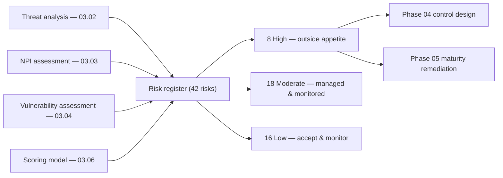

# 03.07 — Risk Register

| Field | Value |
|---|---|
| Document ID | CCB-RA-REG-2026-307 |
| Version | 1.0 |
| Date | 2026-06-15 |
| Classification | Confidential — Nonpublic Information (NPI) // Illustrative Portfolio Sample |
| Owner | Steven Nakamura, Chief Risk Officer (CRO) |
| Author | Advisory Team (Financial-Services GRC) |
| Status | Approved |

## Purpose

This document is **the risk register** — the authoritative, consolidated record of Cornerstone Community Bank's identified information-security risks to customer **nonpublic personal information (NPI)** and to the availability and integrity of the Bank's systems. It applies the scoring model defined in **03.06** to the threat, NPI, and vulnerability analyses (03.02–03.04) and records, for each risk, its category, threat, vulnerability, likelihood, impact, inherent rating, owner, and treatment decision.

The register carries the **complete population of 42 risks**, distributed as **8 High, 18 Moderate, and 16 Low**, consistent with the **overall Moderate** inherent risk profile (03.05). It is the statutory core of the GLBA §501(b) risk assessment: it is the object the Board relies on, that Internal Audit and FFIEC examiners test against, and that drives control prioritization in Phase 04 and maturity remediation in Phase 05.

## How to Read the Register

Each risk carries a stable identifier (**R-01 … R-42**). Likelihood and Impact are scored on the anchored 1–5 scales from 03.06; the **Inherent Rating** is the product mapped through the 5×5 matrix (High = 15–25, Moderate = 6–12, Low = 1–5). Ratings are **inherent** — before crediting control maturity. Treatment codes are: **M** = Mitigate, **T** = Transfer, **A** = Accept, **Av** = Avoid. Owners are accountable first-line or second-line officers.

## Distribution Summary

The scored population reconciles exactly to the Phase 03 storyline.

| Inherent rating | Count | Share | Score band | Governance treatment |
|---|---|---|---|---|
| **High** | 8 | 19% | 15–25 | Outside appetite; mandatory treatment plan; Audit Committee escalation |
| **Moderate** | 18 | 43% | 6–12 | Managed by owner with 2nd-line oversight; monitor |
| **Low** | 16 | 38% | 1–5 | Routine management; accept and monitor |
| **Total** | **42** | **100%** | — | — |

## The Top 8 High Risks

The eight High-rated risks are, by definition, **outside the Bank's risk appetite** and each carries a mandatory treatment plan tracked to closure. They are the primary drivers of the Phase 04 safeguards and the Phase 05 target-maturity remediation.

| Risk ID | Category | Threat | Vulnerability | L | I | Inherent | Owner | Treatment |
|---|---|---|---|---|---|---|---|---|
| **R-01** | NPI confidentiality | Phishing / credential theft → account takeover of internal mailboxes and NPI stores | Users susceptible to phishing; large NPI in mailboxes/shares | 4 | 4 | **High** | Rachel Alvarez (CISO) | M |
| **R-02** | Availability / integrity | Ransomware / destructive malware encrypting NPI and core-dependent systems | Legacy imaging hosts; segmentation and EDR coverage gaps | 3 | 5 | **High** | Marcus Doyle (IT Sec Mgr) | M |
| **R-03** | Third-party | Compromise or concentration failure of critical service provider (Meridian ecosystem) exposing NPI | Single critical dependency; reliance on vendor controls | 3 | 5 | **High** | Steven Nakamura (CRO) | M / T |
| **R-04** | Vulnerability mgmt | Exploitation of an unpatched external-facing system | Patch latency on perimeter/edge assets | 4 | 4 | **High** | Marcus Doyle (IT Sec Mgr) | M |
| **R-05** | Insider | Insider misuse or exfiltration of privileged NPI access | Excess entitlements; limited data-loss monitoring | 3 | 5 | **High** | Rachel Alvarez (CISO) | M |
| **R-06** | Fraud | Wire fraud / Business Email Compromise (BEC) diverting customer or Bank funds | Manual verification gaps; email spoofing exposure | 4 | 4 | **High** | Angela Foster (CCO/BSA) | M |
| **R-07** | Access / NPI | Weak or inconsistent MFA enabling credential-based intrusion | MFA not uniformly enforced across all NPI access paths | 4 | 4 | **High** | Rachel Alvarez (CISO) | M |
| **R-08** | Recovery / availability | Backup or recovery gap impairing timely restoration after a destructive event | Backup immutability/testing and RTO/RPO validation gaps | 3 | 5 | **High** | James Porter (CIO) | M |

## Full Risk Register (R-01 – R-42)

The complete population follows. The first eight rows repeat the High risks above for a single continuous view; rows R-09 onward carry the Moderate and Low populations.

| Risk ID | Category | Threat | Vulnerability | L | I | Inherent | Owner | Treatment |
|---|---|---|---|---|---|---|---|---|
| R-01 | NPI confidentiality | Phishing → mailbox/NPI takeover | Phishing susceptibility; NPI in mailboxes | 4 | 4 | **High** | R. Alvarez | M |
| R-02 | Availability | Ransomware / destructive malware | Legacy hosts; segmentation gaps | 3 | 5 | **High** | M. Doyle | M |
| R-03 | Third-party | Critical provider (Meridian) compromise/concentration | Single critical dependency | 3 | 5 | **High** | S. Nakamura | M/T |
| R-04 | Vulnerability mgmt | Unpatched external system exploited | Perimeter patch latency | 4 | 4 | **High** | M. Doyle | M |
| R-05 | Insider | Insider misuse of NPI access | Excess entitlements; weak DLP | 3 | 5 | **High** | R. Alvarez | M |
| R-06 | Fraud | Wire fraud / BEC | Manual verification gaps | 4 | 4 | **High** | A. Foster | M |
| R-07 | Access / NPI | Weak MFA enabling intrusion | MFA not uniformly enforced | 4 | 4 | **High** | R. Alvarez | M |
| R-08 | Recovery | Backup/recovery gap | Immutability/testing gaps | 3 | 5 | **High** | J. Porter | M |
| R-09 | NPI confidentiality | M365/cloud misconfiguration exposes NPI | Partial cloud hardening | 3 | 3 | Moderate | M. Doyle | M |
| R-10 | Availability / fraud | Digital-banking session/API abuse | Rate-limiting/API controls partial | 3 | 4 | Moderate | J. Porter | M |
| R-11 | Vulnerability mgmt | Web-application vulnerability (non-critical) | Secure-SDLC coverage gaps | 3 | 3 | Moderate | M. Doyle | M |
| R-12 | NPI confidentiality | Data leakage via email/removable media | Limited DLP and media control | 3 | 3 | Moderate | R. Alvarez | M |
| R-13 | Third-party / availability | Meridian core outage impairing service | Vendor concentration; SOC-assured | 2 | 5 | Moderate | S. Nakamura | M/T |
| R-14 | Third-party | Fourth-party / subservice provider risk | Limited fourth-party visibility | 2 | 4 | Moderate | S. Nakamura | M |
| R-15 | Access / insider | Privileged access sprawl / excess entitlements | Incomplete least-privilege reviews | 3 | 4 | Moderate | R. Alvarez | M |
| R-16 | Detection | Inadequate logging/monitoring delays detection | SIEM coverage/tuning gaps | 3 | 3 | Moderate | M. Doyle | M |
| R-17 | Third-party | Unaddressed vendor SOC-report exceptions | SOC review follow-up gaps | 3 | 3 | Moderate | S. Nakamura | M |
| R-18 | NPI confidentiality | Mobile device loss/theft with NPI | MDM coverage partial | 2 | 3 | Moderate | M. Doyle | M |
| R-19 | Fraud / social eng. | Call-center vishing / social engineering | Identity-verification script gaps | 3 | 3 | Moderate | A. Foster | M |
| R-20 | Integrity | Change-management error impacts NPI system | Change controls not fully mature | 3 | 3 | Moderate | J. Porter | M |
| R-21 | Availability | DDoS on internet-facing services | Mitigation reliance on providers | 3 | 3 | Moderate | M. Doyle | M/T |
| R-22 | Compliance | Reg P / privacy-notice or sharing gap | Notice/opt-out process gaps | 2 | 4 | Moderate | K. Ellis | M |
| R-23 | Compliance | 36-hour incident-notification failure | IR notification runbook immature | 2 | 4 | Moderate | R. Alvarez | M |
| R-24 | Fraud | Card / payment fraud (skimming, CNP) | Monitoring thresholds tuning | 3 | 3 | Moderate | A. Foster | M/T |
| R-25 | NPI confidentiality | Shadow IT / unsanctioned SaaS handling NPI | SaaS discovery gaps | 3 | 3 | Moderate | R. Alvarez | M |
| R-26 | Physical | Unauthorized physical access at a branch | Physical access controls variance | 2 | 3 | Moderate | J. Porter | M |
| R-27 | NPI confidentiality | Lost/stolen encrypted branch laptop | Residual exposure if key compromised | 2 | 2 | Low | M. Doyle | M |
| R-28 | Access | Stale low-sensitivity test account | Deprovisioning lag; no NPI | 2 | 1 | Low | M. Doyle | M |
| R-29 | Vulnerability mgmt | Minor misconfiguration on non-NPI system | Config-baseline drift | 2 | 2 | Low | M. Doyle | M |
| R-30 | Availability | Expired certificate on internal service | Certificate lifecycle gaps | 2 | 2 | Low | J. Porter | M |
| R-31 | Physical | Media-disposal minor gap (non-NPI) | Sanitization process variance | 2 | 2 | Low | J. Porter | M |
| R-32 | Network | Guest Wi-Fi segmentation weakness | VLAN/ACL review cadence | 2 | 2 | Low | M. Doyle | M |
| R-33 | Third-party | Non-critical vendor, no NPI access | Onboarding due-diligence lag | 1 | 2 | Low | S. Nakamura | A |
| R-34 | NPI confidentiality | Print/fax handling of low-sensitivity data | Manual handling variance | 2 | 2 | Low | K. Ellis | M |
| R-35 | Access | Endpoint policy drift (auto-lock) | Baseline enforcement gaps | 3 | 1 | Low | M. Doyle | M |
| R-36 | Social eng. | Low-risk phishing to non-NPI accounts | Awareness variance | 3 | 1 | Low | R. Alvarez | M |
| R-37 | Governance | Documentation/version-control lapse | Records discipline variance | 2 | 1 | Low | R. Alvarez | A |
| R-38 | Availability | Informational-website availability blip | Non-critical hosting | 2 | 2 | Low | J. Porter | A |
| R-39 | NPI confidentiality | Non-sensitive report emailed externally | Data-handling variance | 2 | 2 | Low | K. Ellis | M |
| R-40 | Access | Delayed deprovisioning of low-priv account | Offboarding timing gaps | 2 | 2 | Low | M. Doyle | M |
| R-41 | Network | Legacy protocol on isolated segment (no NPI) | Deprecation backlog | 2 | 2 | Low | M. Doyle | M |
| R-42 | Detection | Minor logging gap on non-NPI system | Log-source coverage | 1 | 3 | Low | M. Doyle | A |

**Reconciliation:** R-01–R-08 = 8 High; R-09–R-26 = 18 Moderate; R-27–R-42 = 16 Low; total **42**.

## Category Distribution

Cross-cutting the register by risk category shows where exposure concentrates and confirms the External-Threats emphasis from the inherent risk profile (03.05).

| Category | High | Moderate | Low | Total |
|---|---|---|---|---|
| NPI confidentiality | 1 | 3 | 3 | 7 |
| Availability / recovery | 2 | 3 | 2 | 7 |
| Third-party | 1 | 3 | 1 | 5 |
| Access / insider | 2 | 2 | 4 | 8 |
| Fraud / social engineering | 1 | 3 | 1 | 5 |
| Vulnerability mgmt / integrity | 1 | 2 | 2 | 5 |
| Compliance / privacy | 0 | 2 | 0 | 2 |
| Physical / network / governance | 0 | 0 | 3 | 3 |
| **Total** | **8** | **18** | **16** | **42** |

## Register Governance

The register is a living control. It is owned by the CRO (second line), maintained with input from the CISO (first line), reviewed quarterly by the Risk Committee, and reported at least annually to the Board Audit Committee as part of the GLBA §501(b) report. New risks are added on identification; ratings are re-scored using 03.06; and residual ratings are tracked separately as controls mature (Phase 05). Any decision to **Accept** a Moderate or higher risk follows the risk-acceptance process defined in **03.08**.

## Cross-References

- **03.03-npi-threat-assessment-glba.md** — NPI harm modes informing Impact scores.
- **03.04-vulnerability-assessment.md** — control weaknesses informing Likelihood.
- **03.05-inherent-risk-profile-ffiec.md** — overall Moderate profile the register reconciles to.
- **03.06-risk-scoring-and-criteria.md** — the scoring model and 42-risk distribution.
- **03.08-risk-treatment-and-appetite.md** — appetite, treatment strategies, and acceptance process.
- **03.09-control-gap-preliminary-analysis.md** — gaps derived from the High/Moderate risks.
- **Phase 04 — Control Design** — safeguards prioritized by the top 8 High risks.
- **Phase 05 — FFIEC/NIST CSF 2.0** — residual scoring and the 28 maturity gaps.

---

[⬅ Previous](03.06-risk-scoring-and-criteria.md) · [🏠 Phase README](03.00-README.md) · [Next ➡](03.08-risk-treatment-and-appetite.md)
