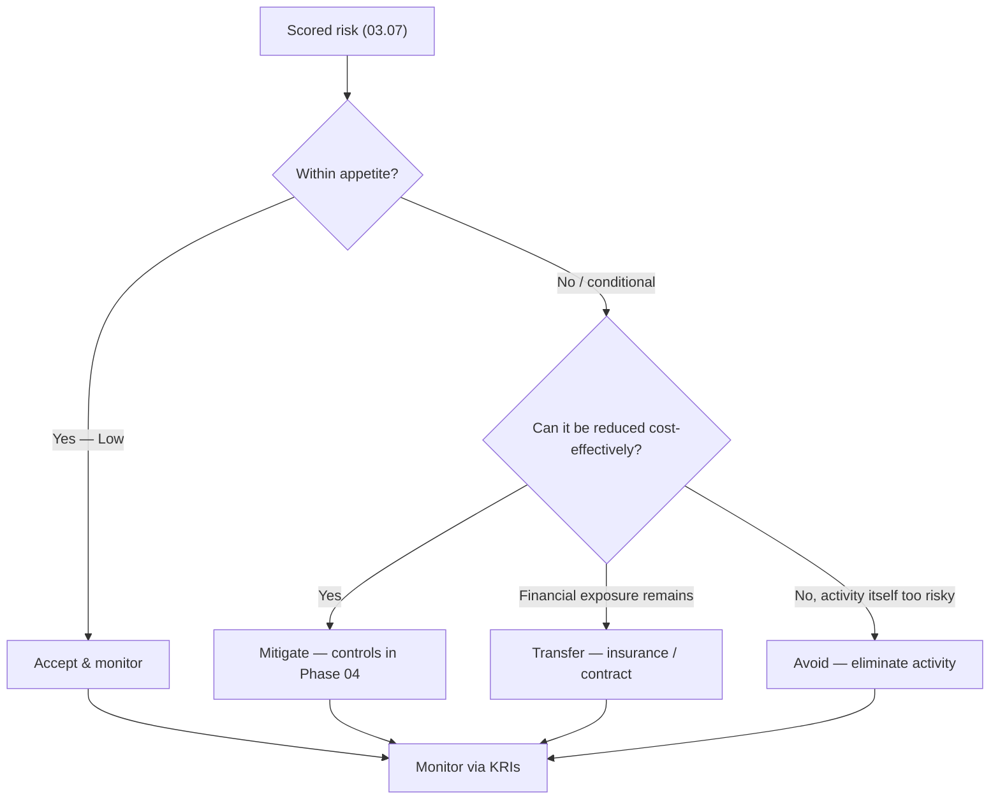

# 03.08 — Risk Treatment and Appetite

| Field | Value |
|---|---|
| Document ID | CCB-RA-TREAT-2026-308 |
| Version | 1.0 |
| Date | 2026-06-15 |
| Classification | Confidential — Nonpublic Information (NPI) // Illustrative Portfolio Sample |
| Owner | Steven Nakamura, Chief Risk Officer (CRO) |
| Author | Advisory Team (Financial-Services GRC) |
| Status | Approved |

## Purpose

This document establishes how Cornerstone Community Bank **decides what to do about the 42 risks** recorded in the register (03.07). It states the Board-approved **risk appetite**, defines the four **treatment strategies** (mitigate, transfer, accept, avoid), sets out how the **8 High risks** are prioritized for treatment in Phase 04, specifies the formal **risk-acceptance process**, and defines the **key risk indicators (KRIs)** used to monitor exposure over time.

Treatment and appetite operationalize the GLBA §501(b) requirement to manage and control identified risks: the register tells the Board *what* the risks are; this document tells the Board *how much risk it is willing to bear* and *what response each risk receives*.

## Risk Appetite Statement

Cornerstone's risk appetite is set by the Board and administered by the CRO. In plain terms: the Bank has **low appetite for risks to the confidentiality and integrity of customer NPI**, **low appetite for regulatory non-compliance**, and **low-to-moderate appetite overall**, consistent with its target **Low-to-Moderate residual posture**.

| Risk domain | Appetite | Statement |
|---|---|---|
| NPI confidentiality & integrity | **Low** | The Bank does not accept avoidable exposure of customer NPI; High risks to NPI must be treated to Moderate or Low. |
| Availability of critical services | Low–Moderate | Brief, contained disruptions tolerated; destructive/extended outages are not within appetite. |
| Fraud & financial loss | Low | Fraud losses are minimized through preventive and detective controls; residual accepted only within defined thresholds. |
| Regulatory & legal compliance | **Very Low** | No appetite for willful or systemic non-compliance with GLBA, Reg P, or notification rules. |
| Third-party / concentration | Low–Moderate | Critical providers (Meridian) require enhanced oversight; concentration managed, not eliminated. |
| Enterprise (overall) | Low–Moderate | Aggregate residual risk maintained at Low-to-Moderate, well-managed. |

**Appetite-to-rating linkage.** High-rated risks are, by definition, *outside* appetite and require a treatment plan; Moderate risks are *conditionally within* appetite subject to controls and monitoring; Low risks are *within* appetite and accepted.

## Treatment Strategies

Every risk in the register carries one of four dispositions. The Bank prefers **mitigation** for risks to NPI, uses **transfer** to complement (never replace) controls, **accepts** only within appetite and with documented rationale, and **avoids** where an activity's risk cannot be brought within appetite.

| Strategy | Code | When applied | Example from register |
|---|---|---|---|
| **Mitigate** | M | Reduce likelihood/impact via administrative, technical, or physical safeguards | R-01 phishing/ATO → MFA, awareness, email security |
| **Transfer** | T | Shift financial consequence via insurance or contractual allocation | R-03/R-13 Meridian → cyber insurance + contractual SLAs/indemnity |
| **Accept** | A | Residual risk is within appetite; formal sign-off recorded | R-33 non-critical vendor, no NPI access |
| **Avoid** | Av | Eliminate the activity/technology when risk cannot be reduced within appetite | Declining a high-risk product or deprecating an unsupported technology |

## Prioritizing the 8 High Risks for Phase 04

The eight High risks are outside appetite and drive the Phase 04 control program. Each is assigned a treatment priority (P1 highest), a target residual rating, and the primary safeguard themes that Phase 04 will design and Phase 05 will mature.

| Risk ID | Risk | Priority | Target residual | Primary Phase 04 safeguards |
|---|---|---|---|---|
| R-06 | Wire fraud / BEC | P1 | Low–Moderate | Callback verification, dual control, email authentication, staff training |
| R-01 | Phishing / ATO to NPI | P1 | Low–Moderate | Phishing-resistant MFA, email security, awareness, conditional access |
| R-07 | Weak MFA | P1 | Low | Uniform MFA enforcement across all NPI access paths |
| R-02 | Ransomware | P1 | Moderate | EDR, segmentation, immutable backups, tested recovery |
| R-04 | Unpatched external system | P2 | Low–Moderate | Vulnerability & patch SLAs, external attack-surface management |
| R-08 | Backup / recovery gap | P2 | Moderate | Backup immutability, RTO/RPO validation, DR testing |
| R-05 | Insider misuse of NPI | P2 | Moderate | Least privilege, access reviews, DLP, monitoring |
| R-03 | Critical provider (Meridian) | P2 | Moderate | Enhanced vendor oversight, SOC review, contractual controls, insurance |

All eight carry a mandatory treatment plan with an accountable owner and are tracked to closure by the Risk Committee. Their remediation is the direct input to the Phase 04 Written Information Security Program (WISP) and the Phase 05 maturity target (Intermediate).

## Risk-Acceptance Process

Accepting a risk at Moderate or above is a governed decision, not a default. The process ensures that any accepted residual exposure is deliberate, documented, time-bound, and visible to the second line and the Board.

| Step | Action | Responsible |
|---|---|---|
| 1 | Document the risk, rationale, compensating controls, and expiry | Risk owner (first line) |
| 2 | Confirm the residual rating and appetite alignment | CRO (second line) |
| 3 | Approve — Low by owner; Moderate by CRO; High by Audit Committee | Per authority table below |
| 4 | Record in the register with review date (max 12 months) | Risk owner / GRC |
| 5 | Re-evaluate at expiry or on material change | Risk owner + CRO |

| Residual rating | Acceptance authority | Maximum acceptance term |
|---|---|---|
| Low | Risk owner | 12 months |
| Moderate | Chief Risk Officer | 12 months |
| High | Board Audit Committee (formal minute) | 6 months, with active treatment |

No High risk may be *accepted as-is*; where a High risk is temporarily tolerated pending remediation, the Audit Committee must record the interim acceptance with a defined treatment timeline.

## Key Risk Indicators (KRIs)

KRIs give the second line and the Board leading and lagging signals that risk is moving toward or away from appetite. Each KRI has a defined green/amber/red threshold; amber and red trigger review and, if needed, treatment escalation.

| KRI | Linked risks | Green | Amber | Red |
|---|---|---|---|---|
| Phishing simulation click rate | R-01, R-36 | < 5% | 5–10% | > 10% |
| Critical/High patches past SLA | R-04 | 0 | 1–3 | > 3 |
| MFA coverage of NPI access paths | R-07 | 100% | 95–99% | < 95% |
| Backup restoration tests passed | R-08 | 100% | 80–99% | < 80% |
| Privileged accounts past access review | R-05, R-15 | 0 | 1–5 | > 5 |
| BEC/wire attempts caught pre-loss | R-06 | 100% | 90–99% | < 90% |
| Critical-vendor SOC exceptions open | R-03, R-17 | 0 | 1–2 | > 2 |
| Mean time to detect (MTTD) | R-16, R-42 | < 24h | 24–72h | > 72h |

KRIs are reported quarterly to the Risk Committee and summarized annually to the Board. Sustained red status on any KRI tied to a High risk triggers a formal review of the treatment plan's adequacy.

## Cross-References

- **03.06-risk-scoring-and-criteria.md** — thresholds tied to the appetite bands.
- **03.07-risk-register.md** — the 42 risks and their treatment codes.
- **03.09-control-gap-preliminary-analysis.md** — controls that realize the mitigation decisions.
- **03.10-risk-assessment-report.md** — appetite and treatment summarized for the Board.
- **Phase 04 — Control Design** — WISP and 14 core policies delivering the safeguards.
- **Phase 05 — FFIEC/NIST CSF 2.0** — residual re-rating and maturity targets.
- **Phase 07 — Third-Party Risk** — enhanced oversight and transfer for Meridian.

---

[⬅ Previous](03.07-risk-register.md) · [🏠 Phase README](03.00-README.md) · [Next ➡](03.09-control-gap-preliminary-analysis.md)
