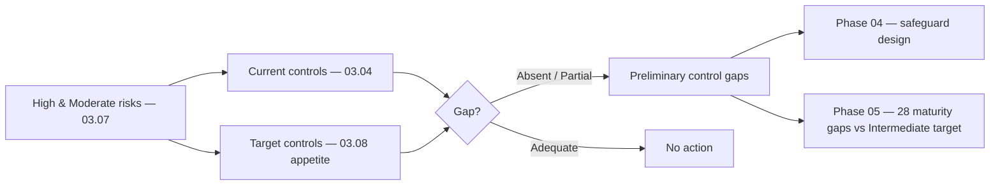

# 03.09 — Control-Gap Preliminary Analysis

| Field | Value |
|---|---|
| Document ID | CCB-RA-GAP-2026-309 |
| Version | 1.0 |
| Date | 2026-06-15 |
| Classification | Confidential — Nonpublic Information (NPI) // Illustrative Portfolio Sample |
| Owner | Rachel Alvarez, Chief Information Security Officer (CISO) |
| Author | Advisory Team (Financial-Services GRC) |
| Status | Approved |

## Purpose

This document provides a **preliminary control-gap analysis**: it maps the Bank's **current controls** against the **controls needed** to bring the register's High and Moderate risks within appetite, and identifies where gaps exist. The gaps are organized against the **NIST CSF 2.0** six Functions (**Govern, Identify, Protect, Detect, Respond, Recover**) so they translate directly into the Phase 05 maturity assessment.

This is deliberately a **preliminary** view produced during risk assessment. It is *not* the formal maturity assessment. Its role is to surface the control themes the risks demand so that Phase 04 can design the safeguards and Phase 05 can score them against the target profile. **This preliminary view feeds directly into Phase 05, where it is refined and quantified into 28 discrete maturity gaps** measured against the Intermediate target.

## Method

For each significant risk theme, we recorded the current control state (from the vulnerability assessment, 03.04), the target control state implied by the risk rating and appetite (03.08), and the resulting gap. Gaps are tagged to the primary CSF 2.0 Function and to a preliminary status: **Absent** (control not in place), **Partial** (in place but not consistent/effective), or **Adequate** (no material gap). Only Absent and Partial states become candidate maturity gaps in Phase 05.

## Current vs. Needed Controls

The table maps the leading risk themes to the current and needed control state and the preliminary gap status.

| Risk theme (register) | Current control state | Needed control | CSF 2.0 Function | Gap status |
|---|---|---|---|---|
| Phishing / ATO (R-01) | Basic awareness; email filtering | Phishing-resistant MFA, advanced email security, continuous training | Protect | **Partial** |
| MFA coverage (R-07) | MFA on some access paths | Uniform MFA on all NPI access paths | Protect | **Partial** |
| Ransomware (R-02) | AV/EDR partial; flat segments | Full EDR, segmentation, immutable/tested backups | Protect / Recover | **Partial** |
| Backup / recovery (R-08) | Backups run; testing ad hoc | Immutable backups; validated RTO/RPO; DR tests | Recover | **Partial** |
| Wire fraud / BEC (R-06) | Some manual verification | Callback + dual control, email authentication (DMARC) | Protect / Detect | **Partial** |
| Unpatched external system (R-04) | Patching without firm SLAs | Risk-based patch SLAs; attack-surface mgmt | Identify / Protect | **Partial** |
| Insider misuse (R-05) | Role-based access; periodic reviews | Least privilege, DLP, privileged-access monitoring | Protect / Detect | **Partial** |
| Third-party (Meridian) (R-03) | SOC reports collected | Enhanced oversight, SOC-exception tracking, contract controls | Govern / Identify | **Partial** |
| Logging / monitoring (R-16) | SIEM partial coverage | Full log coverage, tuned use-cases, 24×7 alerting | Detect | **Partial** |
| Incident response (R-23) | IR plan exists | Tested IR + 36-hour notification runbook | Respond | **Partial** |
| Data protection / DLP (R-12, R-25) | Encryption at rest/in transit partial | Enterprise DLP, SaaS discovery, data-handling controls | Protect | **Partial** |
| Governance / risk mgmt | Risk assessment established | Formal WISP, policy set, board reporting cadence | Govern | **Partial** |
| Vulnerability mgmt program (R-11) | Periodic scanning | Continuous scanning, secure-SDLC integration | Identify | **Partial** |
| Asset / connection inventory | Inventory established (Phase 02) | Maintained, NPI-tagged, connection-mapped | Identify | Adequate |

## Preliminary Gaps by CSF 2.0 Function

Aggregating the themes by Function shows where the control program must concentrate. The counts are a *preliminary* indication; Phase 05 refines them into 28 measured gaps against the Intermediate target.

| CSF 2.0 Function | Primary concern | Preliminary gap themes | Direction |
|---|---|---|---|
| **Govern (GV)** | WISP, roles, risk & vendor governance | Formalize program, policies, oversight cadence | Elevate to Intermediate |
| **Identify (ID)** | Asset, vulnerability, third-party risk mgmt | Patch SLAs, continuous scanning, vendor risk | Elevate to Intermediate |
| **Protect (PR)** | Access, MFA, data protection, awareness | MFA uniformity, DLP, segmentation, training | Highest-priority uplift |
| **Detect (DE)** | Logging, monitoring, fraud detection | SIEM coverage/tuning, 24×7 alerting | Elevate to Intermediate |
| **Respond (RS)** | Incident response, notification | Tested IR, 36-hour notification runbook | Elevate to Intermediate |
| **Recover (RC)** | Backup integrity, DR, resilience | Immutable backups, RTO/RPO validation | Elevate to Intermediate |

The heaviest concentration is in **Protect**, consistent with the register's NPI-confidentiality and access-control emphasis, with elevated **Detect / Respond / Recover** needs flowing from the **Significant** External-Threats inherent rating (03.05).

## From Preliminary Gaps to Phase 05 and Phase 04

This preliminary analysis has two downstream consumers. **Phase 04** uses the gap themes to design the WISP and its administrative, technical, and physical safeguards. **Phase 05** scores the current state against the CSF 2.0 target profile (target = Intermediate) and resolves this preliminary view into the definitive **28 maturity gaps**, each with a remediation owner and timeline.

| Preliminary theme (this doc) | Phase 04 deliverable | Phase 05 outcome |
|---|---|---|
| Access & MFA (Protect) | Access-control & authentication policy + controls | Maturity gaps in PR.AA |
| Data protection / DLP (Protect) | Data-protection & classification safeguards | Maturity gaps in PR.DS |
| Detection & monitoring (Detect) | Logging & monitoring standard | Maturity gaps in DE.CM/DE.AE |
| Incident response (Respond) | IR plan + 36-hour notification runbook | Maturity gaps in RS.MA/RS.CO |
| Backup & recovery (Recover) | BCP/DR & backup standard | Maturity gaps in RC.RP |
| Governance & vendor (Govern/Identify) | WISP, policies, vendor-oversight program | Maturity gaps in GV/ID |

Because the analysis here is preliminary and control-theme-level, the exact count differs from Phase 05's measured **28 gaps**; the relationship is one of refinement, not contradiction — every theme above maps to one or more of the 28.

## Preliminary Gap Prioritization

To help Phase 04 sequence its work, each gap theme is given a preliminary priority based on the severity of the risks it addresses (weighting the eight High risks most heavily) and the extent of the current gap. This is an indicative ordering, not a formal maturity score; Phase 05 assigns the definitive remediation sequencing against the Intermediate target.

| Priority | Gap theme | Driving risks | Rationale |
|---|---|---|---|
| P1 | MFA uniformity & phishing resistance | R-01, R-07 | Directly addresses two of the eight High risks; broad NPI exposure |
| P1 | Wire/BEC preventive controls | R-06 | Highest-frequency fraud vector; funds-transfer exposure |
| P1 | Ransomware defense & recovery | R-02, R-08 | Availability of NPI-bearing systems; destructive-event resilience |
| P2 | Vulnerability & patch SLAs | R-04 | External attack-surface exposure |
| P2 | Least privilege & DLP | R-05, R-12 | Insider misuse and NPI leakage |
| P2 | Detection & monitoring uplift | R-16, R-42 | Reduces dwell time; supports 36-hour notification |
| P3 | Vendor-oversight formalization | R-03, R-17 | Critical-provider concentration (Meridian) |
| P3 | Governance / WISP formalization | Program-wide | Underpins all other safeguards; §501(b) basis |

## Limitations of This Preliminary View

This analysis is intentionally scoped as a first pass and carries the following caveats, which Phase 05 resolves:

- It is **theme-level**, not subcategory-level; the CSF 2.0 106-subcategory scoring occurs in Phase 05.
- Gap status is **qualitative** (Absent / Partial / Adequate), not the numeric current-vs-target maturity scale.
- It reflects the **current control state at assessment date**; controls designed in Phase 04 will change the picture before Phase 05 scoring.
- The count of themes here (control-oriented) does not equal the **28 measured maturity gaps**; the 28 are the authoritative figure.

Despite these limitations, the preliminary view is sufficient to direct the Phase 04 control-design effort and to seed the Phase 05 target-profile assessment without rework.

## Cross-References

- **03.04-vulnerability-assessment.md** — current-state control weaknesses (the "current" column).
- **03.07-risk-register.md** — the High/Moderate risks whose controls are analyzed.
- **03.08-risk-treatment-and-appetite.md** — target state implied by appetite and mitigation.
- **03.10-risk-assessment-report.md** — gaps summarized in the Board report.
- **Phase 04 — Control Design** — WISP and 14 core policies addressing the gaps.
- **Phase 05 — FFIEC/NIST CSF 2.0** — refinement into 28 maturity gaps vs Intermediate target.

---

[⬅ Previous](03.08-risk-treatment-and-appetite.md) · [🏠 Phase README](03.00-README.md) · [Next ➡](03.10-risk-assessment-report.md)
