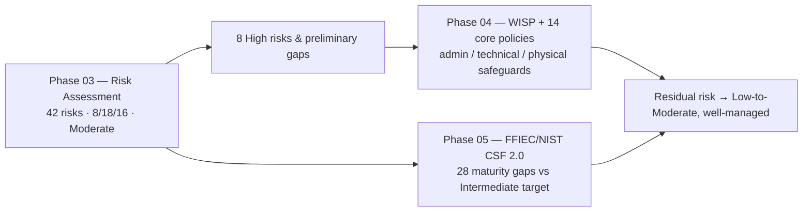

# 03.11 — Phase Summary and Transition

| Field | Value |
|---|---|
| Document ID | CCB-RA-SUM-2026-311 |
| Version | 1.0 |
| Date | 2026-06-15 |
| Classification | Confidential — Nonpublic Information (NPI) // Illustrative Portfolio Sample |
| Owner | Rachel Alvarez, Chief Information Security Officer (CISO) |
| Author | Advisory Team (Financial-Services GRC) |
| Status | Approved |

## Purpose

This document closes **Phase 03 — Risk Assessment (GLBA 501(b) + Inherent Risk)**. It recaps the phase outcomes, confirms that the assessment **satisfies the GLBA §501(b) risk-assessment requirement**, verifies that every phase deliverable is complete and internally consistent, and formally **hands off to Phase 04 — Information Security Program & Control Design**. It is the bridge between "understanding the risk" and "controlling the risk."

## Phase Outcomes

Phase 03 produced a complete, evidence-based, and examinable risk assessment. The headline results are stable across every document in the phase and reconcile to the program storyline.

| Outcome | Result |
|---|---|
| Risks identified | **42** |
| Rating distribution | **8 High · 18 Moderate · 16 Low** |
| Overall inherent risk profile | **Moderate** (External Threats: Significant) |
| Systems processing NPI | 22 of 140 |
| Core / digital banking dependency | Meridian Core Services, LLC (SOC 1 & SOC 2 Type II) |
| High risks outside appetite | 8 — all with treatment plans and owners |
| Preliminary control gaps | Concentrated in Protect; elevated Detect/Respond/Recover |
| Statutory deliverable | GLBA §501(b) Risk Assessment Report (03.10) — Board-approved |

## Deliverables Completed

Every numbered document in the phase is complete, approved, and cross-referenced.

| Doc | Title | Role in phase |
|---|---|---|
| 03.01 | Risk Assessment Methodology | Defines the NIST SP 800-30 approach |
| 03.02 | Threat Landscape and Sources | External/internal threat evidence |
| 03.03 | NPI Threat Assessment (GLBA) | NPI sensitivity and harm modes |
| 03.04 | Vulnerability Assessment | Current-state control weaknesses |
| 03.05 | Inherent Risk Profile (FFIEC) | Overall Moderate determination |
| 03.06 | Risk Scoring and Criteria | 5×5 model; 42-risk distribution |
| 03.07 | Risk Register | The 42 scored risks |
| 03.08 | Risk Treatment and Appetite | Appetite, treatment, KRIs |
| 03.09 | Control-Gap Preliminary Analysis | Gaps feeding Phase 05 |
| 03.10 | Risk Assessment Report | Statutory §501(b) Board deliverable |
| 03.11 | Phase Summary and Transition | This document |

## GLBA §501(b) Compliance Confirmation

The phase satisfies each element of the risk-assessment requirement in the Interagency Guidelines Establishing Information Security Standards.

| §501(b) / Guidelines element | Where satisfied |
|---|---|
| Identify reasonably foreseeable internal and external threats | 03.02, 03.03 |
| Assess likelihood and potential damage, considering NPI sensitivity | 03.03, 03.06 |
| Assess sufficiency of policies, procedures, and controls | 03.04, 03.09 |
| Produce a documented, board-reportable risk assessment | 03.07, 03.10 |
| Provide a basis to design and prioritize safeguards | 03.08, 03.09 → Phase 04 |
| Board oversight and approval | 03.10 sign-off (Audit Committee) |

**Conclusion:** the Phase 03 risk assessment **meets the GLBA §501(b) risk-assessment obligation** and provides a defensible, examinable foundation for the written information security program.

## Transition to Phase 04

Phase 04 converts the risk understanding into a **Written Information Security Program (WISP)** with **14 core policies** and administrative, technical, and physical safeguards. The eight High risks and the preliminary control gaps are the direct inputs.

### Handoff Items

| Handoff | From Phase 03 | Into Phase 04 |
|---|---|---|
| Top 8 High risks with priorities | 03.07 / 03.08 | Safeguard design targets |
| Risk appetite & treatment decisions | 03.08 | Policy scope and control selection |
| Preliminary control gaps by CSF Function | 03.09 | WISP control mapping |
| §501(b) risk assessment (approved) | 03.10 | Program mandate and board basis |
| KRIs | 03.08 | Ongoing monitoring in the program |

Phase 03 also feeds **Phase 05**, where the preliminary gaps are refined into the definitive **28 maturity gaps** measured against the CSF 2.0 **Intermediate** target profile.

## Open Items Carried Forward

No items block the transition; the following are tracked into subsequent phases.

| Item | Owner | Target phase |
|---|---|---|
| Design WISP and 14 core policies | R. Alvarez (CISO) | Phase 04 |
| Enforce uniform MFA; implement DLP | M. Doyle (IT Sec Mgr) | Phase 04 |
| Immutable backups + DR test | J. Porter (CIO) | Phase 04 |
| Refine gaps into 28 maturity gaps | R. Alvarez (CISO) | Phase 05 |
| Enhanced Meridian oversight | S. Nakamura (CRO) | Phase 07 |

## Cross-References

- **03.07-risk-register.md** — the 42 risks handed to Phase 04.
- **03.08-risk-treatment-and-appetite.md** — appetite and treatment priorities.
- **03.09-control-gap-preliminary-analysis.md** — preliminary gaps into Phases 04/05.
- **03.10-risk-assessment-report.md** — the approved §501(b) deliverable.
- **Phase 04 — Information Security Program & Control Design** — WISP + 14 core policies.
- **Phase 05 — FFIEC/NIST CSF 2.0 Assessment** — 28 maturity gaps vs Intermediate target.

---

[⬅ Previous](03.10-risk-assessment-report.md) · [🏠 Phase README](03.00-README.md) · [Next ➡](../04-information-security-program-controls/04.00-README.md)
