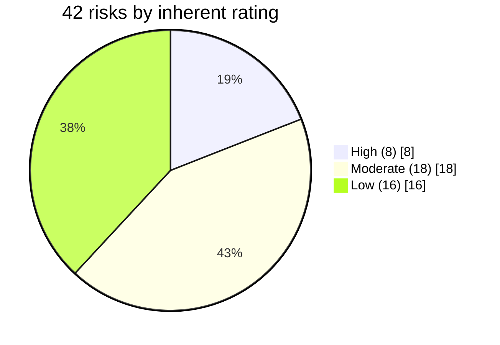

# Diagram — Risk Distribution

| Field | Value |
|---|---|
| Version | 1.0 |
| Date | 2026-06-15 |
| Classification | Confidential — Nonpublic Information (NPI) // Illustrative Portfolio Sample |
| Institution | Cornerstone Community Bank (parent: Cornerstone Bancorp, Inc. — Nasdaq: CCBK) |
| Regulators | FDIC · Ohio DFI · SEC |
| Phase | 03 — Risk Assessment (GLBA 501(b)) |
| Author | Advisory Team (Financial-Services GRC) |
| Status | Approved |

Overall FFIEC inherent risk profile: **Moderate**.

## Cross-References
`03.07-risk-register.md`, `03.05-inherent-risk-profile-ffiec.md`.
