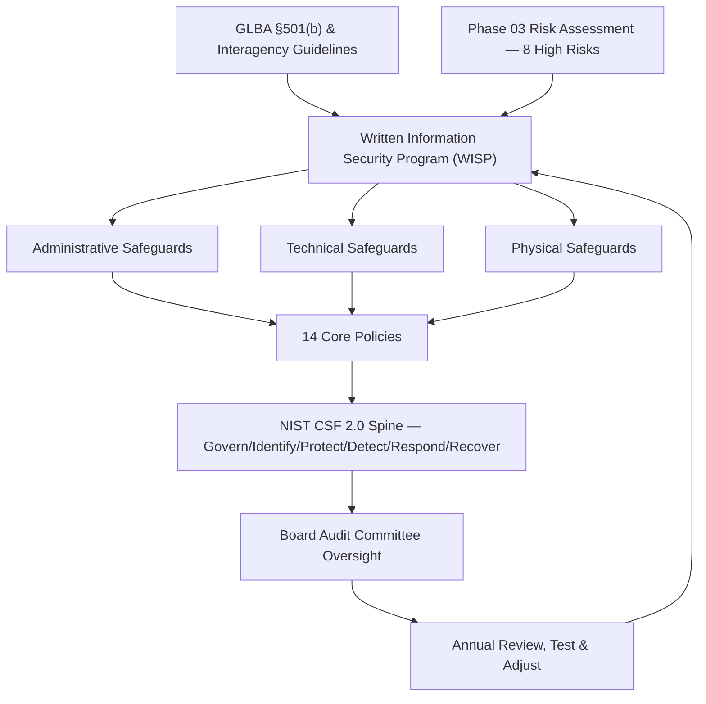

# 04.01 — Written Information Security Program (WISP)

| Field | Value |
|---|---|
| Document ID | CCB-ISP-WISP-2026-401 |
| Version | 1.0 |
| Date | 2026-06-15 |
| Classification | Confidential — Nonpublic Information (NPI) // Illustrative Portfolio Sample |
| Owner | Rachel Alvarez, Chief Information Security Officer (CISO/ISO) |
| Author | Advisory Team (Financial-Services GRC) |
| Status | Approved |

## Purpose

This document is the **Written Information Security Program (WISP)** of Cornerstone Community Bank — the keystone document required by **GLBA §501(b)** and the banking agencies' **Interagency Guidelines Establishing Information Security Standards** ("the Guidelines"). It is the single, board-approved instrument that establishes how the Bank protects the security, confidentiality, and integrity of **customer nonpublic personal information (NPI)** held across its **22 NPI-bearing systems** within a **140-system** enterprise inventory.

The WISP is deliberately concise at the top and layered beneath: it states the program's objectives, defines the **administrative, technical, and physical safeguards** structure mandated by the Guidelines, ties each safeguard family to the **8 High risks** carried in the Phase 03 risk register, references the **14 core policies** that operationalize it, and specifies the governance, board-approval, and review cadence that keep the program current. It is designed to satisfy an FFIEC IT examiner that Cornerstone has a *documented, risk-based, board-overseen* information security program.

## Regulatory Basis and Program Objectives

GLBA §501(b) directs the Bank, through the Guidelines, to (1) designate an employee or employees to coordinate the program, (2) identify and assess risks to NPI, (3) design and implement safeguards to control those risks, (4) oversee service providers, and (5) monitor, test, and adjust the program. The WISP is the document in which those obligations are met and evidenced.

| Guidelines Requirement (GLBA §501(b)) | How the WISP Satisfies It | Reference |
|---|---|---|
| Designate program coordinator | CISO (Rachel Alvarez) appointed as Information Security Officer with board mandate | 04.03 |
| Assess risks to NPI | Phase 03 risk assessment; 42 risks → 8 High / 18 Moderate / 16 Low | 03.07 |
| Design & implement safeguards | Administrative, technical, physical safeguards + 14 core policies | 04.03–04.08 |
| Oversee service providers | Vendor/third-party management; Meridian under enhanced oversight | 04.03, Phase 07 |
| Monitor, test, and adjust | Logging/monitoring, independent testing, annual review & board report | Phase 08, 04.02 |
| Report to the Board annually | Annual GLBA §501(b) report to the Audit Committee | Phase 09 |

The program's stated objectives are:

- **Confidentiality** — ensure NPI is accessible only to authorized parties (treats R-01, R-05, R-07).
- **Integrity** — protect NPI and financially significant data from unauthorized alteration (treats R-02, R-06).
- **Availability** — ensure NPI-dependent services and recovery capability are resilient (treats R-02, R-08).
- **Compliance** — meet GLBA, FFIEC, SOX 404, FDICIA Part 363, and the 36-hour incident-notification rule.
- **Assurance** — provide the Board, examiners, and auditors with evidence the program is effective and improving.

## Safeguards Architecture

The Guidelines organize safeguards into three families. Cornerstone maps each family to owning policies and to the High risks it primarily treats. The **NIST CSF 2.0** framework (6 Functions — Govern, Identify, Protect, Detect, Respond, Recover) is the program's organizing spine and is used to demonstrate coverage and maturity (Phase 05).

| Safeguard Family | Focus | Primary Owner | High Risks Treated | Detail Doc |
|---|---|---|---|---|
| Administrative | Governance, policy, personnel, awareness, vendor oversight | CISO | R-03, R-05, R-06 | 04.03 |
| Technical | Access control, encryption, network, endpoint, monitoring | IT Security Manager | R-01, R-02, R-04, R-07 | 04.04 |
| Physical | Facility, data-center, media, environmental controls | IT Security Manager | R-02 (site), R-05 | 04.05 |

## Mapping the Program to the Risk Assessment

The WISP is explicitly **risk-driven**: safeguards exist to treat identified risks, not as a generic checklist. Each of the 8 High risks from 03.07 is assigned an owning safeguard set and a control locus in Phase 04.

| Risk | Description | Treating Safeguards | Control Doc |
|---|---|---|---|
| R-01 | Phishing → mailbox/NPI takeover | Phishing-resistant MFA, email security, awareness | 04.07, 04.04, 04.03 |
| R-02 | Ransomware / destructive malware | EDR, segmentation, immutable backups | 04.04, 04.05 |
| R-03 | Critical provider (Meridian) compromise | Vendor oversight, SOC reliance, concentration mgmt | 04.03 |
| R-04 | Unpatched external system exploited | Vulnerability & patch management | 04.04, 04.09 |
| R-05 | Insider misuse of NPI access | Least privilege, PAM, DLP, access reviews | 04.06, 04.04 |
| R-06 | Wire fraud / BEC | Email authentication, callback controls, awareness | 04.04, 04.03 |
| R-07 | Weak/inconsistent MFA | Uniform phishing-resistant MFA, conditional access | 04.07 |
| R-08 | Backup/recovery gap | Encryption of backups, immutability, DR testing | 04.08, Phase 07 |

## Governance, Roles, and Board Approval

The program is owned by the **CISO/ISO (Rachel Alvarez)** as coordinator, with second-line challenge from the **CRO (Steven Nakamura)** and independent assurance from **Internal Audit (Priya Sharma)**. The **CIO (James Porter)** owns the technology estate on which technical safeguards operate. The **Board Audit Committee (chaired by Robert Hanley)** approves the WISP and receives the annual GLBA §501(b) report.

| Role | Name | WISP Responsibility |
|---|---|---|
| Program Coordinator / ISO | Rachel Alvarez (CISO) | Owns, maintains, and reports on the WISP |
| Technology Owner | James Porter (CIO) | Delivers and operates technical/physical safeguards |
| IT Security Manager | Marcus Doyle | Implements technical & physical controls day-to-day |
| Second-Line Challenge | Steven Nakamura (CRO) | Independent risk oversight of the program |
| Independent Assurance | Priya Sharma (Internal Audit) | Tests program effectiveness for the Audit Committee |
| Approving Body | Board Audit Committee (R. Hanley, Chair) | Approves WISP; receives annual GLBA report |

The WISP was board-approved in **April 2026** consistent with the engagement timeline; this Version 1.0 is dated **2026-06-15**.

## Review, Testing, and Adjustment Cadence

The Guidelines require the program to be **monitored, tested, and adjusted** as circumstances change. Cornerstone applies the following cadence:

| Activity | Frequency | Owner |
|---|---|---|
| WISP review & re-approval | Annually (or on material change) | CISO → Board Audit Committee |
| Risk assessment refresh | Annually | CRO / CISO |
| Access reviews | Quarterly | IT Security Manager |
| Independent penetration test | Annually (Redwood Security Partners) | CISO |
| Internal audit of the program | Annually | Priya Sharma |
| Board GLBA §501(b) report | Annually | CISO |
| Adjust-and-report on material events | Event-driven | CISO / CRO |

## Cross-References

- **04.02** — Security Policy Framework Overview (the 14 core policies enumerated).
- **04.03–04.05** — Administrative, Technical, and Physical safeguards in detail.
- **03.07 / 03.08** — Risk register and risk treatment (the 8 High risks).
- **Phase 05** — NIST CSF 2.0 maturity assessment against this program.
- **Phase 09** — Annual GLBA §501(b) board report.

---
[⬅ Previous](04.00-README.md) · [🏠 Phase README](04.00-README.md) · [Next ➡](04.02-security-policy-framework-overview.md)
