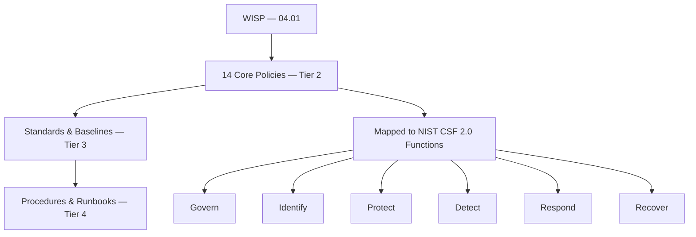

# 04.02 — Security Policy Framework Overview

| Field | Value |
|---|---|
| Document ID | CCB-ISP-POLFW-2026-402 |
| Version | 1.0 |
| Date | 2026-06-15 |
| Classification | Confidential — Nonpublic Information (NPI) // Illustrative Portfolio Sample |
| Owner | Rachel Alvarez, Chief Information Security Officer (CISO/ISO) |
| Author | Advisory Team (Financial-Services GRC) |
| Status | Approved |

## Purpose

This document describes the **security policy framework** that operationalizes the Written Information Security Program (04.01). Where the WISP states *what* the Bank commits to and *why*, the policy framework establishes the **14 core policies** that translate that commitment into enforceable, testable requirements. It defines the policy hierarchy, ownership, approval and review cycles, and the mapping of each policy to a **NIST CSF 2.0** Function so the Board and FFIEC examiners can trace program intent to documented, maintained governance.

Every policy in this framework is board- or management-approved, versioned, assigned a named owner, and reviewed on a defined cycle. Together the 14 policies provide complete coverage of the administrative, technical, and physical safeguards required by GLBA §501(b).

## Policy Hierarchy

Cornerstone uses a four-tier document hierarchy so that stable governance intent is separated from operational detail that changes more frequently.

| Tier | Instrument | Approval Authority | Change Frequency |
|---|---|---|---|
| 1 | WISP (program charter) | Board Audit Committee | Annual |
| 2 | Core Policies (the 14) | Board / Executive Management | Annual |
| 3 | Standards & Baselines | CISO | As needed |
| 4 | Procedures & Runbooks | Control owners | Continuous |

## The 14 Core Policies

The following table enumerates all **14 core policies**, each with its owner, purpose, review cycle, and the primary NIST CSF 2.0 Function it supports. This is the authoritative index of the policy framework.

| # | Policy | Owner | Purpose | Review Cycle | Primary CSF 2.0 Function |
|---|---|---|---|---|---|
| 1 | Information Security Policy | Rachel Alvarez (CISO) | Overarching security mandate and roles | Annual | Govern |
| 2 | Acceptable Use Policy | Rachel Alvarez (CISO) | Permitted use of Bank systems and data | Annual | Protect |
| 3 | Access Control Policy | Marcus Doyle (IT Sec Mgr) | Least privilege, RBAC, JML lifecycle | Annual | Protect |
| 4 | Authentication &amp; MFA Policy | Marcus Doyle (IT Sec Mgr) | Identity proofing and phishing-resistant MFA | Annual | Protect |
| 5 | Encryption &amp; Key Management Policy | Marcus Doyle (IT Sec Mgr) | Encryption at rest/in transit; key lifecycle | Annual | Protect |
| 6 | Data Classification &amp; Handling Policy | Karen Ellis (Privacy Officer) | NPI classification and handling rules | Annual | Identify |
| 7 | Vulnerability &amp; Patch Management Policy | Marcus Doyle (IT Sec Mgr) | Scanning, prioritization, patch SLAs | Annual | Protect |
| 8 | Logging &amp; Monitoring Policy | Marcus Doyle (IT Sec Mgr) | Log capture, SIEM, alerting | Annual | Detect |
| 9 | Change Management Policy | James Porter (CIO) | Controlled change to production systems | Annual | Protect |
| 10 | Vendor / Third-Party Risk Policy | Steven Nakamura (CRO) | Due diligence and ongoing vendor oversight | Annual | Govern |
| 11 | Incident Response Policy | Rachel Alvarez (CISO) | Detect, respond, 36-hour notification | Annual | Respond |
| 12 | Business Continuity / DR Policy | James Porter (CIO) | RTO/RPO, resilience, recovery | Annual | Recover |
| 13 | Security Awareness &amp; Training Policy | Rachel Alvarez (CISO) | Human-risk reduction; phishing training | Annual | Protect |
| 14 | Physical &amp; Environmental Security Policy | Marcus Doyle (IT Sec Mgr) | Facility, data-center, media, environmental | Annual | Protect |

## Policy-to-Risk Coverage

The framework is validated against the 8 High risks to confirm no High risk is unpoliced. Each High risk maps to at least one owning policy.

| High Risk | Primary Governing Policy(ies) |
|---|---|
| R-01 Phishing → NPI takeover | #4 Authentication/MFA, #13 Awareness |
| R-02 Ransomware | #7 Vulnerability/Patch, #8 Logging, #12 BC/DR |
| R-03 Meridian compromise | #10 Vendor/Third-Party |
| R-04 Unpatched external system | #7 Vulnerability/Patch, #9 Change |
| R-05 Insider NPI misuse | #3 Access Control, #6 Data Classification |
| R-06 Wire fraud / BEC | #2 Acceptable Use, #11 Incident Response, #13 Awareness |
| R-07 Weak MFA | #4 Authentication/MFA |
| R-08 Backup/recovery gap | #5 Encryption, #12 BC/DR |

## Policy Structure and Mandatory Elements

To ensure consistency and auditability, every one of the 14 core policies is authored to a common template. An examiner or internal auditor can therefore open any policy and find the same governing elements in the same place.

| Mandatory Element | Purpose |
|---|---|
| Policy statement &amp; scope | What the policy requires and to whom it applies |
| Roles &amp; responsibilities | Named accountable owner and supporting roles |
| Requirements | Enforceable, testable control requirements |
| Standards &amp; procedures reference | Links to Tier 3/4 implementing detail |
| Exceptions | How deviations are requested, risk-assessed, approved |
| Enforcement &amp; sanctions | Consequences of non-compliance |
| Review &amp; approval history | Version, owner, approval date, next review |

## NIST CSF 2.0 Function Coverage

Mapping every policy to a CSF 2.0 Function demonstrates that all six Functions are governed by at least one policy, evidencing complete framework coverage for the Phase 05 maturity assessment.

| CSF 2.0 Function | Governing Policies |
|---|---|
| Govern | #1 Information Security, #10 Vendor/Third-Party |
| Identify | #6 Data Classification &amp; Handling |
| Protect | #2 Acceptable Use, #3 Access Control, #4 Auth/MFA, #5 Encryption, #7 Vuln/Patch, #9 Change, #13 Awareness, #14 Physical |
| Detect | #8 Logging &amp; Monitoring |
| Respond | #11 Incident Response |
| Recover | #12 Business Continuity / DR |

## Governance of the Framework

Policies are maintained in a controlled repository with version history. The CISO is accountable for the framework as a whole; individual owners maintain their policies. Exceptions to any policy are logged, risk-assessed, time-bound, and approved by the CISO (or CRO for higher-risk exceptions). The full set is reviewed **annually** and re-approved by the Board Audit Committee alongside the WISP.

| Governance Activity | Cadence | Accountable |
|---|---|---|
| Framework completeness review | Annual | CISO |
| Individual policy review | Annual (staggered) | Policy owners |
| Exception review | Quarterly | CISO / CRO |
| Board re-approval | Annual | Board Audit Committee |

## Cross-References

- **04.01** — WISP (the program the policies operationalize).
- **04.03–04.08** — Safeguard and control documents implementing these policies.
- **Phase 05** — NIST CSF 2.0 mapping and maturity of policy coverage.
- **04.09** — Vulnerability & Patch Management (policy #7 in practice).

---
[⬅ Previous](04.01-written-information-security-program-wisp.md) · [🏠 Phase README](04.00-README.md) · [Next ➡](04.03-administrative-safeguards.md)
