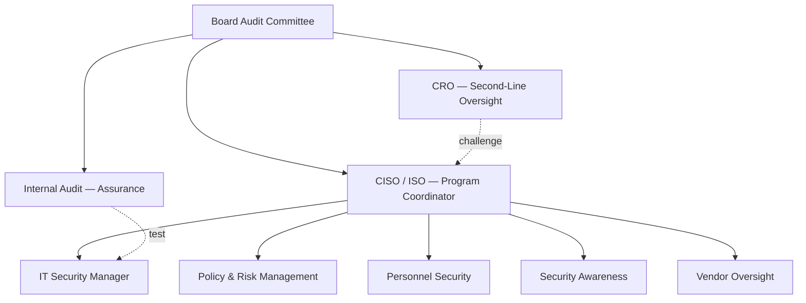

# 04.03 — Administrative Safeguards

| Field | Value |
|---|---|
| Document ID | CCB-ISP-ADMIN-2026-403 |
| Version | 1.0 |
| Date | 2026-06-15 |
| Classification | Confidential — Nonpublic Information (NPI) // Illustrative Portfolio Sample |
| Owner | Rachel Alvarez, Chief Information Security Officer (CISO/ISO) |
| Author | Advisory Team (Financial-Services GRC) |
| Status | Approved |

## Purpose

This document defines the **administrative safeguards** — the "people and process" controls — that Cornerstone Community Bank uses to protect customer NPI, as required by the **Interagency Guidelines** under **GLBA §501(b)**. Administrative safeguards establish *who is accountable*, *how risk is governed*, *how personnel are vetted and managed*, *how staff are trained*, and *how service providers are overseen*. They are the connective tissue that makes technical (04.04) and physical (04.05) safeguards effective, and they are the primary treatment for people- and process-driven High risks — notably **R-03 (vendor)**, **R-05 (insider)**, and **R-06 (fraud/BEC)**.

## Governance and Accountability

Administrative safeguards begin with clear accountability. The CISO coordinates the program under a board mandate; the CRO provides independent second-line challenge; Internal Audit provides third-line assurance. This three-lines model is documented so an examiner can trace every material security decision to an accountable officer.

| Line of Defense | Function | Owner |
|---|---|---|
| First line | Operate controls, own risk in-business | CISO / IT Security Manager |
| Second line | Independent risk oversight & challenge | CRO (Steven Nakamura) |
| Third line | Independent assurance | Internal Audit (Priya Sharma) |
| Board | Oversight & approval | Audit Committee (R. Hanley) |

## Risk Management Integration

The administrative program is driven by the Phase 03 risk assessment. Risks are re-scored annually, treatment plans for the 8 High risks are tracked to closure, and residual risk is reported to the Board. Any decision to accept a Moderate-or-higher risk follows the formal risk-acceptance process (03.08).

| Activity | Frequency | Owner | GLBA §501(b) Linkage |
|---|---|---|---|
| Risk assessment refresh | Annual | CRO / CISO | Identify & assess risks |
| High-risk treatment tracking | Quarterly | CISO | Design & implement safeguards |
| Risk-acceptance governance | Event-driven | CRO | Adjust program |
| Board risk reporting | Annual (min.) | CISO | Board oversight |

## Personnel Security

People are both the first control and a primary risk vector (R-05 insider, R-01/R-06 social engineering). Cornerstone applies safeguards across the full employment lifecycle for its **~240 employees**.

| Control | Requirement | Owner |
|---|---|---|
| Pre-employment background checks | Criminal, credit (as permitted), employment, and OFAC screening for all hires; enhanced for privileged/sensitive roles | HR / CISO |
| Onboarding | Role-based access provisioning (04.06), policy acknowledgment, initial security training before NPI access | HR / IT Security |
| Ongoing | Annual re-acknowledgment, periodic re-screening for sensitive roles, entitlement reviews | HR / IT Security |
| Offboarding | Access revocation on the same business day of separation; asset return; account disablement | HR / IT Security |
| Sanctions | Disciplinary process for policy violations up to termination | HR / CISO |

Personnel changes feed directly into the **joiner/mover/leaver (JML)** process in 04.06, ensuring administrative and technical safeguards stay synchronized.

## Security Awareness and Training

Because R-01 (phishing) and R-06 (BEC) are human-driven, awareness is a mandatory, measured control — not a formality.

| Program Element | Frequency | Audience |
|---|---|---|
| New-hire security training | At onboarding | All new staff |
| Annual security awareness | Annual | All staff & directors |
| Simulated phishing campaigns | At least quarterly | All staff |
| Role-based training (wire, privileged, developer) | Annual | Targeted roles |
| Fraud/BEC awareness (callback verification) | Annual + refresh | Wire, finance, front-line |

Completion rates and phishing click/report metrics are tracked and reported to the CISO and Board as program health indicators.

## Vendor and Third-Party Oversight

Core banking and digital banking are **outsourced to Meridian Core Services, LLC**, making vendor oversight a top-tier administrative safeguard and the direct treatment for **R-03**. The Bank maintains oversight of **85 third parties**, of which **12 are critical/high-risk**; Meridian is under **enhanced oversight**.

| Oversight Activity | Requirement | Owner |
|---|---|---|
| Due diligence | Risk-tiered before onboarding; enhanced for critical vendors | CRO / CISO |
| SOC report review | Annual review of Meridian SOC 1 Type II & SOC 2 Type II, incl. CUECs | CISO |
| Contractual safeguards | Security, confidentiality, breach-notification, audit-rights clauses | Legal / CRO |
| Ongoing monitoring | Performance, financial health, incident history | CRO |
| Concentration risk | Tracked given single critical core dependency | CRO |

The complementary user-entity controls (CUECs) identified in Meridian's SOC reports are mapped to Cornerstone-side controls so no assumed control is left unowned. Full third-party program detail is in **Phase 07**.

## Administrative Safeguards to GLBA Mapping

| Administrative Safeguard | GLBA §501(b) / Guidelines Element | High Risk Treated |
|---|---|---|
| Governance & accountability | Designate coordinator; board oversight | R-03, R-05 |
| Risk management integration | Assess risks; adjust program | All |
| Personnel security | Manage employee risk to NPI | R-05 |
| Security awareness | Control human-factor risk | R-01, R-06 |
| Vendor oversight | Oversee service providers | R-03 |

## Cross-References

- **04.01 / 04.02** — WISP and policy framework this operationalizes.
- **04.04 / 04.05** — Technical and physical safeguards that pair with these controls.
- **04.06** — Access control & IAM (JML process).
- **Phase 07** — Third-party risk & business continuity (Meridian oversight).

---
[⬅ Previous](04.02-security-policy-framework-overview.md) · [🏠 Phase README](04.00-README.md) · [Next ➡](04.04-technical-safeguards.md)
