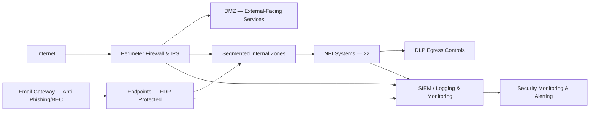

# 04.04 — Technical Safeguards

| Field | Value |
|---|---|
| Document ID | CCB-ISP-TECH-2026-404 |
| Version | 1.0 |
| Date | 2026-06-15 |
| Classification | Confidential — Nonpublic Information (NPI) // Illustrative Portfolio Sample |
| Owner | Marcus Doyle, IT Security Manager |
| Author | Advisory Team (Financial-Services GRC) |
| Status | Approved |

## Purpose

This document defines the **technical safeguards** — the technology controls — Cornerstone Community Bank uses to protect customer NPI across its **22 NPI-bearing systems** and to treat the technology-driven High risks from Phase 03. Technical safeguards implement the requirements of the Interagency Guidelines under **GLBA §501(b)** at the layer of networks, systems, identities, endpoints, email, and data. They are organized around **defense-in-depth**: no single control is relied upon, and controls are layered so that the failure of one does not expose NPI.

These safeguards are the primary treatment for **R-01 (phishing)**, **R-02 (ransomware)**, **R-04 (unpatched systems)**, and **R-07 (weak MFA)**, and provide supporting treatment for **R-05 (insider)** and **R-06 (BEC)**.

## Control Domains Overview

| Domain | Objective | Primary High Risk Treated | Detail Doc |
|---|---|---|---|
| Access control & IAM | Enforce least privilege | R-05 | 04.06 |
| Authentication & MFA | Prevent credential-based intrusion | R-01, R-07 | 04.07 |
| Encryption & key mgmt | Protect NPI at rest/in transit | R-08 (support) | 04.08 |
| Network security | Segment and defend the estate | R-02, R-04 | This doc |
| Endpoint protection (EDR) | Detect/contain malware | R-02 | This doc |
| Email security | Block phishing/BEC | R-01, R-06 | This doc |
| Data loss prevention (DLP) | Prevent NPI exfiltration | R-05 | This doc |
| Logging & monitoring | Detect and respond | R-02, R-04 | This doc |

## Network Security

The network is segmented so that NPI systems sit in protected zones separate from general user and DMZ traffic, directly limiting ransomware lateral movement (R-02) and reducing the blast radius of any external exploit (R-04).

| Control | Standard | Purpose |
|---|---|---|
| Perimeter firewall & IPS | Deny-by-default; documented rulesets | Block unauthorized ingress/egress |
| Network segmentation | NPI zones isolated from user/DMZ zones | Limit lateral movement |
| Secure remote access | VPN with MFA (04.07) | Protect remote NPI access |
| Wireless security | WPA2/3-Enterprise; guest isolation | Prevent rogue access |
| DDoS/edge protection | Provider-managed at digital-banking edge | Availability (R-10 support) |

## Endpoint Protection (EDR)

All endpoints and servers run **Endpoint Detection and Response (EDR)** with behavioral detection, isolation, and rollback capability — the core technical treatment for **R-02 (ransomware)**, which cited legacy hosts and EDR coverage gaps as vulnerabilities. Coverage is measured and gaps are remediated.

| Control | Standard |
|---|---|
| EDR coverage | 100% of managed endpoints & servers; exceptions logged |
| Behavioral detection & isolation | Automated host isolation on detection |
| Application controls | Allow-listing on high-value/legacy hosts |
| Hardening | CIS Benchmark baselines |
| Mobile devices | MDM enrollment with encryption enforcement (R-18) |

## Email Security

Email is the primary vector for **R-01 (phishing)** and **R-06 (BEC/wire fraud)**, so email security is a layered technical priority.

| Control | Purpose |
|---|---|
| Anti-phishing / anti-malware gateway | Block malicious inbound mail |
| SPF, DKIM, DMARC | Authenticate senders; reduce spoofing (R-06) |
| Impersonation / lookalike-domain protection | Catch BEC attempts |
| URL rewriting & attachment sandboxing | Detonate malicious payloads |
| External-sender banners | Flag out-of-org mail |

Email controls are paired with the awareness program (04.03) and callback-verification procedures for wire requests.

## Data Loss Prevention (DLP)

DLP addresses **R-05 (insider exfiltration)** and **R-12 (data leakage)** by detecting and blocking unauthorized movement of NPI. DLP policies are tied to the data classification scheme (04.08 / Phase 02).

| Control | Coverage |
|---|---|
| Email DLP | NPI pattern detection; block/quarantine |
| Endpoint DLP | Removable-media control; copy restrictions |
| Cloud/M365 DLP | Sensitive-info policies in cloud services |
| Web DLP | Egress inspection for NPI |

## Logging, Monitoring, and Detection

Logging and monitoring provide the **Detect** function of NIST CSF 2.0 and are the tripwire for R-02 and R-04. Centralized logging feeds a SIEM with tuned alerting; detection gaps identified in R-16 are being closed through improved coverage and correlation.

| Control | Standard |
|---|---|
| Centralized log collection | Security-relevant logs to SIEM |
| Alerting & correlation | Tuned use-cases for priority threats |
| Time synchronization | Authoritative NTP for correlation/forensics |
| Log retention | Per policy; supports investigations & exam |
| Monitoring coverage | NPI systems, identity, endpoints, network |

## Technical Safeguards to GLBA / Risk Mapping

| Technical Safeguard | GLBA §501(b) Element | High Risk Treated |
|---|---|---|
| Network segmentation | Access restrictions to NPI | R-02, R-04 |
| EDR | Protect against destructive code | R-02 |
| Email security | Protect against unauthorized access | R-01, R-06 |
| DLP | Restrict NPI disclosure | R-05 |
| Logging & monitoring | Detect actual/attempted attacks | R-02, R-04 |

## Cross-References

- **04.06 / 04.07 / 04.08** — Access control, authentication/MFA, and encryption detail.
- **04.09** — Vulnerability & patch management (treats R-04).
- **04.03** — Administrative safeguards (awareness paired with email security).
- **03.07** — Risk register (R-01, R-02, R-04, R-05, R-06, R-07).

---
[⬅ Previous](04.03-administrative-safeguards.md) · [🏠 Phase README](04.00-README.md) · [Next ➡](04.05-physical-safeguards.md)
