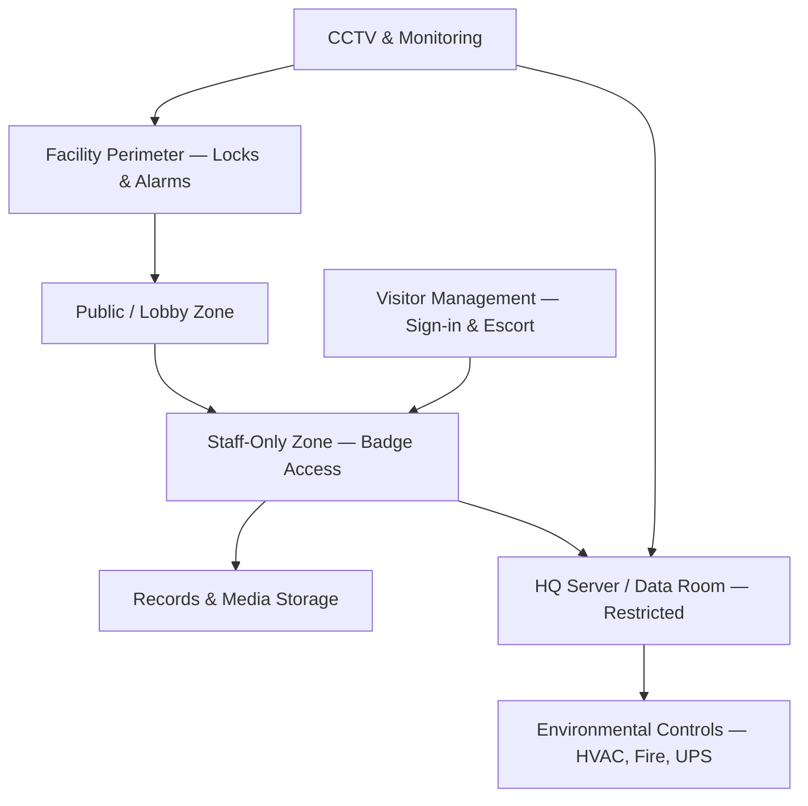

# 04.05 — Physical Safeguards

| Field | Value |
|---|---|
| Document ID | CCB-ISP-PHYS-2026-405 |
| Version | 1.0 |
| Date | 2026-06-15 |
| Classification | Confidential — Nonpublic Information (NPI) // Illustrative Portfolio Sample |
| Owner | Marcus Doyle, IT Security Manager |
| Author | Advisory Team (Financial-Services GRC) |
| Status | Approved |

## Purpose

This document defines the **physical safeguards** Cornerstone Community Bank uses to protect customer NPI and the systems that process it, as required by the Interagency Guidelines under **GLBA §501(b)**. Physical safeguards ensure that NPI — whether on servers, workstations, paper, or portable media — cannot be accessed, removed, damaged, or observed by unauthorized parties. They apply across the Bank's **18 branches** and its **HQ in Riverton, Ohio**, and cover facility access, server/data-room protection, media handling, clean-desk discipline, environmental controls, and visitor management.

Because core banking is **outsourced to Meridian Core Services, LLC**, Cornerstone relies on Meridian's data-center physical controls (evidenced through SOC 1/SOC 2 Type II reports) for the core platform, while the Bank retains full responsibility for physical security at HQ and all branches.

## Scope and Facility Types

| Facility Type | Count | NPI Exposure | Physical Control Tier |
|---|---|---|---|
| Headquarters (Riverton) | 1 | High — servers, records, admin systems | Tier 1 (highest) |
| HQ server / data room | 1 | High — on-prem systems supporting 22 NPI systems | Tier 1 |
| Branches | 18 | Moderate — teller/workstation NPI, records | Tier 2 |
| Meridian data center (outsourced) | — | Core/digital banking | Vendor-assured (SOC) |

## Facility and Branch Access Control

Physical access mirrors the least-privilege principle used for logical access: staff reach only the zones their role requires. Access is layered from public lobby to restricted server room.

| Control | HQ | Branches |
|---|---|---|
| Badge/electronic access | Required for all staff zones | Required for staff-only areas |
| Access zoning | Public → staff → records → server room | Public → teller/staff area |
| After-hours access | Logged & alarmed | Logged & alarmed |
| Access reviews | Quarterly (aligned with logical reviews) | Quarterly |
| CCTV coverage | Entrances, teller line, server room | Entrances, teller line, ATM |
| Alarm & duress | Intrusion + duress alarms | Intrusion + duress alarms |

## Data Center / Server Room Access

The HQ server/data room is the highest-sensitivity physical zone and receives Tier 1 controls. Access is restricted to a named list of authorized personnel and logged.

| Control | Requirement |
|---|---|
| Access authorization | Named list; approved by IT Security Manager |
| Access logging | Every entry logged and periodically reviewed |
| Multi-factor physical access | Badge + PIN for server room |
| Escort of non-authorized personnel | Mandatory (vendors, contractors) |
| Equipment protection | Locked racks; no unattended NPI media |

For the Meridian-hosted core, physical assurance is obtained through **annual review of Meridian's SOC 1/SOC 2 Type II reports**, including data-center physical-security controls and any complementary user-entity control expectations.

## Media Handling and Sanitization

Portable media and paper records are a physical exfiltration path (supporting R-05 and R-12). Cornerstone controls media across its lifecycle and sanitizes per **NIST SP 800-88**.

| Media Type | Handling Control | Disposal |
|---|---|---|
| Backup media | Encrypted; access-controlled storage | NIST SP 800-88 sanitization |
| Removable media | Restricted by endpoint DLP; encryption required | Sanitize or destroy |
| Paper records with NPI | Locked storage; clean-desk | Cross-cut shred / secure destruction vendor |
| Retired hardware | Inventory tracked; wiped before disposal | Certificate of destruction |

## Clean Desk and Visitor Management

| Control | Requirement |
|---|---|
| Clean desk | NPI and sensitive documents secured when unattended; screens locked |
| Visitor sign-in | All visitors logged at HQ and branches |
| Visitor escort | Non-public zones require escort |
| Contractor access | Time-bound, logged, escorted, revoked on completion |
| Signage & privacy | Positioned to prevent shoulder-surfing of NPI |

## Environmental Controls

Environmental controls protect the availability and integrity of NPI systems at HQ (supporting R-02/R-08 at the site level).

| Control | Purpose |
|---|---|
| HVAC / climate control | Maintain operating conditions for equipment |
| Fire detection & suppression | Protect server room and records |
| Uninterruptible power (UPS) / generator | Ride-through and orderly shutdown |
| Water/leak detection | Early warning in server room |
| Redundancy | Aligned with BC/DR objectives (Phase 07) |

## Physical Safeguards to GLBA Mapping

| Physical Safeguard | GLBA §501(b) Element | Risk Treated |
|---|---|---|
| Facility & zone access control | Restrict physical access to NPI | R-05 |
| Server-room protection | Protect systems processing NPI | R-02 (site) |
| Media handling & NIST 800-88 disposal | Secure disposal of NPI | R-05, R-12 |
| Clean desk & visitor management | Prevent unauthorized observation/removal | R-05 |
| Environmental controls | Protect availability of NPI systems | R-02, R-08 |

## Cross-References

- **04.03 / 04.04** — Administrative and technical safeguards paired with physical controls.
- **04.06** — Access reviews aligned with quarterly physical access reviews.
- **04.08** — Encryption of backup media referenced here.
- **Phase 07** — Business continuity, environmental redundancy, and Meridian SOC reliance.

---
[⬅ Previous](04.04-technical-safeguards.md) · [🏠 Phase README](04.00-README.md) · [Next ➡](04.06-access-control-and-iam.md)
