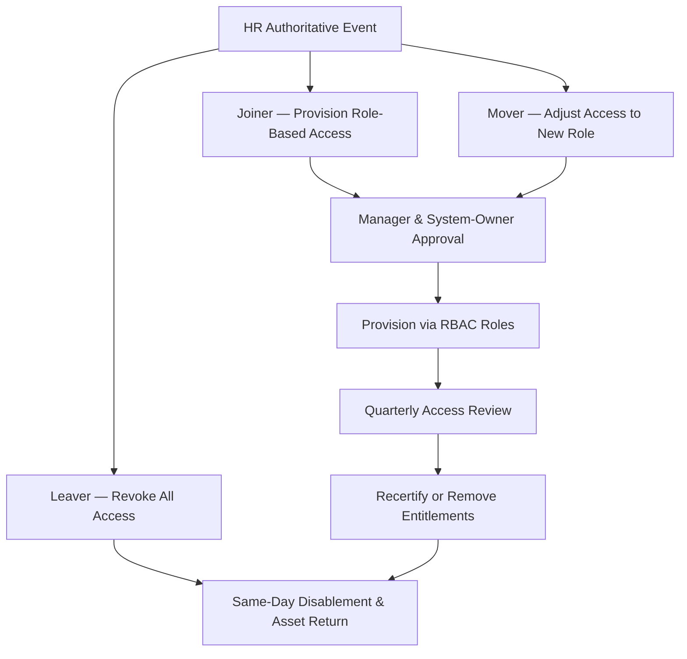

# 04.06 — Access Control &amp; Identity and Access Management (IAM)

| Field | Value |
|---|---|
| Document ID | CCB-ISP-IAM-2026-406 |
| Version | 1.0 |
| Date | 2026-06-15 |
| Classification | Confidential — Nonpublic Information (NPI) // Illustrative Portfolio Sample |
| Owner | Marcus Doyle, IT Security Manager |
| Author | Advisory Team (Financial-Services GRC) |
| Status | Approved |

## Purpose

This document defines Cornerstone Community Bank's **access control and identity and access management (IAM)** safeguards — the controls that ensure only authorized individuals reach NPI, and only to the extent their role requires. IAM is the primary treatment for **R-05 (insider misuse of privileged NPI access)** and **R-15 (privileged access sprawl)**, and a foundational support for **R-01/R-07** (credential-based intrusion). It implements the Access Control Policy (#3) and pairs with Authentication &amp; MFA (04.07).

The controls here span the full identity lifecycle across the Bank's **~240 employees** and its access to **22 NPI-bearing systems**, and they provide the **Access to Programs and Data** evidence relied upon in SOX ITGC (Phase 06).

## Access Control Principles

| Principle | Application at Cornerstone |
|---|---|
| Least privilege | Users receive only the entitlements their role requires |
| Role-based access control (RBAC) | Access granted via defined roles, not per-user grants |
| Segregation of duties (SoD) | Conflicting duties split; enforced for sensitive functions |
| Need-to-know | NPI access limited to business necessity |
| Deny by default | No access without explicit authorization |
| Accountability | Unique IDs; no shared accounts for accountability |

## Identity Lifecycle — Joiner / Mover / Leaver (JML)

Access is provisioned, changed, and revoked through a controlled **JML** process tied to authoritative HR events, keeping administrative (04.03) and technical safeguards synchronized. Timely leaver revocation is a key control against insider and orphaned-account risk.

| Lifecycle Stage | Trigger | Control | SLA |
|---|---|---|---|
| Joiner | New-hire in HR | Role-based provisioning with approval | Before NPI access granted |
| Mover | Role/department change | Remove old entitlements; grant new; re-approve | Within defined change window |
| Leaver | Termination/separation | Disable accounts; revoke access; return assets | Same business day |
| Dormant | Inactivity | Auto-flag and disable stale accounts | Per policy threshold |

A key defect class this treats is the **"mover" accumulation problem** — where role changes add access but never remove the old, producing the entitlement sprawl behind R-05 and R-15.

## Role-Based Access and Segregation of Duties

Access is packaged into roles aligned to job function. Sensitive combinations (e.g., initiate and approve a wire; develop and deploy to production) are separated. SoD conflicts are defined in a matrix and enforced through provisioning controls and periodic review.

| SoD Control Area | Conflict Prevented | Enforcement |
|---|---|---|
| Payments / wires | Same person initiate &amp; approve | Dual control; role split |
| Change management | Developer deploys own change to prod | Separate deploy role (Phase 06) |
| User administration | Admin grants own privileged access | Approval + review |
| Reconciliation | Same person transact &amp; reconcile | Role separation |

## Privileged Access Management (PAM)

Privileged accounts are the highest-value target and the core of R-05. Cornerstone applies enhanced controls to administrative and system-level access.

| PAM Control | Requirement |
|---|---|
| Privileged inventory | All privileged/admin accounts identified &amp; owned |
| Just-in-time / least standing privilege | Elevate only when needed; minimize standing admin |
| Credential vaulting | Privileged credentials vaulted and rotated |
| Session monitoring | Privileged sessions logged; high-risk sessions recorded |
| MFA for privileged access | Phishing-resistant MFA required (04.07) |
| Break-glass | Emergency accounts controlled, logged, reviewed after use |

## Quarterly Access Reviews and Recertification

Access is recertified **quarterly**, aligning with the physical access review cadence (04.05) and providing recurring SOX ITGC evidence. Reviews cover general and privileged access to NPI systems; exceptions are remediated and tracked.

| Review Type | Frequency | Reviewer |
|---|---|---|
| General user access recertification | Quarterly | System owners / managers |
| Privileged access review | Quarterly | IT Security Manager |
| Segregation-of-duties review | Quarterly | Control owners / Internal Audit sampling |
| Dormant/orphan account sweep | Quarterly | IT Security |
| Third-party/vendor access review | Quarterly | Vendor owners |

## Authorization Model and Approval Flow

Access grants require documented authorization before provisioning. The approval chain establishes accountability and generates the evidence relied upon in access reviews and SOX testing.

| Access Type | Requesting Party | Required Approver(s) |
|---|---|---|
| Standard role-based access | User's manager | Manager + system owner |
| Elevated / sensitive NPI access | User's manager | System owner + CISO/IT Security |
| Privileged / administrative access | Requesting admin's manager | IT Security Manager + system owner |
| Third-party / vendor access | Vendor relationship owner | CRO delegate + system owner |
| Emergency (break-glass) | On-call/IT Security | Post-use review by IT Security Manager |

## Account Types and Controls

Different account types carry different risk and therefore different control requirements. All accounts are inventoried and owned.

| Account Type | Control Emphasis |
|---|---|
| Standard user | RBAC, MFA, least privilege |
| Privileged / admin | PAM, JIT elevation, session logging, phishing-resistant MFA |
| Service / system | Owned, inventoried, credential-vaulted, no interactive login |
| Shared / generic | Prohibited except where unavoidable and compensated |
| Third-party | Time-bound, sponsored, quarterly reviewed |

## Access Control to GLBA / Risk Mapping

| IAM Control | GLBA §501(b) Element | Risk Treated |
|---|---|---|
| Least privilege / RBAC | Access restrictions on NPI | R-05, R-15 |
| JML lifecycle | Timely provisioning/deprovisioning | R-05 |
| PAM | Control privileged NPI access | R-05 |
| Quarterly reviews | Ongoing access appropriateness | R-05, R-15 |
| Segregation of duties | Prevent single-actor abuse/fraud | R-05, R-06 |

## Cross-References

- **04.07** — Authentication &amp; MFA (identity assurance layered on access).
- **04.03** — Administrative safeguards (HR JML source events).
- **04.05** — Physical access reviews (same quarterly cadence).
- **Phase 06** — SOX ITGC "Access to Programs and Data" reliance on these controls.

---
[⬅ Previous](04.05-physical-safeguards.md) · [🏠 Phase README](04.00-README.md) · [Next ➡](04.07-authentication-and-mfa.md)
