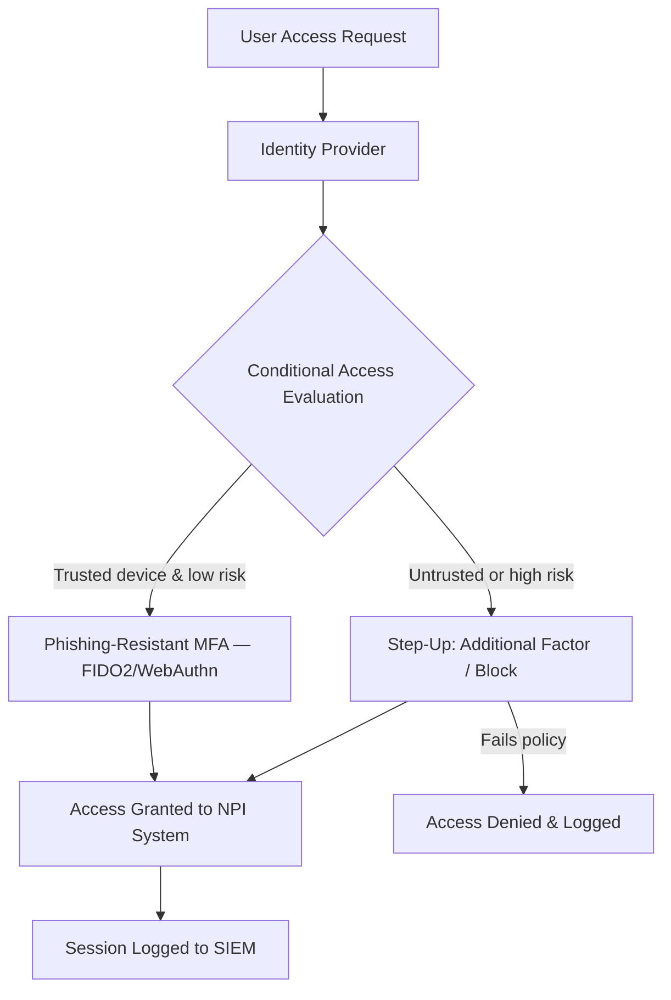

# 04.07 — Authentication &amp; Multi-Factor Authentication (MFA)

| Field | Value |
|---|---|
| Document ID | CCB-ISP-AUTH-2026-407 |
| Version | 1.0 |
| Date | 2026-06-15 |
| Classification | Confidential — Nonpublic Information (NPI) // Illustrative Portfolio Sample |
| Owner | Marcus Doyle, IT Security Manager |
| Author | Advisory Team (Financial-Services GRC) |
| Status | Approved |

## Purpose

This document defines Cornerstone Community Bank's **authentication and multi-factor authentication (MFA)** safeguards — the controls that verify a user is who they claim to be before granting access to NPI. Authentication is the direct treatment for two of the eight High risks: **R-07 (weak or inconsistent MFA enabling credential-based intrusion)** and **R-01 (phishing / credential theft → account takeover)**. Both risks cite MFA that is *not uniformly enforced across all NPI access paths*; this document defines the phishing-resistant MFA rollout that closes that gap.

Controls span workforce authentication, remote access, privileged access, and **customer authentication for digital banking** (delivered through Meridian's platform for the Bank's ~62,000 enrolled digital-banking users).

## Authentication Strategy

Cornerstone's strategy is **phishing-resistant MFA everywhere NPI is accessed**, backed by conditional access that adapts assurance to risk. This treats R-07 by eliminating inconsistent coverage and treats R-01 by defeating credential-replay/phishing.

| Principle | Application |
|---|---|
| Phishing-resistant MFA | FIDO2/WebAuthn or equivalent for workforce &amp; privileged access |
| Uniform enforcement | MFA required on all NPI access paths — no exceptions without logged risk acceptance |
| Conditional / risk-based access | Adjust requirements by user, device, location, and risk signal |
| Strong identity proofing | Verify identity before credential issuance |
| Defense in depth | Authentication layered with access control (04.06) and monitoring (04.04) |

## MFA Coverage by Access Path

The rollout ensures every NPI access path is covered, remediating the uneven enforcement behind R-07. Coverage is measured and reported.

| Access Path | MFA Requirement | Preferred Factor |
|---|---|---|
| Workforce sign-in (M365 / core apps) | Required | Phishing-resistant (FIDO2) |
| Privileged / administrative access | Required — always | Phishing-resistant (FIDO2) + PAM |
| Remote access / VPN | Required | Phishing-resistant or authenticator |
| Cloud / SaaS with NPI | Required | Phishing-resistant |
| Email (webmail/external) | Required | Phishing-resistant |
| Customer digital banking | Required (via Meridian) | Layered/adaptive authentication |

## Conditional / Risk-Based Access

Conditional access enforces context-aware policy so that assurance scales with risk — a key modernization over static MFA.

| Signal | Policy Response |
|---|---|
| Untrusted / unmanaged device | Block or require step-up + limited access |
| Anomalous location / impossible travel | Step-up or block |
| Legacy authentication protocols | Blocked (no MFA bypass) |
| Elevated user risk (identity protection) | Force re-authentication / password reset |
| High-value NPI system | Always require phishing-resistant factor |

## Password and Credential Standards

Passwords remain a factor and a fallback, so standards align to modern guidance (NIST SP 800-63 style): length over forced complexity, screening against breached credentials, and no arbitrary rotation absent evidence of compromise.

| Standard | Requirement |
|---|---|
| Minimum length | Long passphrases favored over complexity churn |
| Breached-password screening | Block known-compromised passwords |
| Rotation | Event-driven (on compromise), not arbitrary periodic |
| Account lockout / throttling | Protect against brute force |
| No shared credentials | Unique IDs per user (04.06) |
| Privileged credentials | Vaulted &amp; rotated via PAM (04.06) |

## Remote-Access Authentication

Remote access is a priority path because it is exposed to the internet and targeted by credential attacks (R-01/R-07).

| Control | Requirement |
|---|---|
| VPN authentication | MFA required; phishing-resistant preferred |
| Device posture | Managed/compliant device check via conditional access |
| Session controls | Timeouts and re-authentication for sensitive actions |
| Logging | All remote sessions logged to SIEM (04.04) |

## Customer Authentication for Digital Banking

For the Bank's **~62,000 enrolled digital-banking users**, authentication is delivered through **Meridian's** online/mobile platform. Cornerstone's oversight ensures customer-facing authentication meets FFIEC expectations for layered/adaptive authentication and is validated through Meridian's SOC reports and the Bank's vendor oversight (Phase 07).

| Customer Control | Requirement |
|---|---|
| Layered authentication | Risk-based / adaptive at login &amp; high-risk transactions |
| Out-of-band / step-up | For sensitive actions (e.g., new payee, profile change) |
| Device recognition | Trusted-device and anomaly detection |
| Oversight | Reviewed via Meridian SOC reports &amp; vendor management |

## Authentication to GLBA / Risk Mapping

| Authentication Control | GLBA §501(b) Element | Risk Treated |
|---|---|---|
| Phishing-resistant workforce MFA | Access controls on NPI | R-01, R-07 |
| Uniform MFA across access paths | Consistent authentication | R-07 |
| Conditional access | Risk-based access restriction | R-01 |
| Customer layered authentication | Protect customer NPI access | R-01 |

## Cross-References

- **04.06** — Access control &amp; IAM (identities MFA protects; PAM for privileged access).
- **04.04** — Technical safeguards (email security, SIEM session logging).
- **04.03** — Security awareness (human layer against phishing).
- **Phase 07** — Meridian oversight and customer-authentication assurance.

---
[⬅ Previous](04.06-access-control-and-iam.md) · [🏠 Phase README](04.00-README.md) · [Next ➡](04.08-encryption-and-key-management.md)
