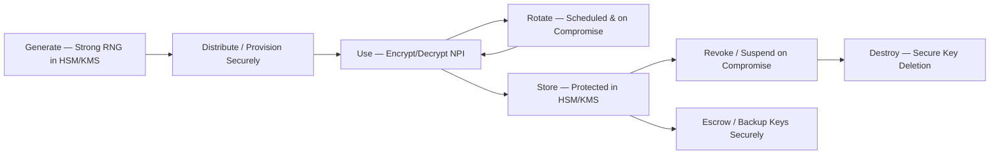

# 04.08 — Encryption &amp; Key Management

| Field | Value |
|---|---|
| Document ID | CCB-ISP-CRYPTO-2026-408 |
| Version | 1.0 |
| Date | 2026-06-15 |
| Classification | Confidential — Nonpublic Information (NPI) // Illustrative Portfolio Sample |
| Owner | Marcus Doyle, IT Security Manager |
| Author | Advisory Team (Financial-Services GRC) |
| Status | Approved |

## Purpose

This document defines Cornerstone Community Bank's **encryption and key management** safeguards — the cryptographic controls that render customer NPI unintelligible to unauthorized parties whether the data is **at rest** or **in transit**. Encryption is a foundational technical safeguard under the Interagency Guidelines (**GLBA §501(b)**) and directly supports the confidentiality objective of the WISP (04.01). It reduces the impact of nearly every High risk — a stolen laptop, an exfiltrated file, an intercepted session, or a compromised backup (**R-08**) yields only ciphertext.

Encryption requirements are driven by the **data classification scheme** (Phase 02): NPI and other Confidential data must be encrypted at rest and in transit; keys must be managed across a defined lifecycle with segregation of duties.

## Encryption Requirements by Data Classification

Encryption obligations follow classification, so the strongest controls concentrate on NPI. This ties the cryptographic program to the Data Classification &amp; Handling Policy (#6).

| Classification | At Rest | In Transit | Key Handling |
|---|---|---|---|
| NPI / Confidential | Required — strong symmetric encryption | Required — TLS 1.2+ | Managed keys; rotation; SoD |
| Internal | Required where feasible | Required for external transfer | Managed keys |
| Public | Not required | Integrity where relevant | N/A |

## Encryption at Rest

NPI at rest is encrypted across the systems and media where it resides — the 22 NPI-bearing systems, endpoints, mobile devices, and backup media.

| Location | Control |
|---|---|
| Servers / databases with NPI | Storage/database-level encryption with strong symmetric algorithms |
| Endpoints &amp; laptops | Full-disk encryption enforced via policy/MDM |
| Mobile devices | Device encryption enforced through MDM (treats R-18) |
| Backup media | Encrypted backups; immutability where supported (treats R-08) |
| Cloud / M365 | Provider + tenant-managed encryption for NPI |
| Removable media | Encryption required; restricted via DLP (04.04) |

## Encryption in Transit and TLS Standards

All NPI moving across networks — internal, internet-facing, and to third parties — is protected with modern transport encryption.

| Channel | Standard |
|---|---|
| Web / digital banking | TLS 1.2 minimum; TLS 1.3 preferred; strong cipher suites |
| Internal service-to-service (NPI) | TLS-encrypted |
| Email (external NPI) | TLS in transit; encrypted/secure messaging for sensitive NPI |
| File transfers to third parties | Encrypted channels (e.g., SFTP/TLS); to Meridian per contract |
| Remote access / VPN | Encrypted tunnels (04.07) |
| Deprecated protocols | SSL, TLS 1.0/1.1, weak ciphers disabled |

## Key Management Lifecycle

Cryptographic keys are the crown jewels of the encryption program: strong encryption with weak key management provides no protection. Keys are managed across a full lifecycle with segregation of duties and protected storage (e.g., HSM/KMS).

| Lifecycle Stage | Control |
|---|---|
| Generation | Strong random generation within HSM/KMS |
| Distribution | Secure provisioning; no plaintext key exposure |
| Storage | Protected in HSM/KMS; access-controlled |
| Rotation | Scheduled rotation and rotation on suspected compromise |
| Segregation of duties | Split key-management duties; dual control for sensitive ops |
| Backup / escrow | Secure key backup to prevent data loss |
| Revocation | Suspend/revoke compromised keys promptly |
| Destruction | Secure deletion at end of life |

## Tokenization

Where sensitive values (e.g., account/card data) can be replaced with non-sensitive surrogates, **tokenization** is used to shrink the footprint of clear NPI — reducing the number of systems that must handle and protect the underlying value and easing PCI DSS scope where card data is present.

| Aspect | Application |
|---|---|
| Use case | Replace stored sensitive values with tokens where feasible |
| Benefit | Reduces NPI/card-data footprint and breach impact |
| PCI DSS linkage | Narrows cardholder-data environment scope |
| Detokenization | Restricted, logged, and access-controlled |

## Governance and Standards Alignment

The encryption program aligns with recognized standards and is validated through independent testing and audit.

| Element | Reference |
|---|---|
| Cryptographic strength | Industry-standard algorithms; deprecated ciphers disabled |
| Supporting frameworks | NIST SP 800-53 Rev.5, CIS Controls v8, PCI DSS (where applicable) |
| Validation | Pen testing (Redwood, Phase 08); internal audit; SOC review (Meridian) |
| Policy | Encryption &amp; Key Management Policy (#5) |

## Encryption to GLBA / Risk Mapping

| Encryption Control | GLBA §501(b) Element | Risk Treated / Supported |
|---|---|---|
| Encryption at rest (NPI) | Protect stored NPI | R-05, R-18 |
| Encryption in transit (TLS) | Protect NPI in transmission | R-01, R-10 (support) |
| Encrypted &amp; immutable backups | Protect recovery data | R-08 |
| Key management lifecycle | Protect cryptographic controls | All (foundational) |
| Tokenization | Reduce clear-NPI footprint | R-05, R-12 |

## Cross-References

- **Phase 02** — Data classification scheme driving encryption requirements.
- **04.04** — Technical safeguards (DLP, network TLS, endpoint encryption).
- **04.07** — Authentication &amp; MFA (encrypted sessions and credential protection).
- **04.09** — Vulnerability &amp; patch management (remediating weak crypto/config).
- **Phase 07** — Backup immutability, DR, and Meridian SOC reliance.

---
[⬅ Previous](04.07-authentication-and-mfa.md) · [🏠 Phase README](04.00-README.md) · [Next ➡](04.09-vulnerability-and-patch-management.md)
