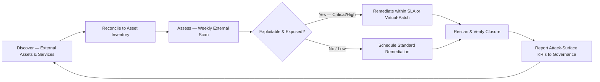

# 04.09 — Vulnerability &amp; Patch Management

| Field | Value |
|---|---|
| Document ID | CCB-ISP-VULN-2026-409 |
| Version | 1.0 |
| Date | 2026-06-15 |
| Classification | Confidential — Nonpublic Information (NPI) // Illustrative Portfolio Sample |
| Owner | Marcus Doyle, IT Security Manager |
| Author | Advisory Team (Financial-Services GRC) |
| Status | Approved |

## Purpose

This document defines Cornerstone Community Bank's **vulnerability and patch management** safeguards — the disciplined, risk-based process for discovering, prioritizing, and remediating technical weaknesses across the enterprise before they can be exploited. It is the direct treatment for **R-04 (exploitation of an unpatched external-facing system)**, one of the eight High risks carried out of the Phase 03 risk assessment, and it materially reduces **R-02 (ransomware / destructive malware)**, whose entry vectors are frequently unpatched services and unmanaged edge assets.

The program operationalizes the **Vulnerability &amp; Patch Management Policy (#7)** of the 14 core policies and supports the **Protect** and **Identify** Functions of the **NIST CSF 2.0** spine. It applies across the **140-system** enterprise inventory, with heightened rigor for the **22 NPI-bearing systems** and the **6 SOX-significant systems**, and it explicitly governs the Bank's **external attack surface**.

## Scope and Objectives

The program covers all Bank-managed assets that store, process, or transmit NPI or that present exposure to the internet. Where infrastructure is operated by **Meridian Core Services** (outsourced core and digital banking), remediation is achieved through contractual patching SLAs and validated via SOC reports and vendor oversight (Phase 07); Cornerstone tracks Meridian's patch posture as a monitored dependency rather than a self-remediated asset.

| Objective | Description |
|---|---|
| Continuous discovery | Identify vulnerabilities across on-prem, cloud, endpoint, and external assets |
| Risk-based prioritization | Rank findings by severity, exploitability, exposure, and NPI/SOX sensitivity |
| Timely remediation | Apply patches or mitigations within defined, risk-based SLAs |
| External attack-surface control | Minimize and monitor internet-facing exposure (treats R-04) |
| Verification &amp; reporting | Confirm closure, track exceptions, and report metrics to governance |

## Risk-Based Patch SLAs

Remediation timelines are anchored to severity and to whether the asset is internet-facing or holds NPI. Internet-facing and NPI/SOX-significant systems receive the shortest windows because they carry the exposure behind R-04 and R-02. SLAs are measured from the date a patch is available (or a vulnerability is validated) to the date remediation is confirmed.

| Severity | Internet-Facing / NPI / SOX | Internal (Standard) | Basis |
|---|---|---|---|
| Critical (CVSS 9.0–10.0) | 7 calendar days (48 hours if actively exploited) | 15 calendar days | Highest exploit likelihood/impact |
| High (CVSS 7.0–8.9) | 15 calendar days | 30 calendar days | Significant exposure |
| Medium (CVSS 4.0–6.9) | 30 calendar days | 60 calendar days | Moderate exposure |
| Low (CVSS 0.1–3.9) | 90 calendar days | 90 calendar days | Limited exposure |
| Emergency (KEV / zero-day) | Expedited out-of-cycle within 48 hours or compensating control | Same | Known-exploited or weaponized |

Where a patch cannot be applied within SLA, a **compensating control** (e.g., virtual patching/WAF rule, network isolation, disabling the vulnerable service) is implemented and a **time-bound, risk-assessed exception** is logged and approved by the IT Security Manager (CISO for High-severity exceptions). Critical/High patches past SLA are a Board-reported KRI (target **0** open past-SLA items).

## Vulnerability Scanning Cadence

Scanning is layered and continuous so that new weaknesses are detected between formal assessments, and authenticated scanning is used wherever possible for depth.

| Scan Type | Scope | Cadence | Authenticated |
|---|---|---|---|
| External vulnerability scan | Internet-facing IP ranges &amp; services | Weekly | N/A (external) |
| Internal authenticated scan | Servers, workstations, network devices | Monthly | Yes |
| NPI / SOX-significant systems | The 22 NPI &amp; 6 SOX-significant systems | Bi-weekly | Yes |
| Cloud / SaaS posture scan | M365 &amp; cloud tenants (CSPM) | Continuous | Yes |
| Web application scan | Public-facing web properties | Quarterly + on change | Yes/Partial |
| Independent penetration test | External &amp; internal (Redwood Security Partners) | Annual (Phase 08) | Yes |

## External Attack Surface Management

Because R-04 is defined by *patch latency on perimeter/edge assets*, the Bank maintains an authoritative, continuously reconciled inventory of everything it exposes to the internet, and it drives that surface toward the minimum necessary.

| Practice | Control |
|---|---|
| Asset attribution | Every external service mapped to a business owner and inventory record |
| Surface minimization | Decommission unused services; close unnecessary ports/protocols |
| Edge/perimeter priority | Firewalls, VPN, and edge appliances patched on the shortest SLAs |
| Exposure validation | Weekly external scans + annual pen test (Redwood, Phase 08) |
| Known-exploited focus | CISA KEV catalog triggers emergency remediation |

## Remediation Tracking and Verification

Findings do not close on assertion; they close on verified rescan. Each vulnerability is ticketed, assigned an owner and due date, tracked to SLA, and re-scanned to confirm remediation. Aggregate status flows to the vulnerability tracker and to management/Board reporting.

| Lifecycle Stage | Activity | Accountable |
|---|---|---|
| Detection | Scan/assessment identifies vulnerability | IT Security |
| Triage &amp; prioritization | Assign severity, exposure, SLA, owner | IT Security Manager |
| Remediation | Patch, reconfigure, or apply compensating control | Asset/system owner |
| Verification | Authenticated rescan confirms closure | IT Security |
| Exception handling | Time-bound risk acceptance where remediation deferred | IT Sec Mgr / CISO |
| Reporting | KRIs &amp; trends to CISO, CRO, Board | IT Security Manager |

## Metrics and Governance

Metrics make the program examinable and tie remediation performance to risk appetite. These KRIs are reported to the CISO monthly and to the Board Audit Committee on the governance cycle.

| Metric (KRI) | Target | Watch | Escalate |
|---|---|---|---|
| Critical/High patches past SLA | 0 | 1–3 | > 3 |
| External Critical vulnerabilities open > 7 days | 0 | 1–2 | > 2 |
| Mean time to remediate (Critical) | ≤ 7 days | 8–14 days | > 14 days |
| Authenticated scan coverage of NPI systems | 100% | 95–99% | < 95% |
| Open exceptions past expiry | 0 | 1–2 | > 2 |

## Control-to-Risk Mapping

| Control | GLBA §501(b) / CSF 2.0 Element | Risk Treated |
|---|---|---|
| Risk-based patch SLAs | Protect — remediate exposure | R-04, R-02 |
| Weekly external scanning &amp; ASM | Identify — attack-surface visibility | R-04 |
| KEV-driven emergency patching | Protect — known-exploited defense | R-04, R-02 |
| Authenticated internal scanning | Identify — vulnerability discovery | R-02, R-05 (support) |
| Remediation verification &amp; KRIs | Govern — accountability &amp; oversight | R-04 |

## Cross-References

- **Phase 03** — R-04 and R-02 risk statements and treatment plans (P2 priority).
- **04.08** — Encryption &amp; key management (remediating weak crypto/config findings).
- **04.10** — Logging, monitoring &amp; detection (detecting exploitation of unpatched services).
- **04.11** — Secure configuration &amp; hardening (reducing vulnerabilities at the baseline).
- **Phase 08** — Independent penetration testing (Redwood Security Partners) validating remediation.

---
[⬅ Previous](04.08-encryption-and-key-management.md) · [🏠 Phase README](04.00-README.md) · [Next ➡](04.10-logging-monitoring-and-detection.md)
