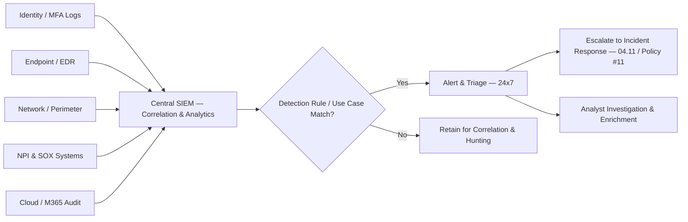

# 04.10 — Logging, Monitoring &amp; Detection

| Field | Value |
|---|---|
| Document ID | CCB-ISP-LOGMON-2026-410 |
| Version | 1.0 |
| Date | 2026-06-15 |
| Classification | Confidential — Nonpublic Information (NPI) // Illustrative Portfolio Sample |
| Owner | Marcus Doyle, IT Security Manager |
| Author | Advisory Team (Financial-Services GRC) |
| Status | Approved |

## Purpose

This document defines Cornerstone Community Bank's **logging, monitoring, and detection** safeguards — the controls that give the Bank timely visibility into security-relevant activity across its environment so that malicious behavior is detected and escalated before it becomes a reportable incident. This capability is the operational core of the **Detect** Function of **NIST CSF 2.0** and a critical enabler of the **Respond** Function, including the **36-hour notification** obligation under the Computer-Security Incident Notification Rule.

Detection engineering here is deliberately aimed at the Bank's High-risk scenarios: **R-01 (phishing → account takeover)**, **R-02 (ransomware / destructive malware)**, **R-05 (insider misuse/exfiltration of NPI)**, and **R-06 (wire fraud / BEC)**. The program operationalizes the **Logging &amp; Monitoring Policy (#8)** and centers on a **Security Information and Event Management (SIEM)** platform fed by the systems that matter most — the **22 NPI-bearing systems**, the **6 SOX-significant systems**, and all internet-facing and identity infrastructure.

## Centralized Logging and SIEM

Logs are aggregated into a central SIEM so that events can be correlated across identity, endpoint, network, and application layers — no single log source tells the full story of an account takeover or ransomware detonation. Log sources are onboarded against a defined priority list, with NPI and SOX-significant systems mandatory.

| Log Source Category | Examples | Priority |
|---|---|---|
| Identity &amp; authentication | M365/IdP sign-ins, MFA events, privileged logons | Mandatory |
| Endpoint / EDR | Process execution, file changes, ransomware behavior | Mandatory |
| Network &amp; perimeter | Firewall, VPN, proxy, DNS | Mandatory |
| NPI &amp; SOX-significant systems | The 22 NPI &amp; 6 SOX-significant systems | Mandatory |
| Cloud / SaaS | M365 audit, cloud control-plane, admin activity | Mandatory |
| Security tooling | Email security, DLP, vulnerability scanners | High |
| Meridian (via oversight) | Relevant security events per contract/SOC | Monitored dependency |

## Detection Use Cases for High-Risk Scenarios

Detection content is engineered to the Bank's actual threat model. The following use cases map directly to the High risks and are tuned to minimize false positives while catching the behaviors that precede loss.

| Use Case | Detection Signal | Risk Addressed |
|---|---|---|
| Account takeover / impossible travel | Anomalous sign-in, MFA fatigue, new-device + geo-velocity | R-01, R-07 |
| Ransomware behavior | Mass file encryption, shadow-copy deletion, EDR detonation | R-02, R-08 |
| Insider NPI exfiltration | Bulk downloads, DLP triggers, off-hours privileged access | R-05 |
| Business Email Compromise | Inbox-rule creation, mailbox forwarding, OAuth-grant abuse | R-06, R-01 |
| Privilege escalation / persistence | New admin, unusual role grants, service-account misuse | R-05, R-02 |
| External exploitation | Edge/perimeter exploit signatures, unexpected outbound C2 | R-04, R-02 |

## Alerting and 24x7 Monitoring Approach

Cornerstone is a ~240-employee community bank; it achieves round-the-clock coverage through a **hybrid model** — an in-house security function operating during business hours, augmented by a **managed detection and response (MDR) / SOC-as-a-service** arrangement providing **24x7x365** triage and escalation. This is a deliberate, documented control decision that gives an institution of Cornerstone's size continuous monitoring without a full internal SOC.

| Attribute | Approach |
|---|---|
| Coverage window | 24x7x365 via in-house team + MDR/SOC provider |
| Alert triage | Tiered — automated enrichment, analyst validation, escalation |
| Severity model | P1 (critical) → P4 (informational) with defined response times |
| Escalation path | Analyst → IT Security Manager → CISO → Incident Response |
| Threat hunting | Proactive hypothesis-driven hunts on retained data |
| Provider oversight | MDR performance reviewed under vendor management (Phase 07) |

## Alert Severity and Response Targets

Severity governs how fast an alert must be acknowledged and triaged, ensuring the highest-impact detections (ransomware, active ATO) are handled immediately and feed the incident-response and 36-hour regulatory clock without delay.

| Severity | Example | Acknowledge | Triage Target |
|---|---|---|---|
| P1 — Critical | Active ransomware, confirmed ATO, NPI exfiltration | ≤ 15 minutes | Immediate escalation to IR |
| P2 — High | Suspicious privileged activity, BEC indicators | ≤ 30 minutes | Same-day investigation |
| P3 — Medium | Policy violations, isolated malware, DLP hits | ≤ 4 hours | Next business day |
| P4 — Informational | Tuning candidates, low-fidelity anomalies | Best effort | Batched review |

## Log Retention

Retention balances investigative depth, regulatory expectation, and cost. Security-relevant logs are retained hot for rapid investigation and archived for the longer horizon that examinations and forensic reconstruction may require.

| Log Category | Hot / Searchable | Archive / Total Retention |
|---|---|---|
| Security &amp; SIEM correlation logs | 90 days | ≥ 1 year |
| Identity / authentication logs | 90 days | ≥ 1 year |
| NPI &amp; SOX-significant system audit logs | 90 days | ≥ 1 year (SOX evidence alignment) |
| Network / perimeter logs | 90 days | ≥ 1 year |
| Incident-related evidence | Duration of case | Per legal/regulatory hold |

## Governance and Metrics

Detection effectiveness is measured, not assumed. These metrics evidence the maturity of the Detect Function for the Phase 05 assessment and are reported to the CISO and Board Audit Committee.

| Metric (KRI) | Target | Watch | Escalate |
|---|---|---|---|
| Mandatory log sources onboarded | 100% | 90–99% | < 90% |
| P1 alert mean time to acknowledge | ≤ 15 min | 16–30 min | > 30 min |
| NPI-system logging coverage | 100% | 95–99% | < 95% |
| Detection use cases mapped to High risks | 100% | — | Gap present |
| Missed/late escalations (quarter) | 0 | 1 | > 1 |

## Control-to-Risk Mapping

| Control | CSF 2.0 Element | Risk Treated |
|---|---|---|
| Centralized SIEM &amp; log aggregation | Detect — continuous monitoring | R-01, R-02, R-05, R-06 |
| ATO / impossible-travel detection | Detect — anomalous activity | R-01, R-07 |
| Ransomware behavioral detection | Detect — malicious event detection | R-02, R-08 |
| DLP / exfiltration detection | Detect — insider activity | R-05 |
| 24x7 MDR triage &amp; escalation | Detect/Respond — timely response | R-01, R-02, R-06 |

## Cross-References

- **Phase 03** — High-risk scenarios (R-01, R-02, R-05, R-06) driving detection use cases.
- **04.09** — Vulnerability &amp; patch management (detecting exploitation of unpatched services).
- **04.11** — Secure configuration &amp; hardening (baseline logging enablement, drift detection).
- **04.12** — Security awareness (human-reported phishing feeding detection).
- **Phase 07** — Incident response, MDR/vendor oversight, and 36-hour notification workflow.

---
[⬅ Previous](04.09-vulnerability-and-patch-management.md) · [🏠 Phase README](04.00-README.md) · [Next ➡](04.11-secure-configuration-and-hardening.md)
