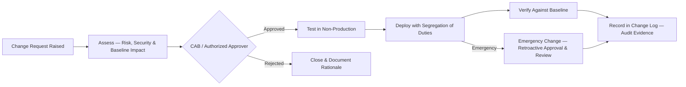

# 04.11 — Secure Configuration &amp; Hardening

| Field | Value |
|---|---|
| Document ID | CCB-ISP-CONFIG-2026-411 |
| Version | 1.0 |
| Date | 2026-06-15 |
| Classification | Confidential — Nonpublic Information (NPI) // Illustrative Portfolio Sample |
| Owner | Marcus Doyle, IT Security Manager |
| Author | Advisory Team (Financial-Services GRC) |
| Status | Approved |

## Purpose

This document defines Cornerstone Community Bank's **secure configuration and hardening** safeguards — the standards and controls that ensure systems are built and maintained in a known-good, minimally-exposed state. A hardened baseline is a preventive control that shrinks the attack surface before a vulnerability is ever scanned: it removes default credentials, disables unnecessary services, and enforces secure settings, thereby reducing the exploitability behind **R-04 (unpatched/exposed external system)** and blunting **R-02 (ransomware)** by limiting lateral movement and privilege abuse.

The program operationalizes the **Change Management Policy (#9)** in partnership with the Vulnerability &amp; Patch (#7) and Access Control (#3) policies, and it supports the **Protect** Function of **NIST CSF 2.0**. It applies enterprise-wide with formal rigor for the **6 SOX-significant systems** (where configuration is an ITGC concern for Phase 06) and the **22 NPI-bearing systems**.

## Baseline Configuration Standards

Every asset class is deployed against a documented secure baseline derived from recognized benchmarks — primarily the **CIS Benchmarks** and **CIS Controls v8**, aligned to **NIST SP 800-53 Rev.5**. Baselines are versioned standards (Tier 3 of the policy hierarchy) owned by the CISO and implemented by system owners.

| Asset Class | Baseline Source | Enforcement Mechanism |
|---|---|---|
| Windows servers &amp; workstations | CIS Benchmark (Level 1/2) | Group Policy / MDM |
| Linux/Unix servers | CIS Benchmark | Configuration management / IaC |
| Network devices (firewall, switch, VPN) | CIS + vendor hardening guide | Golden config templates |
| Databases (incl. NPI stores) | CIS Benchmark | DB config standard + review |
| Cloud / M365 tenants | CIS Foundations Benchmark | CSPM policy-as-code |
| Endpoints &amp; mobile | CIS + MDM baseline | MDM / endpoint management |

## Hardening Principles

Hardening reduces what an attacker can reach and do. These principles are applied uniformly and are the settings most often validated in penetration testing (Phase 08) and ITGC review (Phase 06).

| Principle | Applied Control |
|---|---|
| Least functionality | Disable/uninstall unneeded services, ports, protocols, and software |
| No defaults | Remove default accounts and change default credentials on build |
| Secure protocols only | Disable SSL/TLS 1.0-1.1, SMBv1, and other deprecated protocols |
| Least privilege | Restrict local admin; enforce role separation (04.06) |
| Logging enabled | Baseline audit logging on by default, shipped to SIEM (04.10) |
| Encryption on | At-rest/in-transit encryption enabled per 04.08 |

## Change Control

Configuration integrity is preserved through formal change management: no production change to an NPI or SOX-significant system occurs without authorization, testing, and an auditable record. This is the same control the SOX ITGC "Program Changes" domain (Phase 06) will test.

| Change Type | Authorization | Testing | Record |
|---|---|---|---|
| Standard (pre-approved, low risk) | Pre-authorized catalog | Regression as applicable | Logged |
| Normal | Change Advisory Board (CAB) | Required in non-prod | Full change ticket |
| Emergency | Expedited approver; retroactive CAB | Post-implementation review | Logged + reviewed |
| SOX-significant systems | Segregation of duties enforced | Required | ITGC evidence (Phase 06) |

## Configuration Management for SOX-Significant Systems

The **6 SOX-significant systems** receive the most stringent configuration governance because their integrity underpins financial reporting (FDICIA Part 363 / SOX 404). Configuration items are documented, access to change them is restricted and segregated, and changes are evidenced for external auditor (Whitmore &amp; Associates) reliance.

| SOX Configuration Control | Requirement |
|---|---|
| Documented baseline | Approved, version-controlled configuration standard per system |
| Restricted change access | Only authorized, segregated roles may modify configuration |
| Change evidence | Every change traceable to an approved request and tester |
| Periodic review | Configuration reviewed against baseline on a defined cycle |
| Drift remediation | Unauthorized deviations investigated and corrected |

## Cloud Configuration

Cloud and M365 environments are governed by **policy-as-code** through Cloud Security Posture Management (CSPM), giving continuous assurance that tenant settings match the secure baseline — the control plane is treated with the same rigor as on-prem infrastructure.

| Cloud Control | Requirement |
|---|---|
| Benchmark alignment | CIS Foundations Benchmark for the tenant/subscription |
| Identity hardening | Conditional access, no legacy auth, admin-role restriction (04.07) |
| Data protection | Encryption, sharing controls, and DLP for NPI in M365 |
| Continuous posture scan | CSPM evaluates config continuously; findings ticketed |
| Guardrails | Preventive policy-as-code blocks non-compliant deployments |

## Drift Detection and Remediation

Baselines decay without enforcement, so Cornerstone continuously compares live configuration to the approved standard and treats unauthorized deviation as a security event. Drift is detected, ticketed, and remediated on defined timelines, and unexplained drift is correlated in the SIEM (04.10) as a potential indicator of compromise.

| Drift Activity | Cadence / Trigger | Response |
|---|---|---|
| Automated baseline comparison | Continuous (cloud) / periodic (on-prem) | Generate deviation ticket |
| Unauthorized change correlation | Real-time via SIEM | Investigate as potential incident |
| Remediation | Within severity-based SLA | Restore to baseline or approve exception |
| Exception handling | On deviation | Time-bound, risk-assessed, CISO-approved |
| Reporting | Monthly / on governance cycle | Drift KRIs to CISO and Board |

## Metrics and Governance

Configuration metrics evidence the maturity of preventive controls and feed both the Phase 05 assessment and Phase 06 ITGC testing.

| Metric (KRI) | Target | Watch | Escalate |
|---|---|---|---|
| Systems built to approved baseline | 100% | 95–99% | < 95% |
| SOX-significant systems with documented baseline | 6 of 6 | 5 of 6 | < 5 |
| Unremediated configuration drift past SLA | 0 | 1–2 | > 2 |
| Cloud CSPM critical misconfigurations open | 0 | 1–2 | > 2 |
| Unauthorized production changes (quarter) | 0 | 1 | > 1 |

## Control-to-Risk Mapping

| Control | CSF 2.0 Element | Risk Treated |
|---|---|---|
| CIS baseline hardening | Protect — secure configuration | R-04, R-02 |
| Change control &amp; SoD | Protect — controlled change | R-04, R-05 |
| SOX configuration governance | Protect / Govern — ITGC integrity | R-05 (support), SOX ITGC |
| Cloud CSPM &amp; guardrails | Protect — cloud configuration | R-04, R-01 (support) |
| Drift detection | Detect/Protect — config integrity | R-02, R-04 |

## Cross-References

- **04.04** — Technical safeguards (endpoint, network, and DLP controls the baseline enforces).
- **04.09** — Vulnerability &amp; patch management (hardening reduces baseline vulnerabilities).
- **04.10** — Logging &amp; monitoring (baseline logging enablement; drift-as-signal).
- **Phase 06** — SOX ITGC (Program Changes domain relies on this change control).
- **Phase 08** — Penetration testing validating hardening effectiveness.

---
[⬅ Previous](04.10-logging-monitoring-and-detection.md) · [🏠 Phase README](04.00-README.md) · [Next ➡](04.12-security-awareness-and-training.md)
