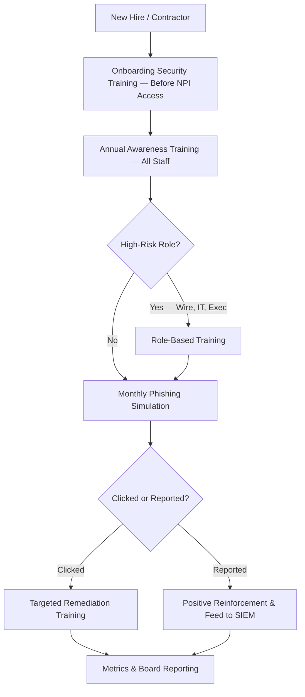

# 04.12 — Security Awareness &amp; Training

| Field | Value |
|---|---|
| Document ID | CCB-ISP-AWARE-2026-412 |
| Version | 1.0 |
| Date | 2026-06-15 |
| Classification | Confidential — Nonpublic Information (NPI) // Illustrative Portfolio Sample |
| Owner | Rachel Alvarez, Chief Information Security Officer (CISO/ISO) |
| Author | Advisory Team (Financial-Services GRC) |
| Status | Approved |

## Purpose

This document defines Cornerstone Community Bank's **security awareness and training** program — the administrative safeguard that reduces **human risk**, which is the leading cause of loss events at community banks. It is a direct treatment for **R-01 (phishing / credential theft → account takeover)** and a material control for **R-06 (wire fraud / Business Email Compromise)**, both of which the Phase 03 assessment traced to *user susceptibility to phishing* and *manual verification gaps*. A workforce that recognizes and reports social engineering is the Bank's first line of defense and a multiplier on every technical control.

The program operationalizes the **Security Awareness &amp; Training Policy (#13)** of the 14 core policies, supports the **Protect** Function of **NIST CSF 2.0** (with reporting behaviors feeding **Detect**), and covers all **~240 employees**, contractors with system access, and the **Board of Directors**. GLBA §501(b) and the Interagency Guidelines expressly require staff training as part of a written information security program.

## Program Structure

Training is layered so that every person receives a baseline and higher-risk roles receive targeted, deeper content. The program is continuous rather than a once-a-year event, combining formal training, ongoing simulations, and just-in-time reinforcement.

| Component | Audience | Frequency |
|---|---|---|
| New-hire security onboarding | All new employees/contractors | At onboarding (before NPI access) |
| Annual security awareness training | All staff | Annually (mandatory, tracked) |
| Role-based training | High-risk roles (see below) | Annually + on role change |
| Phishing simulations | All staff | Monthly / continuous |
| Board &amp; executive briefing | Board of Directors, executives | At least annually |
| Just-in-time reinforcement | All staff | Triggered by events/threats |

## Annual and New-Hire Training

Baseline training establishes the non-negotiable knowledge every employee must hold, delivered before access to NPI is granted and refreshed annually. Completion is mandatory, tracked, and enforced — incomplete training is escalated to management.

| Core Topic | Coverage |
|---|---|
| GLBA / NPI protection | What NPI is and each employee's duty to protect it |
| Phishing &amp; social engineering | Recognizing and reporting lures (treats R-01) |
| Wire &amp; payment fraud / BEC | Callback verification, dual control, spoofing (treats R-06) |
| Password &amp; MFA hygiene | Phishing-resistant MFA, no credential sharing |
| Acceptable use &amp; data handling | Safe handling, classification, clean desk |
| Incident reporting | How and when to report; 36-hour clock awareness |

## Role-Based Training

Employees whose roles carry elevated risk receive additional, specialized training targeted at the threats specific to their function. This concentrates depth where a single mistake can produce the largest loss.

| Role | Additional Training Focus |
|---|---|
| Wire / funds-transfer &amp; finance staff | BEC red flags, mandatory callback verification, dual control (R-06) |
| IT &amp; privileged administrators | Secure administration, privileged-access hygiene, change control |
| Developers / system owners | Secure configuration and change practices (04.11) |
| Customer-facing / branch staff | Customer authentication, pretexting, NPI handling |
| Executives &amp; Board | Governance duties, whaling/BEC targeting, oversight expectations |

## Phishing Simulations

Simulated phishing is the program's primary behavioral control and measurement tool for R-01. Campaigns run **monthly** with varied difficulty and realistic lures; those who click receive immediate, non-punitive remediation training, while those who report reinforce the reporting culture and feed real signal to detection (04.10).

| Simulation Element | Approach |
|---|---|
| Cadence | Monthly, continuous, randomized |
| Difficulty | Progressive — including targeted/BEC-style lures for high-risk roles |
| Click response | Immediate just-in-time remediation training |
| Report response | Positive reinforcement; genuine reports triaged in SIEM |
| Repeat clickers | Escalating remediation and manager involvement |
| Tone | Educational and non-punitive to sustain reporting |

## Metrics

Human-risk reduction is measured and reported to the CISO and Board Audit Committee. These KRIs align to the Phase 03 risk metrics and evidence maturity for the Phase 05 assessment.

| Metric (KRI) | Target | Watch | Escalate |
|---|---|---|---|
| Phishing simulation click rate | < 5% | 5–10% | > 10% |
| Phishing report rate | > 70% | 50–70% | < 50% |
| Annual training completion | 100% | 95–99% | < 95% |
| New-hire training before NPI access | 100% | — | Any gap |
| Repeat clickers (rolling 90 days) | ↓ trend | Flat | ↑ trend |
| Board/executive briefing delivered | Annual | — | Missed |

## Board and Executive Awareness

The **Board of Directors** and executive team receive tailored briefings at least annually so that governance-level oversight of the program is informed and so that executives — high-value BEC/whaling targets — recognize the threats aimed at them. These briefings reinforce the Board's GLBA oversight duty and connect awareness metrics to the annual GLBA report (Phase 09).

| Audience | Content | Cadence |
|---|---|---|
| Board Audit Committee | Program status, human-risk KRIs, threat trends | ≥ Annual |
| Executive management | Targeted threat briefing (BEC/whaling), duties | ≥ Annual |
| All staff | Threat-driven advisories on emerging campaigns | As needed |

## Control-to-Risk Mapping

| Control | CSF 2.0 Element | Risk Treated |
|---|---|---|
| Annual + new-hire awareness training | Protect — awareness &amp; training | R-01, R-06 |
| Phishing simulations &amp; remediation | Protect / Detect — human sensor | R-01 |
| Wire/BEC role-based training | Protect — targeted competency | R-06 |
| Reporting culture | Detect — human-reported events | R-01, R-06 |
| Board &amp; executive briefings | Govern — informed oversight | R-01, R-06 |

## Cross-References

- **Phase 03** — R-01 and R-06 risk statements; phishing click-rate KRI.
- **04.03** — Administrative safeguards (training as a program element).
- **04.07** — Authentication &amp; MFA (human layer complementing phishing-resistant MFA).
- **04.10** — Logging &amp; monitoring (human-reported phishing feeding detection).
- **Phase 09** — Board reporting and the annual GLBA report (awareness metrics).

---
[⬅ Previous](04.11-secure-configuration-and-hardening.md) · [🏠 Phase README](04.00-README.md) · [Next ➡](04.13-vendor-management-policy.md)
