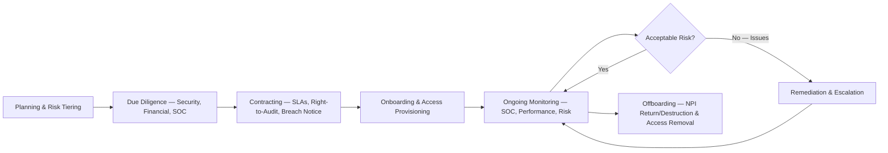

# 04.13 — Vendor Management Policy

| Field | Value |
|---|---|
| Document ID | CCB-VRM-VENDOR-2026-413 |
| Version | 1.0 |
| Date | 2026-06-15 |
| Classification | Confidential — Nonpublic Information (NPI) // Illustrative Portfolio Sample |
| Owner | Steven Nakamura, Chief Risk Officer (CRO) |
| Author | Advisory Team (Financial-Services GRC) |
| Status | Approved |

## Purpose

This document defines Cornerstone Community Bank's **vendor / third-party risk management** policy — the lifecycle by which the Bank governs the **85 third-party relationships** in its portfolio, of which **12 are rated critical/high-risk**. Because Cornerstone **outsources its core banking and digital-banking platform to Meridian Core Services, LLC**, third-party risk is not peripheral; it is central to the Bank's ability to protect NPI and to operate. This policy is the direct treatment for **R-03 (compromise or concentration failure of a critical service provider — the Meridian ecosystem — exposing NPI)**, a High risk owned by the CRO.

The policy operationalizes the **Vendor / Third-Party Risk Policy (#10)** of the 14 core policies, supports the **Govern** and **Identify** Functions of **NIST CSF 2.0**, and aligns to the **FFIEC Outsourcing** booklet and the **Interagency Guidance on Third-Party Relationships (2023)**. It is the design foundation that the deeper, operational third-party-risk and business-continuity work of **Phase 07** will execute and test.

## Governance and Roles

Third-party risk is owned in the second line by the CRO, executed by relationship and business owners in the first line, and assured by internal audit in the third line. Every critical relationship has a named business owner accountable for day-to-day oversight.

| Role | Responsibility |
|---|---|
| Chief Risk Officer (Steven Nakamura) | Policy owner; accountable for the third-party risk program |
| CISO (Rachel Alvarez) | Security due diligence, SOC review, NPI-control assurance |
| Business/relationship owners | First-line day-to-day vendor oversight |
| Vendor Risk / Procurement | Onboarding workflow, contract controls, inventory |
| Board Audit Committee | Oversight of critical relationships (e.g., Meridian) |
| Internal Audit (Priya Sharma) | Independent assurance over the program |

## Vendor Risk Tiering

Every third party is risk-tiered at onboarding and on review, with tier driving the depth of due diligence and the frequency of monitoring. Tiering is based primarily on NPI access, criticality to operations, and financial-reporting relevance.

| Tier | Definition | Population | Oversight Intensity |
|---|---|---|---|
| Critical / High | NPI access + operational criticality (incl. Meridian) | 12 | Enhanced — annual + continuous |
| Moderate | Some NPI or moderate operational dependence | — | Standard periodic review |
| Low | No NPI, limited dependence | — | Baseline / lightweight |
| — | Total portfolio | 85 | Risk-based across tiers |

## Third-Party Risk Lifecycle

The program governs a relationship from planning through offboarding. No vendor with NPI access is onboarded without completed due diligence and executed contractual controls, and none is retired without secure return/destruction of NPI.

## Due Diligence and SOC Review

Due diligence scales with tier and, for NPI-handling and critical vendors, includes review of independent assurance reports. **SOC reports are central**: the Bank obtains and reviews **SOC 1 Type II** (financial-reporting relevance) and **SOC 2 Type II** (security) reports, evaluates the auditor's opinion and exceptions, and — critically — reviews the **Complementary User Entity Controls (CUECs)** to confirm the Bank performs its side of the shared control model.

| Due-Diligence Element | Critical / High | Moderate | Low |
|---|---|---|---|
| Security questionnaire / assessment | Required | Required | Screening |
| SOC 1 / SOC 2 Type II review | Required | Where applicable | N/A |
| CUEC review &amp; mapping | Required | Where applicable | N/A |
| Financial condition review | Required | Periodic | N/A |
| BCP/DR &amp; resilience review | Required | Where applicable | N/A |
| Cyber insurance verification | Required | Recommended | N/A |

## Contractual Controls

Contracts convert oversight expectations into enforceable obligations. Agreements with NPI-handling and critical vendors carry the security, breach-notification, audit, and exit provisions the Interagency Guidance and FFIEC expect.

| Contract Provision | Requirement |
|---|---|
| Confidentiality &amp; NPI protection | Bind vendor to safeguard NPI per GLBA §501(b) |
| Security &amp; control requirements | Defined controls, encryption, and standards |
| Breach / incident notification | Prompt notice supporting the Bank's 36-hour obligation |
| Right to audit / assurance | SOC delivery and/or audit rights |
| SLAs &amp; performance | Availability, RTO/RPO, remedies |
| Subcontractor / fourth-party controls | Flow-down and disclosure of material subcontractors |
| Termination &amp; exit assistance | NPI return/destruction and transition support |

## Ongoing Monitoring

Risk is monitored continuously, not just at onboarding. Critical vendors are re-assessed at least annually with continuous monitoring of security posture, performance, and adverse news; open SOC exceptions are tracked to closure as a KRI.

| Monitoring Activity | Critical / High | Moderate |
|---|---|---|
| Full risk re-assessment | Annual | Periodic (risk-based) |
| SOC report refresh &amp; exception tracking | Annual + on issuance | On issuance |
| Performance / SLA review | Ongoing | Periodic |
| Adverse-news / threat monitoring | Continuous | Event-driven |
| Reporting to Board Audit Committee | Regular (critical) | Summary |

## Meridian Under Enhanced Oversight

**Meridian Core Services** is the Bank's most significant relationship — the outsourced core and digital-banking platform touching NPI for **~85,000 customers** and **~62,000 digital users**. It is subject to the highest oversight intensity: annual full assessment, review of both SOC 1 Type II and SOC 2 Type II reports, CUEC mapping to Cornerstone's own controls, resilience/BCP validation, and Board-level visibility. This concentration is exactly the exposure behind **R-03**, treated by mitigation *and* transfer (contractual SLAs/indemnity plus cyber insurance).

| Meridian Oversight Element | Practice |
|---|---|
| Assurance | SOC 1 &amp; SOC 2 Type II reviewed annually; exceptions tracked |
| CUEC assurance | Bank confirms it performs its complementary controls |
| Concentration risk | Recognized single critical dependency; monitored at Board level |
| Resilience | BCP/DR, RTO/RPO validated (executed in Phase 07) |
| Risk treatment | Mitigate (oversight) + Transfer (SLAs/indemnity, cyber insurance) |

## Phase 07 Preview

This policy is the design layer; **Phase 07 (Third-Party / Vendor Risk &amp; Business Continuity)** executes and evidences it — building the vendor inventory and risk register, completing SOC reviews and CUEC mappings for the 12 critical vendors, validating BCP/DR with RTO/RPO, and exercising incident response including a tabletop. Phase 07 is where the design commitments here become tested, examinable operating controls.

| Design (Phase 04) | Execution (Phase 07) |
|---|---|
| Lifecycle &amp; tiering defined | Inventory &amp; register populated (85 vendors / 12 critical) |
| SOC-review requirement set | SOC 1/SOC 2 reviews &amp; CUEC mapping completed |
| Contractual control standards | Contract adequacy assessed &amp; remediated |
| Meridian enhanced-oversight model | BCP/DR &amp; resilience validated; tabletop exercised |

## Control-to-Risk Mapping

| Control | CSF 2.0 Element | Risk Treated |
|---|---|---|
| Risk tiering &amp; due diligence | Identify / Govern — supply-chain risk | R-03 |
| SOC review &amp; CUEC assurance | Govern — assurance over providers | R-03 |
| Contractual security &amp; breach notice | Govern — third-party requirements | R-03 |
| Enhanced Meridian oversight | Govern — critical-provider management | R-03 |
| Ongoing monitoring &amp; exception tracking | Govern — continuous oversight | R-03 |

## Cross-References

- **Phase 03** — R-03 risk statement (Meridian concentration) and Mitigate/Transfer treatment.
- **04.02** — Policy framework (Vendor/Third-Party Risk Policy #10).
- **04.10** — Logging &amp; monitoring (vendor/MDR security-event oversight).
- **Phase 06** — SOX ITGC reliance on Meridian SOC 1 Type II report.
- **Phase 07** — Third-party risk execution, BCP/DR, and incident-response tabletop.

---
[⬅ Previous](04.12-security-awareness-and-training.md) · [🏠 Phase README](04.00-README.md) · [Next ➡](04.14-control-to-risk-traceability.md)
