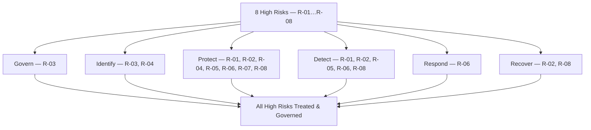

# 04.14 — Control-to-Risk Traceability

| Field | Value |
|---|---|
| Document ID | CCB-ISP-TRACE-2026-414 |
| Version | 1.0 |
| Date | 2026-06-15 |
| Classification | Confidential — Nonpublic Information (NPI) // Illustrative Portfolio Sample |
| Owner | Rachel Alvarez, Chief Information Security Officer (CISO/ISO) |
| Author | Advisory Team (Financial-Services GRC) |
| Status | Approved |

## Purpose

This document is the **keystone of Phase 04**: it provides the **control-to-risk traceability matrix** that proves every one of the **8 High risks (R-01 … R-08)** carried out of the Phase 03 risk assessment is **treated** by named safeguards, governed by at least one of the **14 core policies**, and mapped to a Function of **NIST CSF 2.0**. Traceability is what converts a collection of policies and controls into a defensible program: it lets the Board, internal audit, and FFIEC examiners follow an unbroken thread from an identified risk to the specific control that addresses it and the governance that sustains it.

The matrix closes the loop opened by the WISP (04.01) and the policy framework (04.02): the risk assessment identified *what could go wrong*, the safeguards (04.03–04.13) defined *what the Bank does about it*, and this document demonstrates *that nothing High is left untreated*.

## How to Read the Matrix

Each High risk is traced across five columns: its treatment strategy, the primary safeguard documents that implement the treatment, the governing policy(ies) from the 14, the CSF 2.0 Function(s) engaged, and the residual direction after design. Treatment codes follow Phase 03: **M** = Mitigate, **T** = Transfer, **A** = Accept, **Av** = Avoid.

| Column | Meaning |
|---|---|
| Risk | Phase 03 identifier and short name (inherent rating: High) |
| Treatment | Strategy code (M / T / A / Av) |
| Primary Controls / Docs | Phase 04 safeguards implementing the treatment |
| Governing Policy(ies) | Owning policy from the 14 core policies |
| CSF 2.0 Function(s) | NIST CSF 2.0 Function(s) engaged |

## Keystone Traceability Matrix — 8 High Risks

This is the authoritative demonstration that all eight High risks are treated. Every row terminates in named controls, a governing policy, and a CSF 2.0 Function — no High risk is unpoliced.

| Risk | Treatment | Primary Controls / Docs | Governing Policy(ies) | CSF 2.0 Function(s) |
|---|---|---|---|---|
| R-01 Phishing / ATO to NPI | M | Phishing-resistant MFA &amp; conditional access (04.07); awareness &amp; phishing simulations (04.12); ATO detection (04.10) | #4 Auth/MFA, #13 Awareness | Protect, Detect |
| R-02 Ransomware / destructive malware | M | EDR &amp; segmentation (04.04); patch SLAs (04.09); hardening (04.11); ransomware detection (04.10); immutable/tested backups (Ph.07) | #7 Vuln/Patch, #8 Logging, #12 BC/DR | Protect, Detect, Recover |
| R-03 Critical provider (Meridian) | M / T | Enhanced vendor oversight, SOC/CUEC review, contractual controls, insurance (04.13) | #10 Vendor/Third-Party | Govern, Identify |
| R-04 Unpatched external system | M | Risk-based patch SLAs &amp; attack-surface mgmt (04.09); secure baselines &amp; change control (04.11) | #7 Vuln/Patch, #9 Change | Identify, Protect |
| R-05 Insider misuse of NPI | M | Least privilege &amp; access reviews (04.06); encryption/tokenization (04.08); DLP &amp; exfiltration detection (04.10) | #3 Access Control, #6 Data Classification | Protect, Detect |
| R-06 Wire fraud / BEC | M | Callback verification &amp; dual control; email authentication (04.04); wire/BEC role-based training (04.12); IR (Ph.07) | #2 Acceptable Use, #11 Incident Response, #13 Awareness | Protect, Detect, Respond |
| R-07 Weak / inconsistent MFA | M | Uniform phishing-resistant MFA across all NPI access paths (04.07); IAM (04.06) | #4 Auth/MFA | Protect |
| R-08 Backup / recovery gap | M | Encrypted &amp; immutable backups (04.08); validated RTO/RPO &amp; DR testing (Ph.07); ransomware/anti-tamper detection (04.10) | #5 Encryption, #12 BC/DR | Protect, Recover |

## Policy Coverage Confirmation

The matrix confirms that all eight High risks map onto the 14 core policies with no gaps. Every High risk is owned by at least one policy, and the policies collectively span all six CSF 2.0 Functions.

| High Risk | Governing Policy(ies) | Coverage |
|---|---|---|
| R-01 | #4, #13 | Covered |
| R-02 | #7, #8, #12 | Covered |
| R-03 | #10 | Covered |
| R-04 | #7, #9 | Covered |
| R-05 | #3, #6 | Covered |
| R-06 | #2, #11, #13 | Covered |
| R-07 | #4 | Covered |
| R-08 | #5, #12 | Covered |

## NIST CSF 2.0 Function Coverage

Aggregating the matrix by Function shows the program engages all six CSF 2.0 Functions across the High-risk set — evidence of a balanced, defense-in-depth design for the Phase 05 maturity assessment.

| CSF 2.0 Function | High Risks Engaged |
|---|---|
| Govern | R-03 |
| Identify | R-03, R-04 |
| Protect | R-01, R-02, R-04, R-05, R-06, R-07, R-08 |
| Detect | R-01, R-02, R-05, R-06, R-08 |
| Respond | R-06 |
| Recover | R-02, R-08 |

## Control-Owner Accountability

Every High-risk treatment has a named accountable owner, carried consistently from the Phase 03 register into Phase 04 control design. Named ownership is what makes the traceability operable rather than theoretical.

| Risk | Accountable Owner | Design Residual Direction |
|---|---|---|
| R-01 | Rachel Alvarez (CISO) | Low–Moderate |
| R-02 | Marcus Doyle (IT Sec Mgr) | Moderate |
| R-03 | Steven Nakamura (CRO) | Moderate |
| R-04 | Marcus Doyle (IT Sec Mgr) | Low–Moderate |
| R-05 | Rachel Alvarez (CISO) | Moderate |
| R-06 | Angela Foster (CCO/BSA) | Low–Moderate |
| R-07 | Rachel Alvarez (CISO) | Low |
| R-08 | James Porter (CIO) | Moderate |

## Assurance and Validation Path

Design traceability is asserted here; the following phases independently validate that the traced controls operate effectively — closing the assurance loop.

| Assurance Activity | Phase | Validates |
|---|---|---|
| FFIEC / NIST CSF 2.0 maturity assessment | 05 | Maturity of traced controls vs. target |
| SOX ITGC testing | 06 | Operating effectiveness of IT controls |
| Third-party / BCP execution | 07 | R-03 and R-08 recovery controls |
| Independent penetration test &amp; internal audit | 08 | R-01, R-02, R-04 control effectiveness |
| Board reporting &amp; GLBA report | 09 | Governance oversight of residual risk |

## Cross-References

- **Phase 03** — Risk register (R-01…R-08), treatment plans, and owners.
- **04.01 / 04.02** — WISP and the 14-policy framework the matrix traces to.
- **04.03–04.13** — The safeguard documents implementing each treatment.
- **Phase 05** — NIST CSF 2.0 maturity assessment consuming this traceability.
- **04.15** — Phase summary confirming all High risks treated at design.

---
[⬅ Previous](04.13-vendor-management-policy.md) · [🏠 Phase README](04.00-README.md) · [Next ➡](04.15-phase-summary-and-transition.md)
