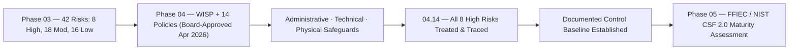

# 04.15 — Phase Summary &amp; Transition

| Field | Value |
|---|---|
| Document ID | CCB-ISP-XSUM-2026-415 |
| Version | 1.0 |
| Date | 2026-06-15 |
| Classification | Confidential — Nonpublic Information (NPI) // Illustrative Portfolio Sample |
| Owner | Rachel Alvarez, Chief Information Security Officer (CISO/ISO) |
| Author | Advisory Team (Financial-Services GRC) |
| Status | Approved |

## Purpose

This document closes **Phase 04 — Information Security Program &amp; Control Design** and hands off to **Phase 05 — FFIEC Cybersecurity Assessment &amp; NIST CSF 2.0 Maturity**. It recaps what Phase 04 delivered: a **Written Information Security Program (WISP)** plus **14 core policies** — **Board-approved in April 2026** — and the administrative, technical, and physical safeguards that implement them. It confirms that **all 8 High risks (R-01…R-08)** from the Phase 03 risk assessment are treated at the design level, that the program provides complete coverage of the **six NIST CSF 2.0 Functions**, and that a documented control **baseline** now exists against which maturity can be measured.

Phase 04 answers *"what controls has the Bank designed to satisfy GLBA §501(b)?"* Phase 05 answers the next question: *"how mature are those controls, and where are the gaps against a defined target?"*

## What Phase 04 Delivered

Phase 04 established the full control-design layer of the program, from the governing charter down through the individual safeguards, culminating in the keystone traceability that proves risk coverage.

| Deliverable | Document(s) | Result |
|---|---|---|
| Program charter (WISP) | 04.01 | Board-approved (April 2026) |
| 14-policy framework | 04.02 | All 14 policies approved &amp; owned |
| Administrative safeguards | 04.03 | Roles, training governance, program ops |
| Technical safeguards | 04.04 | Network, endpoint, email, DLP |
| Physical safeguards | 04.05 | Facility, data-center, media, environmental |
| Access, authentication, encryption | 04.06–04.08 | IAM, phishing-resistant MFA, crypto/key mgmt |
| Vulnerability, logging, hardening | 04.09–04.11 | Patch SLAs, SIEM/detection, CIS baselines |
| Awareness &amp; vendor management | 04.12–04.13 | Human-risk program; 85-vendor lifecycle |
| Control-to-risk traceability | 04.14 | All 8 High risks traced &amp; treated |

## High-Risk Treatment Confirmation

Every High risk carried from Phase 03 is treated by named, owned safeguards governed by the policy framework. This is the design-level assurance that Phase 04 was required to produce; effectiveness is validated in later phases.

| Risk | Short Name | Treated By (Primary) | Status |
|---|---|---|---|
| R-01 | Phishing / ATO | MFA (04.07), Awareness (04.12), Detection (04.10) | Treated (design) |
| R-02 | Ransomware | Patch (04.09), Hardening (04.11), Detection (04.10), Backups | Treated (design) |
| R-03 | Meridian concentration | Vendor management (04.13) | Treated (design) |
| R-04 | Unpatched external | Patch SLAs / ASM (04.09), Config (04.11) | Treated (design) |
| R-05 | Insider NPI misuse | Access (04.06), Encryption (04.08), DLP (04.10) | Treated (design) |
| R-06 | Wire fraud / BEC | Verification, Awareness (04.12), IR | Treated (design) |
| R-07 | Weak MFA | Uniform MFA (04.07) | Treated (design) |
| R-08 | Backup/recovery gap | Encryption (04.08), BC/DR, Backups | Treated (design) |

## Baseline Confirmation

Phase 04 establishes the **control baseline** — the documented set of implemented safeguards that becomes the "current profile" reference point for the Phase 05 maturity assessment. The baseline spans the enterprise with heightened rigor on the **22 NPI-bearing systems** and the **6 SOX-significant systems**, and it recognizes **Meridian** as the critical outsourced dependency.

| Baseline Attribute | Confirmation |
|---|---|
| Governing program | WISP approved; annually reviewed by Board Audit Committee |
| Policy coverage | 14 core policies; all six CSF 2.0 Functions covered |
| Risk coverage | 8 of 8 High risks treated and traced (04.14) |
| Scope anchors | 140 systems; 22 NPI systems; 6 SOX-significant systems |
| Critical dependency | Meridian under enhanced oversight |
| Assurance posture | Design complete; effectiveness testing in Phases 05–08 |

## Open Items Carried Forward

Design is complete, but several controls become fully effective only when executed and tested in later phases. These are tracked as forward dependencies, not gaps in design.

| Open Item | Executes In |
|---|---|
| Maturity scoring vs. target profile (28 gaps expected) | Phase 05 |
| SOX ITGC operating-effectiveness testing (48 key controls) | Phase 06 |
| Vendor SOC/CUEC reviews &amp; BCP/DR validation (RTO/RPO) | Phase 07 |
| Incident-response tabletop exercise | Phase 07 |
| Independent penetration test &amp; internal audit | Phase 08 |

## Transition to Phase 05

Phase 05 takes the Phase 04 baseline as its **current profile** and assesses maturity using the structure of the sunset FFIEC CAT (Inherent Risk Profile + five maturity domains) **mapped forward to NIST CSF 2.0**, with the **CRI Profile** referenced as an alternative crosswalk. The expected outcome, consistent with the program storyline, is a current baseline mostly **"Evolving/Baseline"** against a target of **"Intermediate"**, yielding **28 maturity gaps** to remediate.

| Phase 05 Input (from Phase 04) | Phase 05 Activity |
|---|---|
| WISP + 14 policies | Assess governance maturity (Govern) |
| Safeguards 04.03–04.13 | Score current profile across CSF 2.0 Functions |
| Traceability matrix (04.14) | Confirm risk-aligned control coverage |
| Control baseline | Compare current vs. target profile; identify 28 gaps |

## Cross-References

- **Phase 03** — Risk assessment (42 risks; 8 High) treated by this phase.
- **04.01 / 04.02** — WISP and the 14-policy framework.
- **04.14** — Control-to-risk traceability (the keystone proof).
- **Phase 05** — FFIEC / NIST CSF 2.0 maturity assessment (next phase).
- **Phase 09** — Board reporting and the annual GLBA report on program status.

---
[⬅ Previous](04.14-control-to-risk-traceability.md) · [🏠 Phase README](04.00-README.md) · [Next ➡](../05-ffiec-nist-csf-assessment/05.00-README.md)
